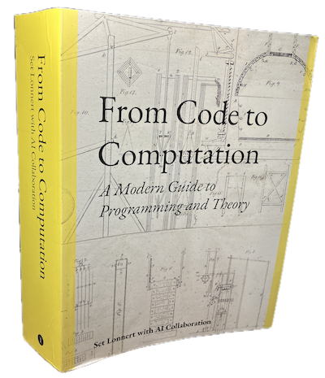

# From Code To Computation: A Modern Guide to Programming and Theory

(Previous working title: *From Basics To Bytecode: A guide to computers and programming*)

A sample from the upcomming book
*From Code To Computation: A Modern Guide to Programming and Theory*.

Teasers for the book in progress (PDF):
- [Cover idea](./cover-idea.pdf)
- [Content](./content.pdf)
- [Introduction](./introduction.pdf)
- [Chapter 1](./ch01.pdf)
- [Chapter 2](./ch02.pdf)
- [Chapter 3](./ch03.pdf)
- ..
