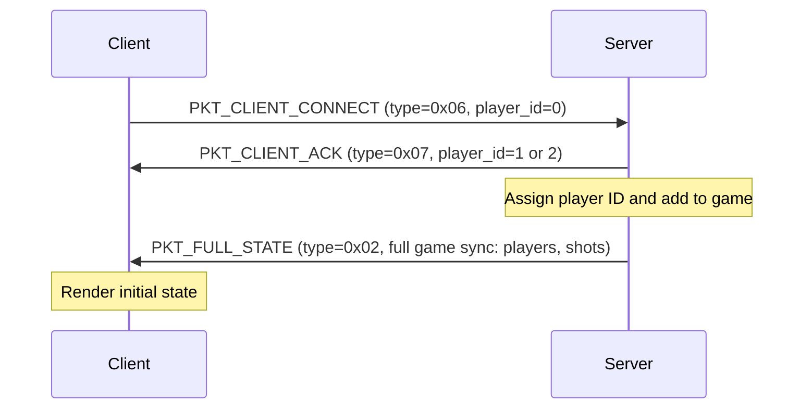
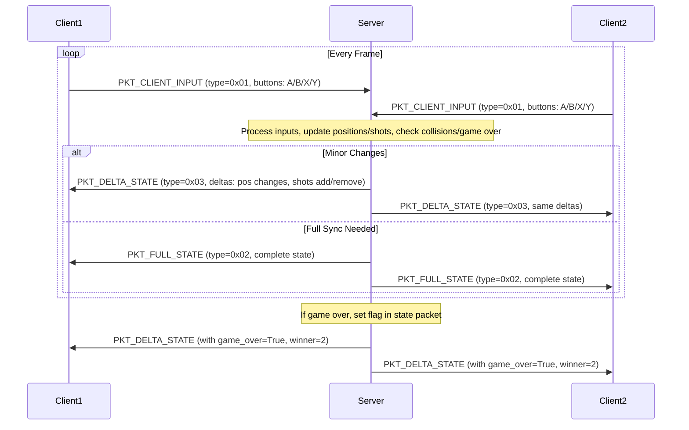
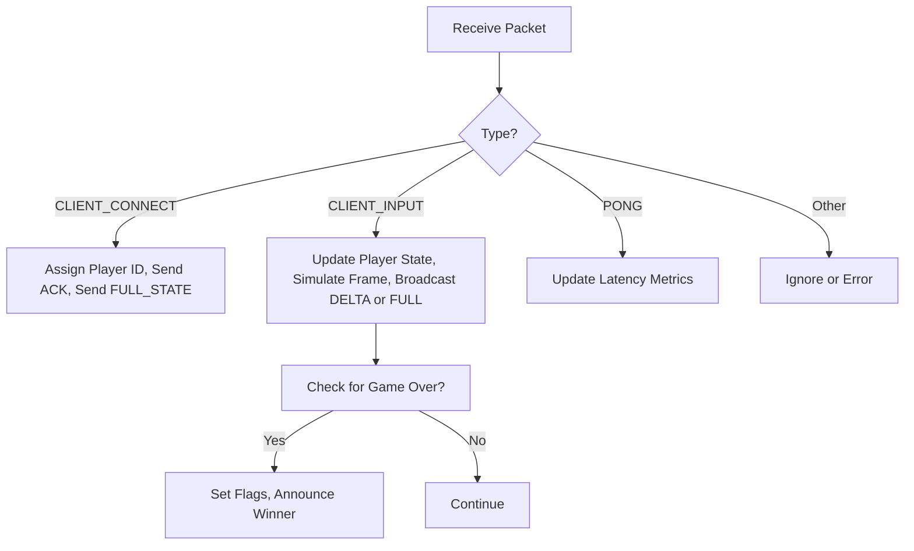
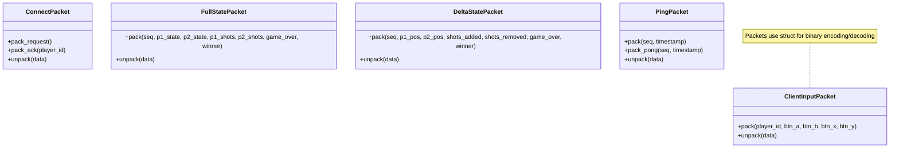

## Dogfight Multiplayer Game Protocol

The `protocol.py` file defines a shared network protocol for a simple multiplayer
"Dogfight" game, used by both the server and clients. This protocol facilitates
communication in a turn-based or real-time multiplayer environment where two players
control characters (likely aircraft or similar) on a 100x80 grid. Players can move
in 8 directions, shoot projectiles, and the game tracks states like positions,
shots, and game-over conditions.

Features:
- *Packet-based communication*: Uses binary packets for efficiency, packed/unpacked
  with Python's `struct` module.
- *Packet types*: Include client inputs (button presses), full game state syncs,
  delta (incremental) updates, connection requests/acks, and ping/pong for latency monitoring.
- *Game mechanics implied*: Players have positions (x, y), directions (0-7 for N, NE, E, etc.),
  and can fire shots with range. The game detects hits, removals, and winners.
- *Efficiency focus*: Full states for initial sync or resync, deltas for ongoing updates
  to minimise bandwidth.
- *Assumptions*: UDP or similar unreliable transport (due to seq numbers for ordering),
  2-player only, no authentication.

This protocol is lightweight, suitable for low-latency games, but lacks error correction or security features.

## How the Protocol Works

### Connection Flow
1. *Client Connects*: The client sends a `PKT_CLIENT_CONNECT` packet (type 0x06) with player_id=0 to request joining.
2. *Server Acknowledges*: The server responds with a `PKT_CLIENT_ACK` packet (type 0x07) assigning a player_id (1 or 2).
3. *Game Starts*: Once connected, the server sends a `PKT_FULL_STATE` to sync the initial game world.

### Game Loop
- *Client Inputs*: Clients send `PKT_CLIENT_INPUT` packets (type 0x01) each frame, containing button states
  (A, B, X, Y – likely for movement/shooting).
- *Server Updates*:
  - Processes inputs, updates game state (positions, shots, collisions).
  - Broadcasts `PKT_FULL_STATE` (type 0x02) for complete sync (e.g., at start or on desync).
  - Broadcasts `PKT_DELTA_STATE` (type 0x03) for incremental changes (position/dir updates, shots added/removed).
- *Shots and Collisions*: Shots move in directions with limited range; removed on hit or expiry.
  The server handles logic, clients render based on states.
- *Game Over*: Flagged in states with a winner (1 or 2).
- *Connection Monitoring*: Periodic `PKT_PING` (0x04) from server, `PKT_PONG` (0x05) responses from
  clients with timestamps for latency.

### Packet Structure Overview
- All packets start with a type byte (1 byte).
- Use fixed formats for packing/unpacking (e.g., "!BBBBBBxx" for inputs, with padding for alignment).
- Positions/shots use 1-byte unsigned ints (0-255), fitting the 100x80 grid.
- Sequence numbers (seq) in states help detect drops/reorders.

The protocol assumes a reliable underlying transport or handles retransmits externally.

## Illustrations

### Client-Server Connection and Game Start

This shows the initial handshake. Once connected, the client begins sending inputs.

### Ongoing Game Loop

This illustrates the input-update-broadcast cycle. Deltas are used for efficiency during normal play.

### Packet Handling on Server

This flowchart outlines server-side packet processing.

### Key Data Structures

This represents the main classes in `protocol.py`, showing methods for packing/unpacking.
