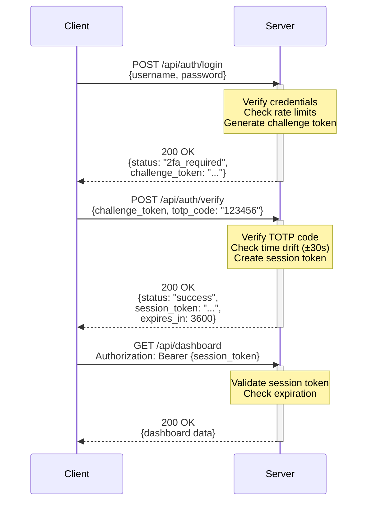
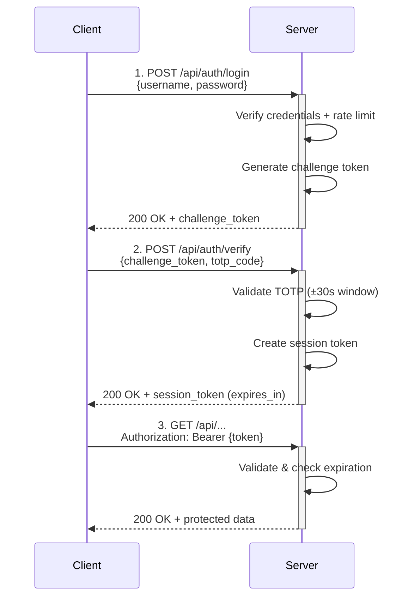

## 2FA Authentication System

This system provides secure two-factor authentication using Time-based One-Time
Passwords (TOTP) based on RFC 6238, with visual feedback through the
Pimoroni Display Pack 2.0.

```
               HTTPS
Python Client  ---->  Pico (2)W Server      Hardware Tokens
               <----                ^--------^
               JSON                  Same TOTP
```


### Authentication Flow







### Testing the System

#### 1. Start the Server
```bash
## Flash server code to Pico W
## Server displays IP address and stats
```

#### 2. Generate TOTP Code
```bash
## On hardware token or run Python demo
python client.py
## Shows: "Demo TOTP: 123456"
```

#### 3. Authenticate
```bash
python client.py
## Enter credentials
## Enter TOTP code from hardware token
## Success: Access granted
```

#### 4. Test Rate Limiting
```bash
## Try wrong password 6 times
## Result: Account locked for 5 minutes
```


### Production Considerations & Project Suggestions

For real-world deployment, add:
1. *Use mbedtls* for proper crypto (HMAC-SHA1, AES, etc.)
2. *HTTPS certificates* - use Let's Encrypt or self-signed (often easier)
3. *Password hashing* - use bcrypt or Argon2
4. *Database storage* - use LittleFS or external database
5. *Logging* - store authentication attempts securely
6. *Backup codes* - for TOTP device loss
7. *Multi-factor recovery* - email/SMS backup
8. *Hardware security* - secure boot, encrypted storage


