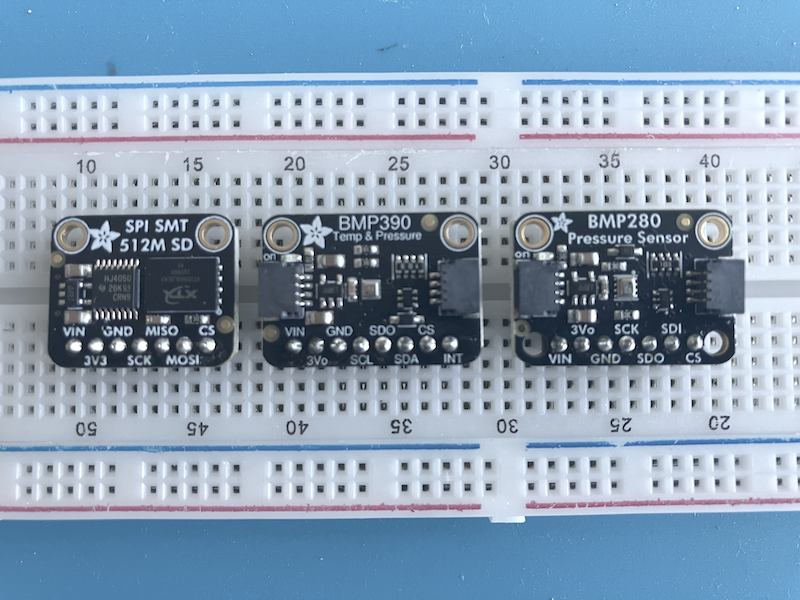

## Reading External Sensors

### Wiring (I2C bus shared)

Both sensors can share the same SDA/SCL lines, since I2C is bus-based.
- Pico (default I2C0 pins):
- GP8 -> SDA
- GP9 -> SCL
- 3V3 -> VCC (both sensors)
- GND →-> GND (both sensors)
- Pull-up resistors:
- Usually the breakout modules for BMP280/BMP390 already have pull-ups
  on SDA/SCL (4.7kΩ–10kΩ to 3.3V). If yours do not, you must add them
  externally.
- Address handling:
- BMP280 default address: 0x76 (sometimes 0x77, depending on module pin wiring).
- BMP390 default address: 0x77 (sometimes configurable).
- Ensure they don’t clash; if both are hardwired to the same address, you’ll need two I2C buses


### MicroPython on Pico

Here’s a script for __BMP280__ showing bus setup and scanning:

```python
class BMP280:
    def __init__(self, i2c, addr=0x76):
        self.i2c = i2c
        self.addr = addr
        # Read calibration data
        calib = self.i2c.readfrom_mem(self.addr, 0x88, 24)
        self.dig_T1 = int.from_bytes(calib[0:2], 'little')
        self.dig_T2 = int.from_bytes(calib[2:4], 'little', signed=True)
        self.dig_T3 = int.from_bytes(calib[4:6], 'little', signed=True)
        self.dig_P1 = int.from_bytes(calib[6:8], 'little')
        self.dig_P2 = int.from_bytes(calib[8:10], 'little', signed=True)
        self.dig_P3 = int.from_bytes(calib[10:12], 'little', signed=True)
        self.dig_P4 = int.from_bytes(calib[12:14], 'little', signed=True)
        self.dig_P5 = int.from_bytes(calib[14:16], 'little', signed=True)
        self.dig_P6 = int.from_bytes(calib[16:18], 'little', signed=True)
        self.dig_P7 = int.from_bytes(calib[18:20], 'little', signed=True)
        self.dig_P8 = int.from_bytes(calib[20:22], 'little', signed=True)
        self.dig_P9 = int.from_bytes(calib[22:24], 'little', signed=True)

        # Set oversampling
        self.i2c.writeto_mem(self.addr, 0xF4, b'\x27')  # temp+press oversampling x1, normal mode
        self.i2c.writeto_mem(self.addr, 0xF5, b'\xA0')  # config

    def read_raw(self):
        data = self.i2c.readfrom_mem(self.addr, 0xF7, 6)
        adc_p = (data[0] << 12) | (data[1] << 4) | (data[2] >> 4)
        adc_t = (data[3] << 12) | (data[4] << 4) | (data[5] >> 4)
        return adc_t, adc_p

    def compensate(self, adc_t, adc_p):
        # Temperature
        var1 = (((adc_t >> 3) - (self.dig_T1 << 1)) * self.dig_T2) >> 11
        var2 = (((((adc_t >> 4) - self.dig_T1) *
                  ((adc_t >> 4) - self.dig_T1)) >> 12) * self.dig_T3) >> 14
        t_fine = var1 + var2
        temp = (t_fine * 5 + 128) >> 8
        temperature = temp / 100.0

        # Pressure
        var1 = t_fine - 128000
        var2 = var1 * var1 * self.dig_P6
        var2 = var2 + ((var1 * self.dig_P5) << 17)
        var2 = var2 + (self.dig_P4 << 35)
        var1 = ((var1 * var1 * self.dig_P3) >> 8) + ((var1 * self.dig_P2) << 12)
        var1 = (((1 << 47) + var1) * self.dig_P1) >> 33
        if var1 == 0:
            pressure = 0
        else:
            p = 1048576 - adc_p
            p = (((p << 31) - var2) * 3125) // var1
            var1 = (self.dig_P9 * (p >> 13) * (p >> 13)) >> 25
            var2 = (self.dig_P8 * p) >> 19
            pressure = ((p + var1 + var2) >> 8) + (self.dig_P7 << 4)
        return temperature, pressure / 25600.0  # hPa

    def read(self):
        adc_t, adc_p = self.read_raw()
        return self.compensate(adc_t, adc_p)
```

Reading from the BMP390 sensors:

```python
class BMP390:
    def __init__(self, i2c, addr=0x77):
        import time
        self.i2c = i2c
        self.addr = addr

        # Reset
        self.i2c.writeto_mem(self.addr, 0x7E, b'\xB6')
        time.sleep(0.01)

        # Read calibration data
        calib = self.i2c.readfrom_mem(self.addr, 0x31, 21)
        self.par_t1 = int.from_bytes(calib[0:2], 'little')
        self.par_t2 = int.from_bytes(calib[2:4], 'little', signed=True)
        self.par_t3 = int.from_bytes(calib[4:5], 'little', signed=True)
        self.par_p1 = int.from_bytes(calib[5:7], 'little', signed=True)
        self.par_p2 = int.from_bytes(calib[7:9], 'little', signed=True)
        self.par_p3 = int.from_bytes(calib[9:10], 'little', signed=True)
        self.par_p4 = int.from_bytes(calib[10:12], 'little', signed=True)
        self.par_p5 = int.from_bytes(calib[12:14], 'little', signed=True)
        self.par_p6 = int.from_bytes(calib[14:15], 'little', signed=True)
        self.par_p7 = int.from_bytes(calib[15:16], 'little', signed=True)
        self.par_p8 = int.from_bytes(calib[16:18], 'little', signed=True)
        self.par_p9 = int.from_bytes(calib[18:20], 'little', signed=True)
        self.par_p10 = int.from_bytes(calib[20:21], 'little', signed=True)

        self.t_lin = 0  # for temp compensation

        # Configure: normal mode, OSR x2, filter
        self.i2c.writeto_mem(self.addr, 0x1C, b'\x02')  # osr_t
        self.i2c.writeto_mem(self.addr, 0x1D, b'\x02')  # osr_p
        self.i2c.writeto_mem(self.addr, 0x1B, b'\x04')  # filter
        self.i2c.writeto_mem(self.addr, 0x1A, b'\x33')  # normal mode

    def read_raw(self):
        data = self.i2c.readfrom_mem(self.addr, 0x04, 6)
        adc_p = data[0] | (data[1] << 8) | (data[2] << 16)
        adc_t = data[3] | (data[4] << 8) | (data[5] << 16)
        return adc_t, adc_p

    def compensate_temp(self, adc_t):
        # Bosch reference: temp in °C
        partial = (adc_t - (self.par_t1 << 8))
        partial2 = (partial * self.par_t2) >> 19
        partial3 = ((partial * partial) >> 12) * self.par_t3 >> 14
        self.t_lin = (partial2 + partial3)
        return self.t_lin / 100.0

    def compensate_press(self, adc_p):
        # Bosch reference: pressure in Pa
        if self.t_lin == 0:
            return 0
        partial1 = self.t_lin * self.par_p6
        partial2 = self.par_p7 << 7
        partial3 = (adc_p - (self.par_p1 << 8))
        partial4 = (partial3 * self.par_p2) >> 14
        comp_press = self.par_p5 + ((partial1 + partial2) >> 8) + partial4
        return comp_press / 100.0  # hPa

    def read(self):
        adc_t, adc_p = self.read_raw()
        temp = self.compensate_temp(adc_t)
        press = self.compensate_press(adc_p)
        return temp, press
```

```python
from machine import Pin, I2C
import time

# Init I2C
i2c = I2C(0, scl=Pin(9), sda=Pin(8), freq=400000)

# Init sensors
bmp280 = BMP280(i2c, addr=0x76)
bmp390 = BMP390(i2c, addr=0x77)

while True:
    t280, p280 = bmp280.read()
    t390, p390 = bmp390.read()
    print("BMP280: T = %.2f °C  P = %.2f hPa" % (t280, p280))
    print("BMP390: T = %.2f °C  P = %.2f hPa" % (t390, p390))
    print("-" * 40)
    time.sleep(1)
```


| Pico Physical Pin | GPIO | Function   | Connect BMP280 | Connect BMP390 |
|-------------------|------|------------|----------------|----------------|
| Pin 11            | GP8  | I2C0 SDA   | SDA            | SDA            |
| Pin 12            | GP9  | I2C0 SCL   | SCL            | SCL            |
| Pin 36            | 3V3  | Power      | VCC            | VCC            |
| Pin 38            | GND  | Ground     | GND            | GND            |




