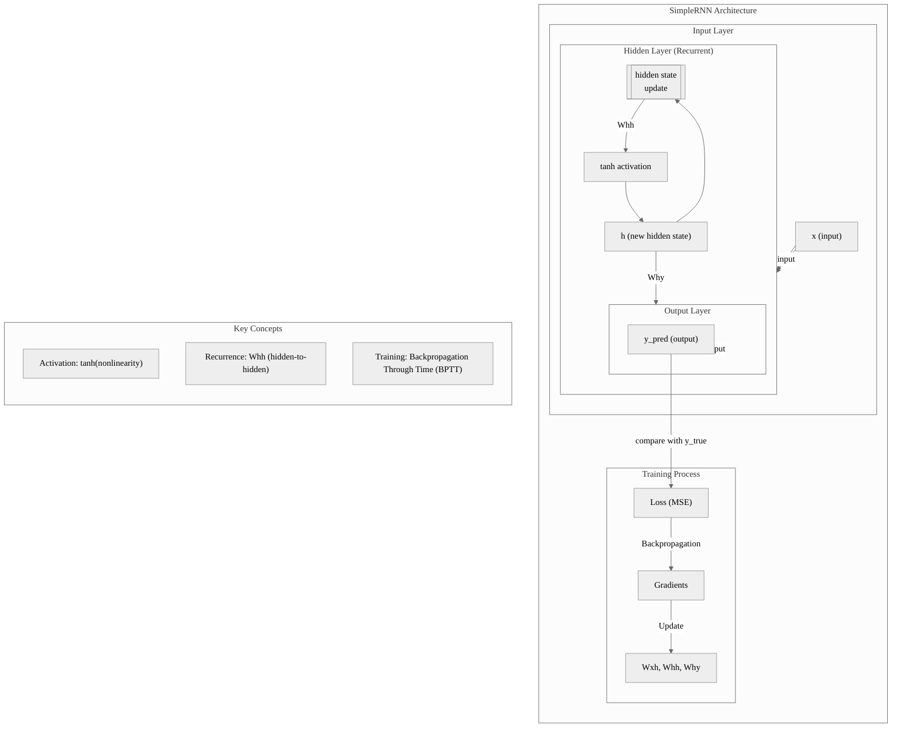

## RNN and Temperatures on the Pico

Plan
1. Read live temperature data from the RPi Pico's onboard temperature sensor.
2. Store past temperature values as a rolling window of data.
3. Use a simple RNN (manually implemented in MicroPython) to predict future temperatures.
4. Output the predicted values to the console (or optionally store them).


### Simple RNN

MicroPython RNN Implementation for RPi Pico

- Reads temperature from the onboard sensor.
- Uses an RNN with a small hidden state (since we have limited memory).
- Predicts the next temperature based on previous readings.


__1. Read Live Temperature Data from RPi Pico__

The RPi Pico has an onboard temperature sensor connected to ADC4, which outputs voltage proportional to temperature.

```python
from machine import ADC
import utime

sensor_temp = ADC(4)  # Onboard temperature sensor
conversion_factor = 3.3 / 65535  # Convert ADC value to voltage

def read_temperature():
    raw_value = sensor_temp.read_u16()  # Read ADC value (0-65535)
    voltage = raw_value * conversion_factor
    temp_celsius = 27 - (voltage - 0.706) / 0.001721  # Pico's temperature formula
    return temp_celsius

# use
while True:
    temp = read_temperature()
    print("Current Temperature:", temp)
    utime.sleep(1)
```


__2. Implement a Simple RNN in MicroPython__

Since MicroPython doesn't support NumPy, we'll implement a basic RNN from scratch using lists and basic math.

```python
import math
import random

class SimpleRNN:
    def __init__(self, input_size, hidden_size):
        self.input_size = input_size
        self.hidden_size = hidden_size

        # Init weights with small random values
        self.Wxh = [[random.uniform(-0.5, 0.5) for _ in range(hidden_size)] for _ in range(input_size)]
        self.Whh = [[random.uniform(-0.5, 0.5) for _ in range(hidden_size)] for _ in range(hidden_size)]
        self.Why = [[random.uniform(-0.5, 0.5) for _ in range(1)] for _ in range(hidden_size)]
        self.h = [0] * hidden_size  # Initial hidden state

    # one pass
    def step(self, x):
        new_h = [sum(x[i] * self.Wxh[i][j] for i in range(self.input_size)) +
                 sum(self.h[i] * self.Whh[i][j] for i in range(self.hidden_size))
                 for j in range(self.hidden_size)]
        
        # Apply activation function (tanh)
        self.h = [math.tanh(h) for h in new_h]

        # Compute output (next temperature prediction)
        y = [sum(self.h[i] * self.Why[i][j] for i in range(self.hidden_size)) for j in range(1)]
        return y[0]  # Return predicted temperature
```


__3. Connect Temperature Data__

We'll now stream temperature readings, store the last 5 readings, and predict the next temperature.

```python
import utime

# Init RNN
input_size = 5  # Number of past temperatures to use for prediction
hidden_size = 10
rnn = SimpleRNN(input_size, hidden_size)

# Store past temperature readings (rolling window)
temperature_history = []

while True:
    temp = read_temperature()
    print("Current Temp:", temp)

    # Store temperature in history (keep only last 5)
    temperature_history.append(temp)
    if len(temperature_history) > input_size:
        temperature_history.pop(0)

    # Only predict if we have enough data
    if len(temperature_history) == input_size:
        predicted_temp = rnn.step(temperature_history)
        print("Predicted Next Temp:", predicted_temp)

    utime.sleep(2)  # Wait 2 seconds before next reading
```


1. Reads live temperature data from the RPi Pico sensor.
2. Stores the last 5 temperatures.
3. Feeds this data into the RNN, which learns patterns over time.
4. Predicts the next temperature and prints it.


### Gradient Descent

Let's implement gradient descent to fine-tune the RNN weights in MicroPython.
We'll manually compute gradients and update weights using backpropagation through time (BPTT).


Plan
1. Read live temperature data and store a rolling window of the last 5 readings.
2. Forward pass: Predict the next temperature using the RNN.
3. Compute loss: Measure the difference between predicted and actual values using Mean Squared Error (MSE).
4. Backward pass: Calculate gradients using backpropagation and update weights.
5. Repeat: Over time, the model improves at predicting future temperatures.


__Updated RNN with Gradient Descent__

We'll modify the SimpleRNN class to include weight updates using gradient descent.

```python
import math
import random

class SimpleRNN:
    def __init__(self, input_size, hidden_size, learning_rate=0.01):
        self.input_size = input_size
        self.hidden_size = hidden_size
        self.learning_rate = learning_rate

        # Init weights randomly
        self.Wxh = [[random.uniform(-0.5, 0.5) for _ in range(hidden_size)] for _ in range(input_size)]
        self.Whh = [[random.uniform(-0.5, 0.5) for _ in range(hidden_size)] for _ in range(hidden_size)]
        self.Why = [[random.uniform(-0.5, 0.5) for _ in range(1)] for _ in range(hidden_size)]
        self.h = [0] * hidden_size  # Initial hidden state

    # one fwd pass
    def step(self, x):
        new_h = [sum(x[i] * self.Wxh[i][j] for i in range(self.input_size)) +
                 sum(self.h[i] * self.Whh[i][j] for i in range(self.hidden_size))
                 for j in range(self.hidden_size)]
        
        # Apply activation function (tanh)
        self.h = [math.tanh(h) for h in new_h]

        # Compute output (next temperature prediction)
        y = [sum(self.h[i] * self.Why[i][j] for i in range(self.hidden_size)) for j in range(1)]
        return y[0]  # Return predicted temperature

    # incl. backprop
    def train(self, x, y_true):
        y_pred = self.step(x)

        # Compute loss (Mean Squared Error)
        loss = (y_pred - y_true) ** 2

        # Compute gradients
        dL_dy = 2 * (y_pred - y_true)  # Derivative of MSE

        # Gradients for Why
        dL_dWhy = [[dL_dy * self.h[i] for j in range(1)] for i in range(self.hidden_size)]

        # Gradients for hidden state
        dL_dh = [dL_dy * self.Why[i][0] for i in range(self.hidden_size)]
        dL_dh = [(1 - self.h[i] ** 2) * dL_dh[i] for i in range(self.hidden_size)]  # tanh derivative

        # Gradients for Wxh and Whh
        dL_dWxh = [[dL_dh[j] * x[i] for j in range(self.hidden_size)] for i in range(self.input_size)]
        dL_dWhh = [[dL_dh[j] * self.h[i] for j in range(self.hidden_size)] for i in range(self.hidden_size)]

        # Update weights using gradient descent
        for i in range(self.hidden_size):
            self.Why[i][0] -= self.learning_rate * dL_dWhy[i][0]

        for i in range(self.input_size):
            for j in range(self.hidden_size):
                self.Wxh[i][j] -= self.learning_rate * dL_dWxh[i][j]

        for i in range(self.hidden_size):
            for j in range(self.hidden_size):
                self.Whh[i][j] -= self.learning_rate * dL_dWhh[i][j]

        return loss
```





__Connect RNN to Live Temperature Data__

Now, we integrate the training process into the live sensor loop.

```python
from machine import ADC
import utime

sensor_temp = ADC(4)  # Onboard temperature sensor
conversion_factor = 3.3 / 65535  # Convert ADC value to voltage

def read_temperature():
    """Reads temperature from the onboard sensor in Celsius."""
    raw_value = sensor_temp.read_u16()  # Read ADC value (0-65535)
    voltage = raw_value * conversion_factor
    temp_celsius = 27 - (voltage - 0.706) / 0.001721  # Pico's temperature formula
    return temp_celsius

# Initialize RNN
input_size = 5  # Use last 5 readings for prediction
hidden_size = 10
learning_rate = 0.005
rnn = SimpleRNN(input_size, hidden_size, learning_rate)

# Store past temperature readings (rolling window)
temperature_history = []

while True:
    temp = read_temperature()
    print("Current Temp:", temp)

    # Store temperature in history (keep only last 5)
    temperature_history.append(temp)
    if len(temperature_history) > input_size:
        temperature_history.pop(0)

    # Only predict and train if we have enough data
    if len(temperature_history) == input_size:
        predicted_temp = rnn.step(temperature_history)
        print("Predicted Next Temp:", predicted_temp)

        # Train the model
        loss = rnn.train(temperature_history, temp)
        print("Loss:", loss)

    utime.sleep(2)  # Wait 2 seconds before next reading
```


1. Reads live temperature data from the RPi Pico onboard sensor.
2. Stores the last 5 readings in a list (rolling window).
3. Uses the RNN to predict the next temperature.
4. Trains the RNN using gradient descent, adjusting weights to minimize error.
5. Repeats, so the model learns over time and improves its predictions.


### LSTM

Using LSTMs instead of a simple RNN will improve the model's ability to capture long-term
dependencies, such as daily trends, temperature cycles, and slow environmental changes.
Since, again, MicroPython doesn't support NumPy or TensorFlow, we'll implement an LSTM
from scratch in a way that works on the Raspberry Pi Pico.


__Why LSTM Instead of Simple RNN?__

Problems with Simple RNNs:
- Short memory: RNNs tend to forget information after a few time steps.
- Vanishing gradients: Makes it hard for the model to learn long-term patterns.
- Not ideal for temperature prediction, where long-term trends matter.

How LSTM Solves This:
- Has a memory cell that retains important information over many time steps.
- Uses gates (input, forget, output) to decide what information to keep or discard.
- Prevents vanishing gradients, making it better for seasonal temperature trends.


Plan
1. Read temperature from the Pico's onboard sensor.
2. Store recent temperature values (rolling window).
3. Use an LSTM to predict the next temperature.
4. Train the LSTM using gradient descent to improve predictions over time.


__Implementing LSTM in MicroPython__

We'll implement the LSTM from scratch using basic lists and math.

```python
import math
import random

class LSTM:
    def __init__(self, input_size, hidden_size, learning_rate=0.01):
        self.input_size = input_size
        self.hidden_size = hidden_size
        self.learning_rate = learning_rate

        # Initialize weights with small random values
        def init_matrix(rows, cols):
            return [[random.uniform(-0.5, 0.5) for _ in range(cols)] for _ in range(rows)]

        self.Wf = init_matrix(input_size + hidden_size, hidden_size)  # Forget gate
        self.Wi = init_matrix(input_size + hidden_size, hidden_size)  # Input gate
        self.Wc = init_matrix(input_size + hidden_size, hidden_size)  # Candidate memory cell
        self.Wo = init_matrix(input_size + hidden_size, hidden_size)  # Output gate
        self.Why = init_matrix(hidden_size, 1)  # Output weights

        # Memory cell state and hidden state
        self.h = [0] * hidden_size
        self.c = [0] * hidden_size

    def sigmoid(self, x):
        return 1 / (1 + math.exp(-x))

    def tanh(self, x):
        return math.tanh(x)

    def step(self, x):
        """Forward pass of LSTM: predicts next temperature"""
        combined = x + self.h  # Concatenate input and hidden state

        # Compute LSTM gates
        forget_gate = [self.sigmoid(sum(combined[i] * self.Wf[i][j] for i in range(len(combined)))) for j in range(self.hidden_size)]
        input_gate = [self.sigmoid(sum(combined[i] * self.Wi[i][j] for i in range(len(combined)))) for j in range(self.hidden_size)]
        candidate = [self.tanh(sum(combined[i] * self.Wc[i][j] for i in range(len(combined)))) for j in range(self.hidden_size)]
        output_gate = [self.sigmoid(sum(combined[i] * self.Wo[i][j] for i in range(len(combined)))) for j in range(self.hidden_size)]

        # Update memory cell and hidden state
        self.c = [forget_gate[j] * self.c[j] + input_gate[j] * candidate[j] for j in range(self.hidden_size)]
        self.h = [output_gate[j] * self.tanh(self.c[j]) for j in range(self.hidden_size)]

        # Compute output (predicted temperature)
        y = [sum(self.h[i] * self.Why[i][0] for i in range(self.hidden_size))]
        return y[0]  # Return predicted temperature

    def train(self, x, y_true):
        """Basic training: update weights using gradient descent"""
        y_pred = self.step(x)
        loss = (y_pred - y_true) ** 2  # Mean Squared Error loss

        # Compute gradient of loss
        dL_dy = 2 * (y_pred - y_true)

        # Gradient for output weights
        dL_dWhy = [[dL_dy * self.h[i]] for i in range(self.hidden_size)]

        # Update weights using simple gradient descent
        for i in range(self.hidden_size):
            self.Why[i][0] -= self.learning_rate * dL_dWhy[i][0]

        return loss
```


__Reading Live Temperature Data and Training the LSTM__

Now, let's connect this LSTM model to the Raspberry Pi Pico's temperature sensor and start training it.

```python
from machine import ADC
import utime

sensor_temp = ADC(4)  # Onboard temperature sensor
conversion_factor = 3.3 / 65535  # Convert ADC value to voltage

def read_temperature():
    """Reads temperature from the onboard sensor in Celsius."""
    raw_value = sensor_temp.read_u16()  # Read ADC value (0-65535)
    voltage = raw_value * conversion_factor
    temp_celsius = 27 - (voltage - 0.706) / 0.001721  # Pico's temperature formula
    return temp_celsius

# Initialize LSTM
input_size = 5  # Use last 5 readings for prediction
hidden_size = 10
learning_rate = 0.005
lstm = LSTM(input_size, hidden_size, learning_rate)

# Store past temperature readings (rolling window)
temperature_history = []

while True:
    temp = read_temperature()
    print("Current Temp:", temp)

    # Store temperature in history (keep only last 5)
    temperature_history.append(temp)
    if len(temperature_history) > input_size:
        temperature_history.pop(0)

    # Only predict and train if we have enough data
    if len(temperature_history) == input_size:
        predicted_temp = lstm.step(temperature_history)
        print("Predicted Next Temp:", predicted_temp)

        # Train the model
        loss = lstm.train(temperature_history, temp)
        print("Loss:", loss)

    utime.sleep(2)  # Wait 2 seconds before next reading
```


1. Reads temperature from the Raspberry Pi Pico's onboard sensor.
2. Stores the last 5 readings as input for the LSTM.
3. Uses the LSTM to predict the next temperature.
4. Trains the model using gradient descent, so it improves over time.
5. Repeats continuously, adjusting its predictions as it learns.


Better Than an ordinary RNN:
- Better Memory Handling: LSTM can learn longer-term patterns.
- More Accurate Predictions: As it learns, it gets better at forecasting.
- Handles Gradual Changes: Unlike a basic RNN, it can remember slow temperature shifts.
