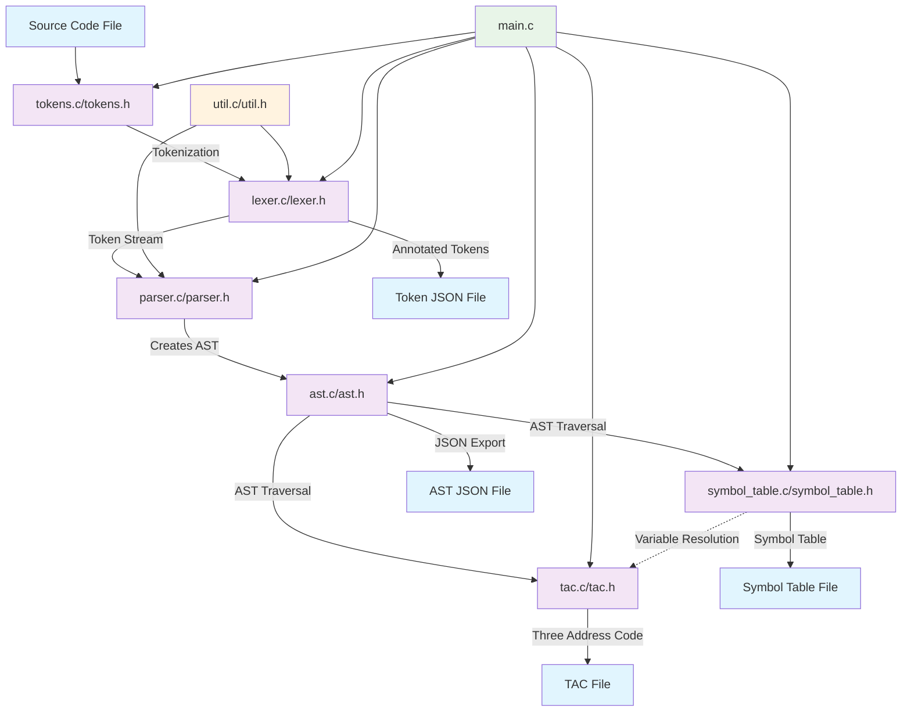

## Compiler System Overview

This is a compiler/interpreter system for a Pascal-like programming language.
The system processes source code through multiple phases to generate Three Address Code (TAC).


#### 1. *Lexical Analysis (Tokenization)*
- *Files*: `tokens.h/c`, `lexer.h/c`
- *Purpose*: Converts source code into a stream of tokens
- *Key Features*:
  - Recognizes keywords (begin, end, if, while, procedure, etc.)
  - Handles identifiers, numbers, operators, and punctuation
  - Produces both simple token files and annotated JSON with line/column info
  - Supports all Pascal-like language constructs

#### 2. *Syntax Analysis (Parsing)*
- *Files*: `parser.h/c`
- *Purpose*: Creates Abstract Syntax Tree (AST) from token stream
- *Grammar Support*:
  - Programs with procedures
  - Variable and constant declarations
  - Control structures (if-then, while-do)
  - Expressions with proper precedence
  - Procedure calls and assignments

#### 3. *Abstract Syntax Tree*
- *Files*: `ast.h/c`
- *Purpose*: Tree representation of program structure
- *Node Types*: Program, Block, Declarations, Statements, Expressions, etc.
- *Features*: JSON export, tree traversal, memory management

#### 4. *Symbol Table Management*
- *Files*: `symbol_table.h/c`
- *Purpose*: Tracks variables, constants, and procedures
- *Scope Handling*: Global variables and procedure-local variables
- *Features*: Symbol resolution, type tracking (mutable/immutable)

#### 5. *Code Generation*
- *Files*: `tac.h/c`
- *Purpose*: Generates Three Address Code (intermediate representation)
- *Capabilities*:
  - Arithmetic operations with temporary variables
  - Control flow (labels, jumps, conditionals)
  - Procedure calls and returns
  - Variable assignments and loads


#### 6. *Utilities*
- *Files*: `util.h/c`
- *Purpose*: Helper functions for symbol handling and debugging

#### 7. *Main Controller*
- *Files*: `main.c`
- *Purpose*: Orchestrates the entire compilation pipeline


### Language Features

#### Data Types & Declarations
```pascal
const PI = 3;
var x, y, result;
```

#### Procedures
```pascal
procedure calculateSum;
begin
    result := x + y
end;
```

#### Control Structures
```pascal
if (x > y) then result := x;
while (x # 0) do x := x - 1;
```

#### Expressions & Operations
- Arithmetic: `+`, `-`, `*`, `/`
- Comparisons: `=`, `#` (not equal), `<`, `<=`, `>`, `>=`
- Precedence handling for complex expressions

### Compilation Pipeline

1. *Source File* → *Tokenization* → *Token Stream*
2. *Token Stream* → *Parsing* → *Abstract Syntax Tree*
3. *AST* → *Symbol Analysis* → *Symbol Table*
4. *AST + Symbol Table* → *Code Generation* → *Three Address Code*

### Output Files Generated

- *Token File*: Raw token sequence
- *Annotated Tokens JSON*: Tokens with source location info
- *AST JSON*: Complete syntax tree structure
- *Symbol Table*: Variable and procedure definitions
- *TAC File*: Three address code (two formats: structured and easy-parse)

### Key Design Features

#### Memory Management
- Proper allocation/deallocation for all data structures
- Temporary variable tracking in TAC generation
- Cleanup functions for AST, symbol table, and TAC

#### Error Handling
- Syntax error reporting with context
- Undefined variable detection
- Memory allocation failure handling

#### Extensibility
- Modular design allows easy addition of language features
- Clean separation of concerns between phases
- JSON exports enable external tool integration

#### Code Generation Strategy
- Uses temporary variables for intermediate results
- Generates labels for control flow
- Handles variable scoping correctly
- Produces readable three-address code format


