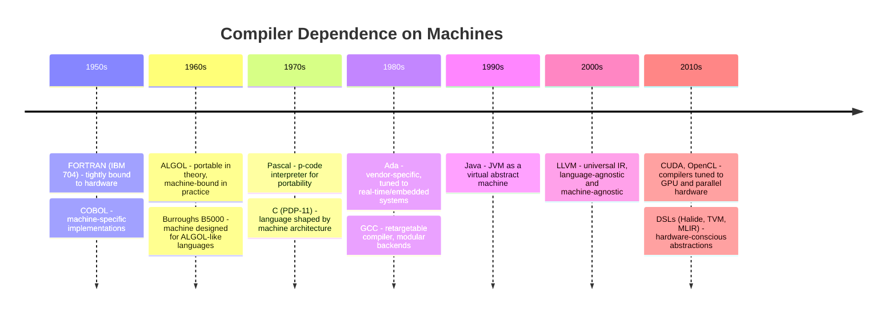

## A Classic Approch to Compilers

This is the first part in a series of two. In [ch07](./../../ch07/)
[modern](./../../ch07/modern/) we will look at compilers with a
different--more modern--approach. To be quite frank: *It is more an application
of programming concepts that will be introduced through the chapters, than a
reflection of actual current compiler designs*.

The approach in this folder incorporates elements such as a handcrafted recursive descent
parser, an imperative programming style, and a linear pipeline in which each tool is applied
sequentially to transform the source code. It serves as a clear illustration of how
compiler code evolves from high-level specifications toward a working implementation.

In this example, C was chosen as the implementation language, reflecting a deliberate balance
between performance and control. Its efficiency and closeness to the underlying hardware make 
it well-suited for compiler development, particularly when the generated code must eventually
execute on a target machine at near-optimal speed. By using C, the compiler both leverages a
low-level, machine-oriented abstraction and demonstrates how language choice influences the
design, structure, and performance characteristics of a compiler itself.

### History of Compilers and Closeness to the Machine

The history of compilers is, in many ways, the history of programming languages struggling against
the constraints of the machine. In the earliest decades of digital computing, the line between a
programming language and its target hardware was thin and permeable: a compiler was less a general
translator than a carefully engineered bridge to a very specific model of computation. Over time,
as machines diversified, the compiler took on a new role: to abstract away the quirks of the hardware,
to offer programmers the illusion of portability. Yet the machine has never disappeared from the
story; it still shapes the languages we use, sometimes in subtle ways.

In the 1950s, the first widely adopted high-level languages emerged in the shadow of mainframes.
FORTRAN, released in 1957 for the IBM 704, was an ambitious attempt to allow scientists and engineers
to write formulae in something resembling mathematics. Its compiler, however, was deeply machine-conscious:
the IBM 704’s instruction set and limited floating-point performance dictated the optimisations that
the compiler team pioneered, from loop unrolling to register allocation. Similarly, COBOL, designed
in 1959 for business data processing, promised human readability but was implemented separately
for each manufacturer’s machine. Decimal arithmetic, a business requirement, was handled differently
on different hardware, making COBOL a language "portable" in name more than reality.

The 1960s brought ALGOL, a language aimed at clarity and algorithmic description rather than any one
computer. Yet in practice, ALGOL’s fate was bound to machines: each implementation required a compiler
handcrafted for the target hardware, and its lack of a standard runtime environment hindered portability.
A fascinating inversion occurred with the Burroughs B5000: here the hardware was designed for ALGOL-like
languages, making the machine itself a kind of compiler target optimised for high-level constructs.
For once, the language dictated the architecture rather than the other way around.

By the 1970s, the problem of portability was becoming central. Pascal, initially bound to specific
machines, became far more portable through the UCSD p-code system, which introduced an abstract virtual
machine. Programs were compiled into p-code, which could then be interpreted or compiled further on
any machine with a p-code interpreter. At the same time, C emerged from Bell Labs, designed directly
on the PDP-11. C’s types and operators map uncannily well onto the PDP-11’s word size, memory model,
and instruction set. Here again, machine and language co-evolved: C was low-level enough to serve as
"portable assembly," but its first form was deeply tied to one specific architecture.

The 1980s extended this tension. Ada, commissioned for the U.S. Department of Defense, aimed at
general-purpose use with strong typing and concurrency features. But Ada compilers often had to be
tuned to particular vendor machines, especially in real-time and embedded contexts. In contrast, GCC,
first released in 1987, marked a turning point: it separated language front ends from machine back
ends, making compilers retargetable. For the first time, one compiler could serve as a universal
framework, insulating programmers from hardware details while still exploiting them for efficiency.

In the 1990s, this insulation deepened with Java, whose virtual machine provided a standard runtime
across platforms. Instead of compiling directly to the quirks of hardware, Java compilers targeted
the JVM, an abstract machine. Hardware came back into the picture only at runtime, when just-in-time
(JIT) compilers translated bytecode into native code. By the 2000s, LLVM extended this approach,
introducing a powerful, language-agnostic intermediate representation (IR) that could support
optimisation, analysis, and retargeting in a modular fashion. With LLVM, the compiler ceased to be
a bespoke bridge and became a toolkit for constructing many bridges at once.

Yet even as compilers became more abstract, the machine never entirely receded. The rise of GPUs
and parallel computing in the 2010s demanded new compilers attuned to highly specialised architectures.
Frameworks like CUDA and OpenCL made programmers aware of memory hierarchies, vector units, and
thread models, binding software performance tightly to the hardware beneath. More recently,
domain-specific languages such as Halide, TVM, and MLIR continue this tradition, abstracting the
hardware while nonetheless remaining deeply informed by it.

From FORTRAN’s close coupling to the IBM 704 to LLVM’s portable IRs, the arc of compiler history
shows a gradual loosening of the bond between language and machine. But the bond has never been
broken. The compiler, after all, is the translator between human thought and mechanical execution.
It cannot be entirely free of the machine, only ever negotiating with it.

