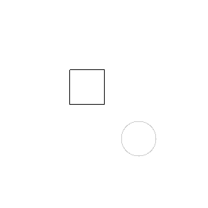
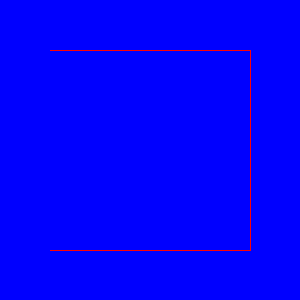
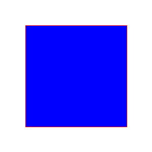

Developer thinking ..

We begin by collaborating closely with our client to determine their actual needs.
From our discussions, it appears that some kind of a PostScript-inspired interpreter
would meet their requirements. As a craftsperson, I might have previously encountered
concepts related to PostScript in the way vector graphics are understood but I’ll admit
that my understanding was not at all complete. Nevertheless, starting with a concrete and
tangible approach allows us to both clarify the client's vision and refine our own
understanding. The client also seems to be not sure on PostScript, but understands
that the findings they did, were some kind of PostScript inspired graphics
This hands-on exploration helps align our thoughts and fosters a productive dialogue.


### Defining the Client's Requirements

To provide the client with a clear picture of what we are aiming for, I delved into the
essentials of PostScript (what I think). Based on this study, a minimal functional
implementation requires three key components:

1. Interpreter: The central engine that parses and executes the instructions in a
   PostScript-like program.

2. A Renderer or Rasterizer: A system that converts vector-based graphics (shapes,
   paths, and lines) into pixel data suitable for display or saving as an image file.
   A renderer could potentially besides pixels, also render in PDF or other vecotr formats.

3. Graphics State: A structure that manages the current drawing parameters, such as
   color, line width, transformation matrices, and active paths.

Together, these components should form the backbone of a simple system and provide
a foundation for further development.


### Sketching a Prototype

To translate this conceptual framework into a working model, we can outline our prototype as follows:

1. The Interpreter:
    - This component reads commands, processes them one by one, and manipulates the graphic state accordingly.
    - It also serves as the interface for executing drawing instructions, applying transformations, and
      managing the graphics state stack.

2. The Rasterizer:
    - Responsible for rendering paths and shapes to a pixel-based canvas.
    - It will handle common operations like stroking paths (outlining) and filling areas with color, as well
      as manage the pixel grid for saving or displaying the image.

3. The Graphics State:
    - A central repository for parameters such as the current path, fill and stroke colors, line width, and
      transformation matrix.
    - This state will support nesting and restoration through commands like gsave and grestore, enabling
      hierarchical and reusable design elements.


### First suggestion ..

To make this more relatable for the client, we have to present an example program written for this
(what we think is a) PostScript-inspired language.

```python
class Rasterizer:
        self.width = width
        self.height = height
        self.canvas = [['255 255 255' for _ in range(width)] for _ in range(height)]

    def set_pixel(self, x, y, color):
        ..

    def draw_line(self, x0, y0, x1, y1, color):
        .. algo for line drawing

    def to_ppm(self, filename="output.ppm"):
        .. save a pixel file


class GraphicsState:
        self.rasterizer = rasterizer
        self.line_width = 1
        self.fill_color = (0, 0, 0)
        self.stroke_color = (0, 0, 0)
        self.current_position = (0, 0)
        self.stack = [] # stack of graphic states

    def save(self):
        .. graphic state

    def restore(self, state):
        .. graphic state


class PostScriptInterpreter:
        self.state = GraphicsState(rasterizer)
        self.graphics_state_stack = []

    def execute(self, program):
        ..

    @property
    def commands(self):
        return {
            "moveto": self.moveto,
            "lineto": self.lineto,
            "setrgbcolor": self.setrgbcolor,
            "stroke": self.stroke,
            "save": self.save,
            "restore": self.restore,
            "showpage": self.showpage,
            "newpath": self.newpath,
            "rlineto": self.rlineto,
            "closepath": self.closepath,
            "setgray": self.setgray,
            "fill": self.fill,
            "arc": self.arc,
        }

    def moveto(self, x, y):
        self.state.current_position = (x, y)

    def lineto(self, x, y):
        x0, y0 = self.state.current_position
        self.state.rasterizer.draw_line(x0, y0, x, y, self.state.stroke_color)
        self.state.current_position = (x, y)

    def rlineto(self, dx, dy):
        ..

    def arc(self, x, y, r, start_angle, end_angle):
        ..

    def newpath(self):
        self.state.current_position = (0, 0)

    def closepath(self):
        x0, y0 = self.state.current_position
        self.state.rasterizer.draw_line(x0, y0, self.state.current_position[0], self.state.current_position[1], self.state.stroke_color)

    def setrgbcolor(self, r, g, b):
        self.state.stroke_color = (int(r * 255), int(g * 255), int(b * 255))

    def setgray(self, gray):
        self.state.stroke_color = (int(gray * 255), int(gray * 255), int(gray * 255))

    def fill(self):
        ..

    def stroke(self):
        ..

    def save(self):
        ..

    def restore(self):
        ..

    def showpage(self):
        self.state.rasterizer.to_ppm()


# example
rasterizer = Rasterizer(300, 300)
interpreter = PostScriptInterpreter(rasterizer)

program = [
    # draw and fill a rectangle
    ("newpath",),
    ("fill",),
    ("moveto", 100, 100),
    ("rlineto", 50, 0),
    ("rlineto", 0, 50),
    ("rlineto", -50, 0),
    ("rlineto", 0, -50),
    ("setgray", 0.8),
    ("closepath",),

    # draw and stroke a circle
    ("newpath",),
    ("arc", 200, 200, 25, 0, 360),
    ("setrgbcolor", 1, 0, 0),
    ("stroke",),
    ("showpage",),
]

interpreter.execute(program)
```

A bit premature, I think I have something:



__Client: *I see you’ve got something rendering—this is exciting! But.. hold on. The image doesn't seem right. The square is black, and the circle is gray? That's not what the script says, is it?*__

Developer: Hmm, let me take a look. You’re absolutely right—the script specifies a gray fill for the square and a red stroke for the circle. What we’re seeing doesn’t match the expected output. This suggests there’s an issue with how the commands are interpreted or applied.

We seem to get things going, but the image seems to be not corresponding to the script?

Developer: Hm, let me get back to you ..

The square is black, and the circle is gray? I'll wait before I talk to the client again, .. this must be fixed or amended somehow.


### Second suggestion ...

Back to the texteditor. Ok, so some changes needs to be done. Ready, here comes the next proposal.

```python
class GraphicsState:

    def __init__(self):
        self.path = []  # current drawing path
        self.line_width = 1.0
        self.fill_color = (0, 0, 0)
        self.stroke_color = (0, 0, 0)
        self.current_position = (0, 0)
        self.saved_states = []

    def save(self):
        self.saved_states.append({
            "path": list(self.path),
            "line_width": self.line_width,
            "fill_color": self.fill_color,
            "stroke_color": self.stroke_color,
            "current_position": self.current_position
        })

    def restore(self):
        if self.saved_states:
            state = self.saved_states.pop()
            self.path = state["path"]
            self.line_width = state["line_width"]
            self.fill_color = state["fill_color"]
            self.stroke_color = state["stroke_color"]
            self.current_position = state["current_position"]


class Interpreter:
    def __init__(self, rasterizer):
        self.stack = []
        self.graphics_state = GraphicsState()
        self.rasterizer = rasterizer

    def execute(self, program):
        for command in program:
            self._execute_command(command)

    def _execute_command(self, command):
        cmd = command[0]
        args = command[1:]

        if cmd == "newpath":
            self.graphics_state.path = []

        elif cmd == "moveto":
            x, y = args
            self.graphics_state.current_position = (x, y)

        elif cmd == "lineto":
            x, y = args
            self.graphics_state.path.append((self.graphics_state.current_position, (x, y)))
            self.graphics_state.current_position = (x, y)

        elif cmd == "rlineto":
            dx, dy = args
            x, y = self.graphics_state.current_position
            new_x, new_y = x + dx, y + dy
            self.graphics_state.path.append(((x, y), (new_x, new_y)))
            self.graphics_state.current_position = (new_x, new_y)

        elif cmd == "arc":
            cx, cy, radius, start_angle, end_angle = args
            self.graphics_state.path.append(("arc", cx, cy, radius, start_angle, end_angle))

        elif cmd == "closepath":
            self.graphics_state.path.append("close")

        elif cmd == "stroke":
            self.rasterizer.stroke(self.graphics_state.path, self.graphics_state.stroke_color, self.graphics_state.line_width)

        elif cmd == "fill":
            self.rasterizer.fill(self.graphics_state.path, self.graphics_state.fill_color)

        elif cmd == "setlinewidth":
            self.graphics_state.line_width = args[0]

        elif cmd == "setgray":
            gray = args[0]
            self.graphics_state.fill_color = self.graphics_state.stroke_color = (gray, gray, gray)

        elif cmd == "setrgbcolor":
            self.graphics_state.fill_color = self.graphics_state.stroke_color = tuple(args)

        elif cmd == "gsave":
            self.graphics_state.save()

        elif cmd == "grestore":
            self.graphics_state.restore()


class Rasterizer:
    def __init__(self, width, height):
        self.width = width
        self.height = height
        self.canvas = [[(1.0, 1.0, 1.0) for _ in range(width)] for _ in range(height)]  # white bg

    def stroke(self, path, color, line_width):
        # stroke a path with a specified color (and line width)
        for segment in path:
            if segment == "close":
                continue
            self._draw_line(segment[0], segment[1], color)

    def fill(self, path, color):
        # create an outline of the path by stroking it
        for segment in path:
            if isinstance(segment, tuple):
                self._draw_line(segment[0], segment[1], color)

        # simple flood fill algorithm
        self._flood_fill(color)

    def _draw_line(self, start, end, color): # Bresenham or Wu?
        x1, y1 = start
        x2, y2 = end
        dx = abs(x2 - x1)
        dy = abs(y2 - y1)
        sx = 1 if x1 < x2 else -1
        sy = 1 if y1 < y2 else -1
        err = dx - dy

        while True:
            if 0 <= x1 < self.width and 0 <= y1 < self.height:
                self.canvas[y1][x1] = color
            if x1 == x2 and y1 == y2:
                break
            e2 = err * 2
            if e2 > -dy:
                err -= dy
                x1 += sx
            if e2 < dx:
                err += dx
                y1 += sy

    def _flood_fill(self, fill_color):
        seed_x, seed_y = self.width // 2, self.height // 2
        target_color = self.canvas[seed_y][seed_x]

        if target_color == fill_color:
            return  # no infinite recursion

        stack = [(seed_x, seed_y)]
        while stack:
            x, y = stack.pop()
            if 0 <= x < self.width and 0 <= y < self.height and self.canvas[y][x] == target_color:
                self.canvas[y][x] = fill_color
                stack.extend([(x + 1, y), (x - 1, y), (x, y + 1), (x, y - 1)])

    def save_to_ppm(self, filename):
        # save the canvas of pixels as a PPM3
        with open(filename, 'w') as f:
            f.write("P3\n")
            f.write(f"{self.width} {self.height}\n")
            f.write("255\n")
            for row in self.canvas:
                for r, g, b in row:
                    f.write(f"{int(r * 255)} {int(g * 255)} {int(b * 255)} ")
                f.write("\n")


# example
rasterizer = Rasterizer(300, 300)
interpreter = Interpreter(rasterizer)

program = [
    ("newpath",),
    ("moveto", 50, 50),
    ("lineto", 250, 50),
    ("lineto", 250, 250),
    ("lineto", 50, 250),
    ("closepath",), # do anything?
    ("setrgbcolor", 0, 0, 1),  # blue? here
    ("fill",), # fill now?
    ("setrgbcolor", 1, 0, 0),  # red? here
    ("setlinewidth", 2), # no width impl.
    ("stroke",),
]
interpreter.execute(program)
rasterizer.save_to_ppm("output2.ppm")
```


#### Some changes

1. The first program uses a simpler approach to managing graphics state. The drawing operations like "line" or "arc"
directly update the canvas as soon as they are called, without saving a record of the shapes being drawn. The
graphics state is minimal and doesn't store information about the paths or complex shape properties.

2. In contrast, the *second* program explicitly keeps track of a list of shapes and paths that are being drawn. These
shapes are stored temporarily and can be processed later, for example, to fill them or to stroke their outlines.
This makes the second program more sophisticated and allows for more flexible rendering operations.

3. In the first program, the rasterizer handles very basic tasks like setting individual pixels and drawing simple
lines. If the program needs to draw complex shapes like a circle, the interpreter itself calculates all the
points of the shape and tells the rasterizer to connect those points with lines.

4. The *second* program's rasterizer is more capable. It can handle entire paths (collections of lines and curves)
as a single unit, and it provides higher-level operations like filling shapes. This division of responsibilities
makes the second program's design much more modular and easier to extend.

5. The first program does not explicitly save paths. For example, when you draw a rectangle, each line is drawn
immediately, and there is no memory of the rectangle itself once the lines are on the canvas. This means operations
like "filling" a shape or reusing its path aren't really possible.

6. The *second* program, however, keeps a record of paths as they are created. This allows the program to perform more
complex actions, like filling the shape with a color or stroking its outline, only after the entire path is defined.
Paths can also be reused or manipulated in more advanced ways.

7. The first program adopts a straightforward, immediate approach to rendering: each command directly affects the
canvas as it is encountered. This approach is simple to understand and implement but lacks the flexibility for more
advanced graphics features.

8. The *second* program uses a deferred rendering approach: it builds up a representation of the graphics (paths and
shapes) in memory and processes them all at once when the user requests a "fill" or "stroke" operation. This approach
is closer to how professional graphics systems like PostScript or PDF rendering engines work, offering more power Sand
control.

Ok, so we seem to have made some progress. However, what comes out isn't improving ..



__Client: *Could it be that the program isn't respecting the "setrgbcolor" or the previous example with "setgray" commands? I mean, I don't know much about these scripts, but that seems like an obvious thing to check.*__

Developer: Exactly—that's a good observation. Let me explain how the interpreter processes these commands. It reads them sequentially, updating the graphics state as it goes. If the color state isn’t being applied correctly or gets reset unexpectedly, we might see something like this. I suspect the issue lies in either how the "fill" or "stroke" operations handle the current graphics state.

__Client: *Ah, I see. So, the colors for the square and circle might not be getting stored or used properly?*__

Developer: That's one possibility. Another could be the order in which commands are executed. Let’s consider the script again. It says to fill the square first with a light gray and then stroke the circle in red previous example, and now there should be a blue square with a red line around. If the "fill" operation isn't considering the current fill color .. or if the "stroke" operation is defaulting to black .. we'd see exactly this kind of discrepancy.

__Client: *Interesting. Can the interpreter or rasterizer debug itself somehow? Like show the current state of the commands or colors while processing?*__

Developer: Absolutely! That's a great idea. I could add logging or a debugging mode to print out the graphics state after each operation. It would show things like the current position, stroke color, fill color, and path. This could help us pinpoint the exact moment something goes wrong.

__Client: *Okay, but I'm curious .. why wouldn't this just work out of the box? Is it normal for systems like this to have such issues?*__

Developer: It's quite normal during development, especially for something like a PostScript-like interpreter. These systems rely heavily on state management and precise command execution. If even a single part of the chain .. like updating the stroke color .. isn't handled properly, you'll see issues downstream. It's like baking a cake: if you forget to mix the sugar in before baking, you'll notice it, but only after the cake is done.

__Client: *Good analogy! So what's the next step? Can we fix it quickly?*__

Developer: I think so. First, I'll verify that the graphics state is updating correctly when "setrgbcolor" and "setgray" are called. Then, I'll check that the "fill" and "stroke" operations are pulling from the correct part of the state. I can also compare the commands and rasterizer behaviors to ensure they're in sync.

__Client: *Sounds good. I'll leave you to it. Just let me know when you've got a fix—or if you need me to test anything on my end.*__

Developer: Will do! By the way, this debugging process is a great learning moment. Once we get it working, I can explain more about how interpreters like this handle state and why these issues can arise.

__Client: *Looking forward to it. Debugging aside, it's exciting to see the interpreter starting to take shape.*__

Developer: It is! And once we iron out these issues, it'll feel even better. Let me get back to it, and I'll keep you posted.

Yeah, that was a mistake by me to not show any real progress. But on the other hand, transparency gives a lot of information to both. Assuming the time spent wan't detrimental, both the developer and the client benefitted from the exchange?

So what is wrong in the program? Let's have a look ..

```python
program = [
    ("newpath",),
    ("moveto", 50, 50),
    ("lineto", 250, 50),
    ("lineto", 250, 250),
    ("lineto", 50, 250),
    ("closepath",), # do anything?
    ("setrgbcolor", 0, 0, 1),  # blue? here
    ("fill",), # fill now?
    ("setrgbcolor", 1, 0, 0),  # red? here
    ("setlinewidth", 2), # no width impl.
    ("stroke",),
]
```

### Third attempt ..

Ok, this program is getting cluttered. We have to do some basic redesigning. But also fix our
interpretation, even if the graphics have improved. Oh, I have to look up how PostScript really look like.
Reading ..

After reading, could we try something else, a JavaScript implementation?

```javascript
class Interpreter {

    constructor(canvas) {
        this.stack = [];
        this.systemdict = {};
        this.ctx = canvas.getContext('2d');

        this.definePrimitives();
    }

    definePrimitives() {
        this.systemdict['def'] = () => this.def();
        this.systemdict['if'] = () => this.ifOp();
        this.systemdict['ifelse'] = () => this.ifelse();
        this.systemdict['for'] = () => this.forOp();
        this.systemdict['repeat'] = () => this.repeat();
        this.systemdict['load'] = () => this.load();
        this.systemdict['add'] = () => this.add();
        this.systemdict['sub'] = () => this.sub();
        this.systemdict['mul'] = () => this.mul();
        this.systemdict['div'] = () => this.div();
        this.systemdict['eq'] = () => this.eq();
        this.systemdict['dup'] = () => this.dup();
        this.systemdict['exch'] = () => this.exch();
        this.systemdict['moveto'] = () => this.moveto();
        this.systemdict['lineto'] = () => this.lineto();
        this.systemdict['stroke'] = () => this.stroke();
        this.systemdict['setrgbcolor'] = () => this.setrgbcolor();
        this.systemdict['showpage'] = () => this.showpage();
    }

    // stack manipulation: def, dup, exch
    def() {
        const value = this.stack.pop();
        const key = this.stack.pop();
        this.systemdict[key] = value;
    }

    dup() {
        const value = this.stack[this.stack.length - 1];
        this.stack.push(value);
    }

    exch() {
        const a = this.stack.pop();
        const b = this.stack.pop();
        this.stack.push(a);
        this.stack.push(b);
    }

    // arithmetic
    add() {
        const a = this.stack.pop();
        const b = this.stack.pop();
        this.stack.push(a + b);
    }

    sub() {
        const a = this.stack.pop();
        const b = this.stack.pop();
        this.stack.push(b - a);
    }

    mul() {
        const a = this.stack.pop();
        const b = this.stack.pop();
        this.stack.push(a * b);
    }

    div() {
        const a = this.stack.pop();
        const b = this.stack.pop();
        this.stack.push(b / a);
    }

    eq() {
        const a = this.stack.pop();
        const b = this.stack.pop();
        this.stack.push(a === b);
    }

    // control flow
    ifOp() {
        const condition = this.stack.pop();
        const proc = this.stack.pop();
        if (condition) {
            this.execute(proc);
        }
    }

    ifelse() {
        const falseProc = this.stack.pop();
        const trueProc = this.stack.pop();
        const condition = this.stack.pop();
        if (condition) {
            this.execute(trueProc);
        } else {
            this.execute(falseProc);
        }
    }

    repeat() {
        const proc = this.stack.pop();
        const count = this.stack.pop();
        for (let i = 0; i < count; i++) {
            this.execute(proc);
        }
    }

    forOp() {
        const proc = this.stack.pop();
        const end = this.stack.pop();
        const incr = this.stack.pop();
        const start = this.stack.pop();
        for (let i = start; i <= end; i += incr) {
            this.stack.push(i);
            this.execute(proc);
        }
    }

    // loading values
    load() {
        const key = this.stack.pop();
        this.stack.push(this.systemdict[key]);
    }

    // drawing: moveto, lineto, setrgbcolor, stroke, showpage
    moveto() {
        const y = this.stack.pop();
        const x = this.stack.pop();
        this.ctx.moveTo(x, y);
    }

    lineto() {
        const y = this.stack.pop();
        const x = this.stack.pop();
        this.ctx.lineTo(x, y);
    }

    setrgbcolor() {
        const b = this.stack.pop();
        const g = this.stack.pop();
        const r = this.stack.pop();
        this.ctx.strokeStyle = `rgb(${r * 255}, ${g * 255}, ${b * 255})`;
    }

    stroke() {
        this.ctx.stroke();
    }

    showpage() {
        this.ctx.beginPath(); // clear current path
    }

    // a procedure (array of operations)
    execute(proc) {
        proc.forEach(op => {
            if (typeof op === 'function') {
                op();
            } else if (typeof op === 'number') {
                this.stack.push(op);
            } else if (typeof op === 'string') {
                this.systemdict[op]();
            }
        });
    }
}


const canvas = document.getElementById('canvas');
const ps = new Interpreter(canvas);

// example: move to (100, 100), draw a line to (200, 200), and stroke the line
ps.stack.push(100, 100);
ps.systemdict['moveto']();
ps.stack.push(200, 200);
ps.systemdict['lineto']();
ps.systemdict['stroke']();
```

Hm, realising that *I* got it all wrong, as it uses Reverse Polish Notation (RPN) and evaluation
thus is suspended until a command comes along which executes what is on the stack, and uses
the current graphic state to fill paths .. then restructure, but keep the rasterizer for now.


```python

class GraphicsState:
    def __init__(self):
        self.path = []
        self.line_width = 1.0
        self.fill_color = (0, 0, 0)
        self.stroke_color = (0, 0, 0)
        self.current_position = (0, 0)
        self.saved_states = []

    def save(self):
        self.saved_states.append({
            "path": list(self.path),
            "line_width": self.line_width,
            "fill_color": self.fill_color,
            "stroke_color": self.stroke_color,
            "current_position": self.current_position
        })

    def restore(self):
        if self.saved_states:
            state = self.saved_states.pop()
            self.path = state["path"]
            self.line_width = state["line_width"]
            self.fill_color = state["fill_color"]
            self.stroke_color = state["stroke_color"]
            self.current_position = state["current_position"]


class Command:
    def execute(self, interpreter):
        raise NotImplementedError("Execute must be implemented by subclasses")


class NewPathCommand(Command):
    def execute(self, interpreter):
        interpreter.graphics_state.path = []


class MoveToCommand(Command):
    def execute(self, interpreter):
        y, x = interpreter.pop_two()  # PostScript order (y, x)
        interpreter.graphics_state.current_position = (x, y)


class LineToCommand(Command):
    def execute(self, interpreter):
        y, x = interpreter.pop_two()  # PostScript order (y, x)
        start_pos = interpreter.graphics_state.current_position
        end_pos = (x, y)
        interpreter.graphics_state.path.append((start_pos, end_pos))
        interpreter.graphics_state.current_position = end_pos


class SetLineWidthCommand(Command):
    def execute(self, interpreter):
        line_width = interpreter.stack.pop()
        interpreter.graphics_state.line_width = line_width


class SetGrayCommand(Command):
    def execute(self, interpreter):
        gray = interpreter.stack.pop()
        interpreter.graphics_state.fill_color = interpreter.graphics_state.stroke_color = (gray, gray, gray)


class SetRGBColorCommand(Command):
    def execute(self, interpreter):
        b, g, r = interpreter.pop_three()  # PostScript order (b, g, r)
        interpreter.graphics_state.fill_color = interpreter.graphics_state.stroke_color = (r, g, b)


class StrokeCommand(Command):
    def execute(self, interpreter):
        path = interpreter.graphics_state.path
        color = interpreter.graphics_state.stroke_color
        line_width = interpreter.graphics_state.line_width
        interpreter.rasterizer.stroke(path, color, line_width)


class FillCommand(Command):
    def execute(self, interpreter):
        path = interpreter.graphics_state.path
        color = interpreter.graphics_state.fill_color
        interpreter.rasterizer.fill(path, color)

class ClosePathCommand(Command):
    def execute(self, interpreter):
        if interpreter.graphics_state.path:
            start_point = interpreter.graphics_state.path[0][0]  # first segment
            current_position = interpreter.graphics_state.current_position
            interpreter.graphics_state.path.append((current_position, start_point))
            interpreter.graphics_state.current_position = start_point

class Interpreter:
    def __init__(self, rasterizer):
        self.stack = []
        self.graphics_state = GraphicsState()
        self.rasterizer = rasterizer
        self.commands = {
            "newpath": NewPathCommand(),
            "moveto": MoveToCommand(),
            "lineto": LineToCommand(),
            "setlinewidth": SetLineWidthCommand(),
            "setgray": SetGrayCommand(),
            "setrgbcolor": SetRGBColorCommand(),
            "stroke": StrokeCommand(),
            "fill": FillCommand(),
            "closepath": ClosePathCommand(),
        }

    def execute(self, program):
        for token in program:
            if isinstance(token, (int, float, tuple)):  # numbers or tuples onto the stack
                self.stack.append(token)
            elif isinstance(token, str):  # exec commands
                if token in self.commands:
                    self.commands[token].execute(self)
                else:
                    raise ValueError(f"Unknown command: {token}")
            else:
                raise ValueError(f"Invalid token: {token}")

    def pop_two(self):
        return self.stack.pop(), self.stack.pop()

    def pop_three(self):
        return self.stack.pop(), self.stack.pop(), self.stack.pop()


class Rasterizer:
    def __init__(self, width, height):
        self.width = width
        self.height = height
        self.canvas = [[(1.0, 1.0, 1.0) for _ in range(width)] for _ in range(height)]

    def stroke(self, path, color, line_width): # widht not impl.
        for segment in path:
            if segment == "close":
                continue
            self._draw_line(segment[0], segment[1], color)

    def fill(self, path, color):
        for segment in path:
            if isinstance(segment, tuple):
                self._draw_line(segment[0], segment[1], color)
        self._flood_fill(color)

    def _draw_line(self, start, end, color):
        x1, y1 = start
        x2, y2 = end
        dx = abs(x2 - x1)
        dy = abs(y2 - y1)
        sx = 1 if x1 < x2 else -1
        sy = 1 if y1 < y2 else -1
        err = dx - dy

        while True:
            if 0 <= x1 < self.width and 0 <= y1 < self.height:
                self.canvas[y1][x1] = color
            if x1 == x2 and y1 == y2:
                break
            e2 = err * 2
            if e2 > -dy:
                err -= dy
                x1 += sx
            if e2 < dx:
                err += dx
                y1 += sy

    def _flood_fill(self, fill_color):
        seed_x, seed_y = self.width // 2, self.height // 2
        target_color = self.canvas[seed_y][seed_x]

        if target_color == fill_color:
            return  # no infinite recursion

        stack = [(seed_x, seed_y)]
        while stack:
            x, y = stack.pop()
            if 0 <= x < self.width and 0 <= y < self.height and self.canvas[y][x] == target_color:
                self.canvas[y][x] = fill_color
                stack.extend([(x + 1, y), (x - 1, y), (x, y + 1), (x, y - 1)])

    def save_to_ppm(self, filename):
        with open(filename, 'w') as f:
            f.write("P3\n")
            f.write(f"{self.width} {self.height}\n")
            f.write("255\n")
            for row in self.canvas:
                for r, g, b in row:
                    f.write(f"{int(r * 255)} {int(g * 255)} {int(b * 255)} ")
                f.write("\n")

# example
rasterizer = Rasterizer(300, 300)
interpreter = Interpreter(rasterizer)

program = [
    "newpath",
    50, 50, "moveto",
    250, 50, "lineto",
    250, 250, "lineto",
    50, 250, "lineto",
    "closepath",
    0, 0, 1, "setrgbcolor",  # blue
    "fill",
    1, 0, 0, "setrgbcolor",  # red
    2, "setlinewidth",
    "stroke",
]

interpreter.execute(program)
rasterizer.save_to_ppm("output3.ppm")
```

Yea this we whould be able to show the client?



Developer: Good news it shows what the program intended!

__Client: *Fantastic! Can we head over to the rasterizing?*__

Developer: Yes, let's do that. Let's go to [rendering](../render) or rasterizing ..
