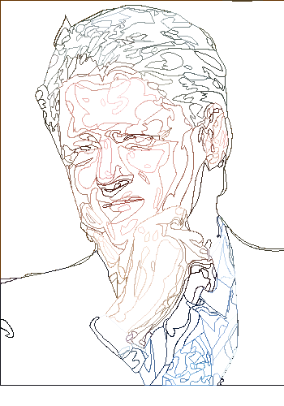

## Rendering

To fully understand how we can render vector graphics, we first need to comprehend what vector graphics are.
Vector graphics are images represented by paths, rather than pixels. These paths are described using geometric
shapes such as lines, curves, and polygons, and each of these shapes can have specific attributes like color
and stroke. A popular format for storing vector graphics is SVG (Scalable Vector Graphics), which is widely
used and well-supported. PostScript is unfourtantely not very common today as solutions for rendering graphics. 

In this first exercise, we will focus on how to transform vector data into pixel data. Our goal is to take a simple
SVG image and render it into a rasterized format, such as a PPM (Portable Pixmap) image, which we can view
easily on most systems. To start, we’ll experiment with a relatively simple and easily parsed image, which in
this case is an SVG representation of Bill Clinton. The SVG can be seen in the clinton.svg file, though if
you don’t have access to an SVG viewer, you can still see the rendered output below (n PNG).


### Parsing

Before we can render the image, we first need to parse the SVG file to extract its path data. SVG files are
essentially XML documents, and the first step in working with SVG data is to parse this XML structure. In our
case, we will use a custom SVG parser adapted to our needs, called 'svgparse.py'.

This parser extracts important elements from the SVG, such as the paths, styles, and coordinates. Below is an
example of the type of SVG content our parser will handle:

```xml
<svg xmlns="http://www.w3.org/2000/svg">
    <path style="fill:#653300" d="M274 0 C289 1.667 308 1.667 323 0 L357 0 z"/>
    <path style="fill:#503e20" d="M323 0 C308 1.667 289 1.667 274 0 z"/>
</svg>
```

The key data in this SVG are the 'd' attributes of the <path> elements, which define the drawing commands.
These paths are described using the “M” (move to) and “C” (cubic Bezier curve) commands, which tell the parser
how to render the shape.


### First Attempt at Rendering

With the parsing logic in place, we can attempt to render the image into a rasterized format. Our first attempt
at rendering will focus on generating a basic raster output, stored in the PPM format. The PPM format is ideal
for this purpose because it is easy to work with, and the file contents are human-readable ASCII, which makes
debugging simpler.

After parsing the SVG data and processing it into pixel data, we save the resulting image to a file called
'output.ppm'. The first attempt might not look perfect, but it gives us a foundation to work with and iterate upon.

Below is an image generated from the 'output.ppm' file (here copied in PNG), which illustrates the initial
results of our rasterization:




### Finding Out How Fill Works

Hm, something is lacking. When dealing with vector graphics, one important concept is how the shapes are filled
with color. In SVG, there are several ways to fill a shape, and the method we choose can affect the rendering.
In particular, the "winding" and "evenodd" rules are essential for determining how areas inside a path are filled.

- Winding rule: The winding rule dictates that the interior of a path is filled if the path crosses a boundary in
  a clockwise direction. This rule considers the direction in which the path is drawn to determine what is
  considered "inside" the shape.

- Evenodd rule: The evenodd rule works by counting how many times the path crosses a ray drawn from a point.
  If the count is odd, the area is filled; if the count is even, it is not.

Understanding these rules is crucial for ensuring that shapes are filled correctly, particularly when paths overlap
or self-intersect. Both are used in PostScript, as well as SVG. See FILL.md for more information.


### Second Attempt at Rendering

With the parsing and filling logic in place, we can now move on to the second iteration of our rendering process.
By combining the SVG parsing (which we now handle using Python’s built-in XML parsing tools) with the fill routines
we've implemented, the image starts to look more accurate.


While the first rendering attempt gave us a basic image, this second attempt will involve more refined handling of
fill rules and path rendering, resulting in a more accurate representation of the original vector image. The
rendering will also be more accurate when dealing with overlapping paths or complex shapes.

By leveraging the winding and evenodd fill rules, along with proper path handling, we can achieve a clearer, more
recognizable output. The image now begins to closely resemble the original SVG, but there are many improvements to
be made for further optimisation and refinement.

With each iteration, our goal is to continue improving the quality of the rasterization and make the process of
converting vector data into pixel data as efficient and accurate as possible.

Developer: Now, I seem to have done somethings I think you may like?

__Client: *Yeah, I've been waiting for this moment .. could I see this?*__

Developer: Sure, here is a rendering of Bill Clinton, for now as I haven't integrated anything yet, it is from SVG
another vector graphics format. The PostScript implementation I have to leave to my students ..

And here you enter!


### Things to consider ..

We should start by considering immediate improvements, such as feature enhancements. For example, can you
improve the algorithm that generates the paths? Right now, it doesn’t look good at all.

There are also conditions, iteration variants, and other control structures that need to be implemented.
These could be seen as new features in this context.

Additionally, could you extend the stroke feature to allow for lines thicker than 1 pixel? It's also crucial
to clarify the client's requirements--communication is key here! Did we forgot something important?

On that note, can you improve the communication with the client? Do they need more documentation? What kind
of documentation would be most helpful to them? The requirements are still unclear, and we need to define
what the program's documentation should look like.

How would you assess your progress so far? What elements from the session with the client are worth keeping?
Make sure to separate prototypes from production code as the process moves forward. Up to now, the code has
been more prototype-oriented, even the "new" design, which has mainly been about testing ideas. It hasn't
yet settled into something final. Remember: don't get too attached to the code. The ideas and concepts behind
it are what truly matter and should be preserved.
