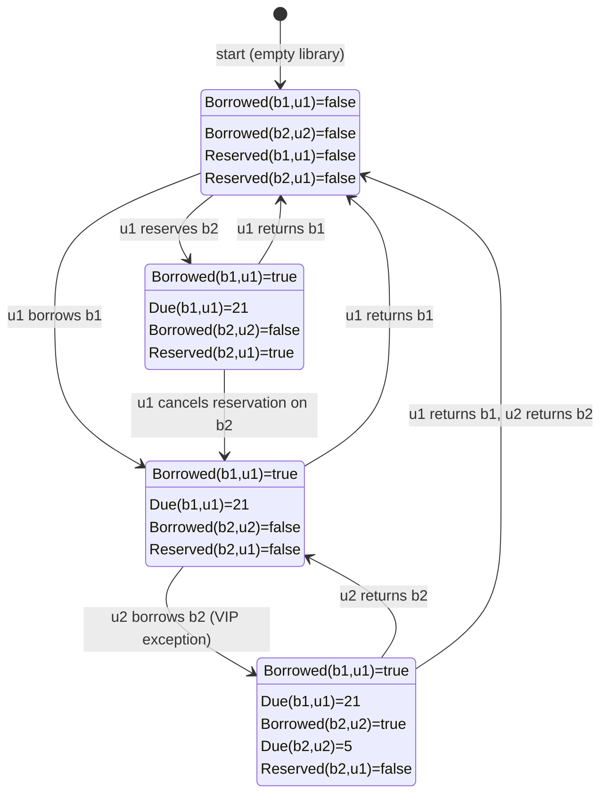

## A Semantic Foundation for Deontic Action Logic in Software Specification

##### Abstract
This paper presents a semantics-first formulation of a deontic action logic suitable
for software specification and analysis. Rather than beginning with axioms or proof
systems, we introduce a small set of semantic primitives--*possible worlds*, *admissibility*,
*obligation*, *permission*, and *action*--directly in first-order logic. We show how normative
concepts arise as constraints over structures, and how this framework naturally supports
reasoning about system behaviour.

A concrete example involving a library information system illustrates the approach.


### 1. Motivation

Software systems increasingly encode normative assumptions: what must never occur,
what must occur under certain conditions, and what actions are permitted or forbidden.
Traditional requirements documents express these informally, while program code
enforces them implicitly. This gap invites misinterpretation.

Deontic logic historically addressed similar problems in ethics and action theory.
However, axiomatic systems often obscure the intended semantics and introduce unintended
commitments. Instead, we adopt a model-theoretic approach, following the spirit of
such philosophers as Stig Kanger and Georg Henrik von Wright, in which norms constrain the
set of admissible structures.

Our aim is not to develop a complete logical calculus, but to provide a *semantic substrate*
that can be understood by developers, audited by stakeholders, and implemented by machines.


### 2. Semantic Primitives

We begin by introducing the core primitives directly.

#### 2.1 Worlds
Let $W$ be a non-empty set. Elements $w \in W$ are called worlds. A world represents a complete
description of a system state, or, if desired, a complete execution history. No internal
structure of worlds is assumed at this stage.

#### 2.2 Admissibility
Not all worlds are acceptable. Norms distinguish acceptable from unacceptable system behaviours.

We introduce a unary predicate:
```math
A(w)
```
read as "w is admissible".

The set of admissible worlds is thus:
```math
A = \{ w \in W \mid A(w) \}
```
Normativity enters the model entirely through this predicate.

##### NOTE: Admissable
A world is admissible if it is a world the system is willing to acknowledge as an acceptable outcome of its design.
Think of admissibility as a normative filter placed over the space of all possible system behaviours.
Before any logic is applied, there exists a vast space of logically possible worlds. Most of these worlds are
irrelevant, dangerous, nonsensical, or unacceptable from the standpoint of the system's purpose.

#### 2.3 Propositions
Let propositional conditions be represented by unary predicates over worlds. For *example*:
```math
Borrowed(w), \quad Overdue(w), \quad Reserved(w)
```
Each predicate specifies whether a condition holds in a given world.
Borrowed(w) is true if, in world w, a book is currently checked out.
Overdue(w) is true if any book has passed its due date in that world.
Reserved(w) is true if a book has an active reservation.

Truth is always evaluated relative to a world.

##### NOTE: In Practice
This perspective is practically useful because it shifts the developer's focus from writing code
for single actions to *reasoning about the set of possible system states*. For example, if a developer
wants to ensure that no overdue book is ever loaned, they can express this as:
```math
\forall w \big( A(w) \rightarrow \neg (Overdue(w) \land Borrowed(w)) \big)
```
Here, $A(w)$ defines admissibility: only worlds that satisfy the system's norms are considered.
The formula says: in every admissible system snapshot, it must never happen that a copy of a book
is both overdue and borrowed.

By working with predicates over worlds, the developer, or future Logic Auditor, can reason semantically
about the entire system behaviour, rather than only about individual actions. Predicates over worlds
act as formalised, queryable conditions that bridge intention, specification, and implementation,
making it possible to verify or generate code while keeping the system within the explicitly defined
space of acceptable outcomes.

Let's take an example. Library systems often encode many seemingly exceptional cases: borrowing
durations differ by book type, user category, or special circumstances; certain rare books might
have stricter rules; temporary exceptions might override normal rules. In traditional systems,
these exceptions are implemented as special-case code, sometimes scattered across the application.
Each exception increases the cognitive load, risks contradictions, and makes reasoning about the
system globally much harder.

From a semantic viewpoint, these "exceptions" are simply constraints on admissibility.
Each rule, including exceptions, defines which worlds are acceptable. For instance:
- Standard textbooks: 30-day loan period.
- Reference books: cannot be loaned.
- Rare manuscripts: 3-day loan, special handling required. They stay at the library.
- User exceptions: certain categories may get extended loans.

Instead of treating these as isolated code paths, we can model them as predicates over worlds.
Each world $w$ encodes the full system state: all loans, book types, and user categories.
A predicate for a given rule might be:
```math
LoanDuration(b,u,w) \leq MaxDuration(b,u)
```
Where $MaxDuration(b,u)$ depends on book $b$ and user $u$, capturing all "exceptions" declaratively.
Then the admissibility predicate combines all these constraints:
```math
A(w) \;\equiv\; \bigwedge_{\text{rule } i} Rule_i(w)
```
By defining admissibility this way, exceptions are handled early in the reasoning process. A world
that violates any of the rules, even a rare exception, is automatically excluded from the set of
admissible worlds.

1. Early semantic validation: Before generating code, the Logic Auditor can explore candidate
   worlds and ensure that all exception rules are consistent.
2. Unified reasoning: Borrowing rules, exceptions, and special cases are treated uniformly as
   constraints on worlds, rather than ad-hoc code branches.
3. Simplified implementation: Code (human-written or LLM-generated) becomes a projection of
   admissible worlds; exception handling is largely a byproduct of adherence to admissibility
   rather than bespoke logic.

In other words, predicates over worlds are the practical tool for enforcing admissibility:
they make the system's constraints explicit and machine-checkable, whether by static analysis,
model checking, or even LLM-assisted candidate generation.


### 3. Obligation, Prohibition, and Permission

With admissibility in place, we define deontic notions semantically.

#### 3.1 Obligation
A proposition $\varphi$ is *obligatory* if it holds in all admissible worlds. In first-order logic:
```math
O(\varphi) \;\; \equiv \;\; \forall w \big( A(w) \rightarrow \varphi(w) \big)
```
This definition is global:
obligations do not depend on a particular evaluation world.
They define system-wide constraints.

#### 3.2 Prohibition
A proposition $\varphi$ is *forbidden* if it holds in __no__ admissible world:
```math
F(\varphi) \;\; \equiv \;\; \forall w \big( A(w) \rightarrow \neg \varphi(w) \big)
```
Semantically, prohibition is obligation of negation, but we treat it as a distinct concept for clarity.

#### 3.3 Permission
A proposition $\varphi$ is *permitted* if it holds in at least one admissible world:
```math
P(\varphi) \;\; \equiv \;\; \exists w \big( A(w) \land \varphi(w) \big)
```
Permission is existential and weak; it does not imply desirability or obligation.

Therefore: An obligation is simply a condition that holds in all admissible worlds.
A prohibition is a condition that holds in none.
A permission is a condition that holds in at least one.


### 4. Conditional Norms

Most real norms are conditional. We express conditional obligation by restricting the admissible domain:
```math
O(\varphi \mid \psi)
\;\; \equiv \;\;
\forall w \big( (A(w) \land \psi(w)) \rightarrow \varphi(w) \big)
```
This formulation avoids embedding implication inside obligation and instead filters the worlds under consideration.
This mirrors the treatment in early action-based deontic semantics.


### 5. Actions and Transitions

To reason about behaviour, not just static states, we introduce actions.

Let Act be a set of actions. Introduce a ternary predicate:
```math
T(w, a, w')
```
read as "performing action a in world w may lead to world w'".

This gives us a transition system without committing to determinism or totality.

#### 5.1 Action Constraints
An action constraint states that all admissible executions of an action lead to acceptable outcomes. For example:
```math
O[a]\varphi
\;\; \equiv \;\;
\forall w \forall w'
\big( A(w) \land T(w,a,w') \rightarrow \varphi(w') \big)
```
This is a safety condition over transitions.


### 6. Interpretation

We have not introduced deontic logic (a modal logic) and the reasoning background.
But at this point, nothing modal remains. All deontic notions are reduced to first-order quantification
over explicitly represented worlds. The expressive power lies not in axioms,
but in the *structure of admissibility*.

This framework is intentionally weak proof-theoretically and strong semantically.
It is designed to describe normative assumptions, not to derive all their consequences automatically.
We will return to this later.


### 7. Example: A Library System

We now apply the framework to our simplified library interaction.

#### 7.1 Domain Predicates
Assume the following predicates over worlds:
```math
Borrowed(b,w) \quad \text{"book } b \text{ is borrowed in } w\text{"}
```
```math
Overdue(b,w) \quad \text{"book } b \text{ is overdue in } w\text{"}
```
```math
LoanedTo(b,u,w) \quad \text{"book } b \text{ is loaned to user } u \text{ in } w\text{"}
```

#### 7.2 Norms
__Norm 1__: Overdue books must not be loaned
```math
F\big( \exists b \exists u \, (Overdue(b,w) \land LoanedTo(b,u,w)) \big)
```
Expanded:
```math
\forall w \Big(
A(w) \rightarrow
\neg \exists b \exists u \big( Overdue(b,w) \land LoanedTo(b,u,w) \big)
\Big)
```
__Norm 2__: Borrowing requires registration

Let $Registered(u,w)$ mean "user u is registered".
```math
O\big( LoanedTo(b,u,w) \mid Borrowed(b,w) \big)
```
Formally:
```math
\forall w \Big(
A(w) \land Borrowed(b,w)
\rightarrow
Registered(u,w)
\Big)
```
#### 7.3 Action: Borrow
Let $borrow(b,u) \in Act$.

Constraint:
```math
O[borrow(b,u)] \neg Overdue(b)
```
Meaning:
```math
\forall w \forall w'
\big(
A(w) \land T(w,borrow(b,u),w')
\rightarrow
\neg Overdue(b,w')
\big)
```
This states that any admissible execution of a borrow action
must lead to a world where the book is not overdue.


### 8. From Semantics to Implementation

A developer implementing a library system is not primarily writing code,
but *selecting admissible worlds*. The code is correct if and only if its
reachable states are a subset of $A$.

Testing, model checking, and specification languages like e.g. Alloy can all
be understood as tools for approximating this semantic judgment.


### 9. Conclusion

By introducing deontic and action concepts directly into first-order semantics,
we avoid unnecessary axiomatic commitments while retaining expressive power.
Norms become predicates over structures;
obligation becomes universal quantification; 
permission becomes existential reachability.

This approach aligns naturally with software engineering practice and explains
*why* ideas from early deontic action logic reappear in modern specification
and verification tools.


### 10. Large Language Models and the Emergence of the Logic Auditor

The semantic framework developed in this paper makes it possible to situate large
language models precisely within the programming process, without attributing to
them any semantic authority they do not possess. LLMs neither introduce nor alter
the foundational notions of admissibility, obligation, action, or transition.
These notions remain grounded in explicit semantic structures. What LLMs change
is the economics of expression: they dramatically lower the cost of producing
syntactic artefacts formulated in a formal language.

As a consequence, the locus of responsibility in programming shifts. When code
generation becomes inexpensive, the primary source of risk is no longer faulty
*construction*, but faulty *specification*. In semantic terms, errors arise not
because an implementation is poorly written, but because the set of admissible
worlds $A$ has been inadequately or ambiguously defined. This shift gives rise
to a distinct role: the *Logic Auditor*.

The Logic Auditor is not primarily a programmer in the traditional sense, nor a
mere validator of implementations. Instead, the Logic Auditor is responsible for
the explicit *articulation*, *examination*, and *stress-testing* of the semantic
constraints that define acceptable system behaviour. Their task is to make implicit
normative assumptions explicit, to translate informal intentions into precise invariants,
and to identify forbidden states that must be excluded from the system's reachable
behaviours.

Within this framework, LLMs become tools of semantic provocation rather than semantic
authority. The Logic Auditor can employ LLMs to generate candidate interpretations of
stakeholder intent, alternative formulations of obligations, or adversarial scenarios
that challenge the current definition of admissibility. These generated artefacts are
not accepted at face value. They are subjected to semantic evaluation: do they preserve
the invariants, do they introduce new forbidden states, do they collapse distinctions
that must remain sharp?

This dynamic mirrors the traditional role of model-theoretic analysis in logic.
A theory is *not* validated by the ease with which formulas can be written, but by the
structure of its models. Similarly, an LLM-generated program or specification is not
validated by syntactic plausibility, but by whether its *induced transition system remains
within the admissible region defined by the norms*. The Logic Auditor is the agent
who enforces this distinction.

Importantly, this role is inherently *communicative*. Stakeholders may understand prototypes
or feature lists, but they are accountable for the logic of the system only when its
normative structure is made visible. By presenting the logic model--the admissibility
conditions, obligations, and forbidden states--the Logic Auditor creates a shared object
of *responsibility*. If a system behaves undesirably, the question is no longer
"Who wrote this code?" but "Which constraint was accepted, omitted, or misunderstood?"

In this sense, LLMs *intensify* rather than diminish the need for formal languages and
semantic clarity. They accelerate the production of candidate artefacts, but they also
amplify the consequences of vague or underspecified norms. The Logic Auditor emerges
as the professional who governs this boundary: between intent and execution, between
probabilistic generation and semantic commitment.

The deeper continuity, then, is not technological but *conceptual*. The possible-worlds
semantics developed in deontic and action logic anticipated a world in which many
behaviours could be generated, but only some should be allowed. LLMs simply make that
world concrete. The craft of programming does not disappear; it consolidates around
the explicit management of meaning.


### 11. A Semantics-Guided LLM Workflow for Logic Auditing

To make the role of the Logic Auditor concrete, we now describe a practical workflow
in which a large language model is embedded within a semantics-first development process.
The workflow is deliberately structured to ensure that semantic authority remains external
to the model, while still exploiting its generative capacity.

The pipeline consists of four stages: 1) prompt construction, 2) candidate specification
generation, 3) semantic evaluation, and 4) revision. This is not a linear automation pipeline,
but a controlled *feedback loop* in which each stage is governed by explicit semantic criteria.


#### 11.1 Prompt as Normative Elicitation

The initial prompt to the LLM is *not* a request for code. It is a request for normative
articulation. Instead of asking "implement a library system", the Logic Auditor frames
the prompt to elicit obligations, prohibitions, and goals.

For example, a prompt might ask the model to reformulate a stakeholder statement such as
"users should not be blocked unnecessarily" into explicit constraints, exceptions, and
edge cases. The intent of the prompt is *not* correctness, but coverage. The LLM is
being used as a device for expanding the space of candidate interpretations of intent.

At this stage, ambiguity is not a failure mode; it is a signal. Multiple incompatible
formulations are desirable, because they expose hidden assumptions. The Logic Auditor
treats the prompt as a way of surfacing *alternative possible worlds* that the stakeholders
*may or may not accept*.


#### 11.2 Candidate Specification as Draft Theory

The output of the LLM at this stage is a candidate specification, not an implementation.
Concretely, this may take the form of:
- first-order predicates over worlds,
- candidate invariants expressed as universal constraints,
- conditional obligations and forbidden states,
- or a transition schema describing actions.

From the semantic point of view developed earlier, the LLM is proposing a theory $T$
whose models define a set of admissible worlds $A_T$. The key point is that this theory
is *provisional*. It has not yet been endorsed as normative.

Because LLMs are particularly good at producing internally coherent text, they often
generate specifications that appear reasonable while subtly over-constraining or
under-constraining the admissible set. This is precisely why semantic evaluation
must be *external*.


#### 11.3 Semantic Evaluation as Model Checking

Once a candidate specification exists, it is subjected to semantic evaluation.
This evaluation may be carried out using formal tools such as Alloy, first-order
model finders, or custom constraint solvers, but the conceptual operation is model-theoretic.

The Logic Auditor asks: does there exist a world satisfying all constraints? Are there
unintended admissible worlds? Are there conflicts between obligations? Do certain actions
necessarily lead to forbidden states? In first-order terms, this is a question about
the satisfiability and structure of $A(w)$.

This stage corresponds directly to the classical use of possible-world semantics in deontic logic.
Instead of proving theorems, the auditor explores models. Countermodels are especially valuable:
they represent system behaviours that satisfy the formal constraints while violating
the stakeholders' expectations.
By examining these counterexamples, the Logic Auditor can refine the specification,
tightening constraints or clarifying ambiguous norms. In this way, countermodels act as early
warning signals, ensuring the system's behavior aligns with both formal correctness and
stakeholder intent before code is generated.

When such a countermodel is found, the failure is *not* attributed to the tool or the LLM.
It is attributed to an underspecified or misarticulated norm.


#### 11.4 Revision as Normative Commitment

Revision is the point at which responsibility is exercised. The Logic Auditor presents the
semantic findings to stakeholders, often in the form of concrete scenarios: "Under the current rules,
this situation is allowed. Is that acceptable?" The discussion is no longer about code,
but about admissibility.

At this stage, LLMs can again be used, but only instrumentally. They may assist in reformulating
constraints, tightening invariants, or exploring alternative rule sets. However, the acceptance
of a revision is a human normative act. It amounts to redefining the admissibility predicate $A$.

Over successive iterations, the set of admissible worlds becomes narrower and more intentional.
The role of the LLM is to accelerate the search and articulation process; the role of the Logic
Auditor is to decide when the constraints are sufficiently precise to be implemented.


#### 11.5 Implementation as a Secondary Projection

Only once the semantic structure stabilises does implementation become relevant. At that point,
code generation--whether human-written or LLM-generated--is a projection from the admissible model
into a particular execution environment.

Correctness is defined semantically: the implementation is acceptable if its reachable states are
a subset of the admissible worlds defined by the specification. In this sense, the code is no longer
the primary artefact. It is a disposable realisation of a stable logic model.


#### 12. Implications

This workflow makes explicit what is often implicit in contemporary discussions of AI-assisted programming.
LLMs do not replace programmers; they redistribute effort. They are powerful generators of candidate
structures, but they require a semantic discipline to prevent normative drift.

The Logic Auditor emerges as the professional who maintains this discipline. Their expertise lies not
in producing syntax, but in governing meaning: defining what must hold in all admissible worlds,
what must never occur, and how actions may transform one world into another.

From the standpoint of deontic and possible-worlds semantics, this is not a rupture but a continuation.
The theoretical machinery developed to reason about obligation and action now finds a practical role in
constraining systems whose behaviour space has become too large to manage informally.
LLMs simply make this machinery operational at scale.


#### 13. Example: Admissible Worlds in a Library System

Assume:
- Books $B = \{ b_1, b_2 \}$
- Users $U = \{ u_1, u_2 \}$
- Categories: $b_1$ is Textbook, $b_2$ is Rare
- User types: $u_1$ Standard, $u_2$ VIP

The rules/admissibility constraints include:
1. Reference books cannot be borrowed.
2. Borrow durations respect category limits
   (3 days for Rare, 30 days for Textbook; VIPs can extend Rare books by 2 days).
3. Overdue books cannot be borrowed again.
4. Reservations prevent borrowing by others.


Admissible Worlds (snapshots of the system)
1. World $w_1$ – Minimal activity
```math
Borrowed(b_1,u_1,w_1) = \text{true},\quad Due(b_1,u_1,w_1) = 21
Borrowed(b_2,u_2,w_1) = \text{false}, \quad Reserved(b_2,u_1,w_1) = \text{false}
```
Explanation: Only a standard book is borrowed within allowed duration. Rare book untouched.

2. World $w_2$ – VIP exception applied
```math
Borrowed(b_1,u_1,w_2) = \text{true}, \quad Due(b_1,u_1,w_2) = 21
Borrowed(b_2,u_2,w_2) = \text{true}, \quad Due(b_2,u_2,w_2) = 5
```
Explanation: VIP user borrows Rare book; due date extended by 2 days. All admissibility rules satisfied.

3. World $w_3$ – Reservation respected
```math
Reserved(b_2,u_1,w_3) = \text{true}, \quad Borrowed(b_2,u_2,w_3) = \text{false}
Borrowed(b_1,u_1,w_3) = \text{true}, \quad Due(b_1,u_1,w_3) = 21
```
Explanation: Rare book reserved by another user; cannot be borrowed. All rules satisfied.

4. World $w_4$ – Empty library
```math
\forall b,u: Borrowed(b,u,w_4) = \text{false}, \quad Reserved(b,u,w_4) = \text{false}
```
Explanation: No books borrowed, all constraints trivially satisfied. Admissible as a starting or resting state.


How the Logic Auditor Uses These Worlds
- Step 1: Enumerate admissible worlds as above to visualise all allowed states.
- Step 2: Check for completeness: Are there plausible states the stakeholders
  expect that are missing? Are exceptions (like VIP loans) represented?
- Step 3: Compare candidate LLM-generated specifications or code against these
  admissible worlds. If a generated world violates a rule, it is immediately flagged.
- Step 4: Iterate: adjust rules, update admissibility predicate, and regenerate
  candidate worlds to see if they now match stakeholder expectations.


#### Illustration

All combinations for a small library system like before (2 books, 2 users, 1 VIP exception, borrowing/reservation rules) and illustrate transitions (borrow, return, reserve) while showing which worlds are admissible.




How to Read This Diagram
- Nodes w4, w1, w2, w3 represent admissible worlds. Each world lists the system state:
  which books are borrowed, due dates, and reservations.
- Edges represent transitions (actions) like borrowing, returning, or reserving a book.
- Only transitions that produce admissible worlds are included. Any action that would
  violate a rule (e.g., borrowing a reserved or overdue book) is excluded--these woul
  lead to inadmissible worlds.
- This visualises the state space that the Logic Auditor can reason about *before* implementation.
  LLM-generated candidate code can be checked against these admissible transitions.

