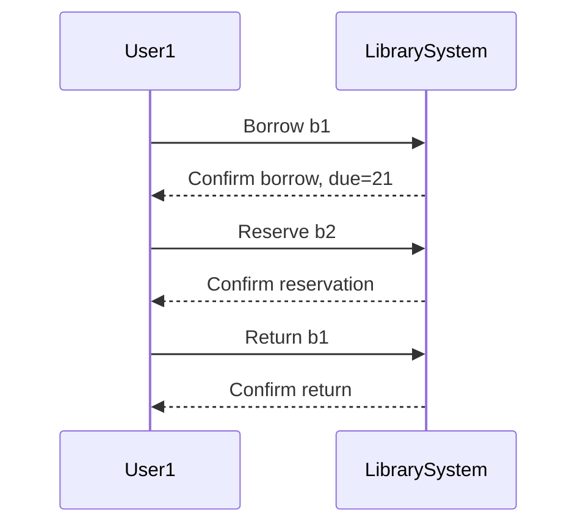
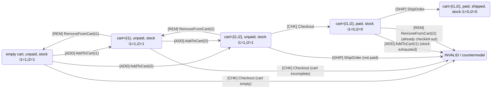

## Example of Semantic Model with Actions: Cart

Primitives:
- Worlds $w$: represent the state of the system at a point in time.
- Predicates over worlds:
```
Cart(u,w)       : set of items in user u’s cart
Paid(u,w)       : whether u has completed payment
Stock(i,w)      : quantity of item i in stock
Shipped(u,w)    : whether u has received items
```

- Actions ($Act$): operations that change worlds.


__Example Actions__

1. $AddToCart(i,u)$
- Preconditions: $Stock(i,w) > 0$
- Effects: $Cart(u,w') = Cart(u,w) ∪ {i}$

2. $RemoveFromCart(i,u)$
- Preconditions: $i ∈ Cart(u,w)$
- Effects: $Cart(u,w') = Cart(u,w) \ {i}$

3. $Checkout(u)$
- Preconditions: $Cart(u,w) ≠ ∅$
- Effects: $Paid(u,w') = true, Stock(i,w') = Stock(i,w) - 1 ∀ i ∈ Cart(u,w)$

4. $ShipOrder(u)$
- Preconditions: $Paid(u,w) = true$
- Effects: $Shipped(u,w') = true$


__Admissible Worlds__

We can define some simple worlds for one user $u1$ and two items $i1$ and $i2$:

|World|Cart|Paid|Stock|Shipped|Notes|
|-----|----|----|-----|-------|-----|
|w0|∅|false|i1=1,i2=1|false|initial state|
|w1|{i1}|false|i1=1,i2=1|false|added i1|
|w2|{i1,i2}|false|i1=1,i2=1|false|added i2|
|w3|{i1,i2}|true|i1=0,i2=0|false|checkout completed|
|w4|{i1,i2}|true|i1=0,i2=0|true|order shipped|


__Actions as Transitions__
- $w0$ — $AddToCart(i1,u1)→ w1$
- $w1$ — $AddToCart(i2,u1)→ w2$
- $w2$ — $Checkout(u1)→ w3$
- $w3$ — $ShipOrder(u1)→ w4$



__Expressing with Act Concept__

Now we can explicitly treat actions as semantic objects:
```math
Act = \{ AddToCart(i,u), RemoveFromCart(i,u), Checkout(u), ShipOrder(u) \}
```
- Each action has a precondition function $Pre: Act × W → Bool$
- Each action has an effect function $Eff: Act × W → W'$

So the logic auditor could formalise:
```math
w' = Eff(a, w) \quad \text{if and only if} \quad Pre(a,w) = true
```
- Candidate code generated by LLMs could propose $Checkout$ at $w1$ (cart incomplete)
  -> semantic check fails because $Pre(Checkout,w1) = false$.
- The auditor catches this early, before deployment.


__Why This Matters for a Programmer__
- Actions explicitly encode domain rules, making it easier to:
  1. Simulate scenarios
  2. Detect counterexamples (e.g., shipping unpaid items)
  3. Use LLMs to propose candidate implementations, then check them against admissible worlds
- This mirrors real-world checkout systems, reservation systems, or inventory management,
  where preconditions and effects are critical.


### Second Sample




__Primitives__

Worlds $w \in W$ are defined by predicates over items and users:
- $Cart(u, i, w)$: item $i$ is in user $u$’s cart in world $w$.
- $Paid(u, w)$: user $u$ has completed payment in world $w$.
- $Shipped(u, w)$: user $u$’s order has been shipped in world $w$.
- $Stock(i, w)$: available quantity of item $i$ in world $w$.


__Actions as Functions__

Each action $a \in Act$ has:
1. Preconditions $Pre(a, w)$ — must be true for the action to be executed.
2. Effects $Eff(a, w) \rightarrow w'$ — new world (w') after action.


1. $AddToCart(i,u)$
```math
Pre(AddToCart(i,u), w) : Stock(i, w) > 0 \wedge \neg Cart(u,i,w)

Eff(AddToCart(i,u), w) : Cart(u,i,w') = Cart(u,i,w) \cup \{i\}, \; Stock(i,w') = Stock(i,w)
```


2. $RemoveFromCart(i,u)$
```math
Pre(RemoveFromCart(i,u), w) : Cart(u,i,w) = \{i\}

Eff(RemoveFromCart(i,u), w) : Cart(u,i,w') = Cart(u,i,w) \setminus \{i\}, \; Stock(i,w') = Stock(i,w)
```


3. $Checkout(u)$
```math
Pre(Checkout(u), w) : Cart(u, \_, w) \neq \emptyset

Eff(Checkout(u), w) : Paid(u,w') = true, \; \forall i \in Cart(u,w), Stock(i,w') = Stock(i,w)-1
```


4. $ShipOrder(u)$
```math
Pre(ShipOrder(u), w) : Paid(u,w) = true \wedge \forall i \in Cart(u,w), Stock(i,w) \ge 0

Eff(ShipOrder(u), w) : Shipped(u,w') = true
```


__Countermodels__

A countermodel is a world $wX$ reached when $Pre(a, w) = false$.

Example:
- $Checkout(u1) in w0$ (empty cart) -> $wX$
- $ShipOrder(u1) in w2$ (not paid) -> $wX$

Formally:
```math
\text{if } \neg Pre(a,w) \Rightarrow Eff(a,w) = wX
```


Optional Logical Properties
1. Admissibility: $w \in W$ is admissible if $\exists a \in Act$ such that $Pre(a,w) = true$ or it is an initial world.
2. Temporal progression: if $w \rightarrow_{a} w'$ then $w'$ occurs after $w$.
3. Invariant: $Stock(i, w) \ge 0$ is an invariant in all admissible worlds.


This makes all rules explicit, so the diagram above can be read as a semantic model:
- States = worlds
- Edges = actions
- Admissibility = precondition satisfaction
- Countermodel nodes = violations of preconditions

