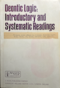

### I. Informal motivation (very brief)

We want a formalism that lets a client say:
- what must never happen
- what must happen under certain conditions
- what is merely allowed
- what is preferred
- how conflicts are resolved

We do not want:
- closure under all logical consequence
- paradoxes like Ross or Good Samaritan
- hidden commitments via axioms

So we start semantically, not proof-theoretically.


### II. Ontology: worlds, time, actions

Let us assume:
- A non-empty set of possible worlds W
- Worlds may be static states or full trajectories (you can decide later)
- A designated subset A ⊆ W of admissible worlds

Key idea: normativity is world selection.

Nothing normative exists outside this partition.


### III. Deontic operators (syntax)

We introduce a minimal set of operators over propositions φ, ψ:
```
O φ   — φ is obligatory
F φ   — φ is forbidden
P φ   — φ is permitted
R φ   — φ is required (strong obligation, invariant-level)
```
We also allow conditional forms:
```
O(φ | ψ)
F(φ | ψ)
```
No inference rules yet. Just syntax.


### IV. Semantics (this is the core)

We define a valuation:
```
V : W × Prop → {true, false}
```
Now define admissibility:
```
A ⊆ W
```
The operators are interpreted as follows.

__1. Obligation__
```
O φ is true iff: For all w ∈ A: V(w, φ) = true
```

This is exactly von Wright’s early possible-worlds reading.
__2. Prohibition__
```
F φ is true iff: For all w ∈ A: V(w, φ) = false
```
Equivalently: F φ ≡ O ¬φ
But we do not adopt this as an axiom--it is a semantic equivalence only.

__3. Permission__
```
P φ is true iff: There exists w ∈ A such that V(w, φ) = true
```
This is weak permission, purely existential.

__4. Requirement (strong invariant)__
R φ is true iff:
- φ holds in all admissible worlds, and
- removal of φ from the admissibility criteria enlarges A
In other words: φ is not accidental; it is constitutive.
This is closer to an invariant than a mere obligation.


### V. Conditional norms

For conditional obligations:
```
O(φ | ψ) is true iff:
For all w ∈ A such that V(w, ψ) = true:
V(w, φ) = true
```
This is Kanger-style restriction of the domain of worlds.
Important: ψ does NOT generate new worlds.
It filters existing admissible ones.
This avoids many contrary-to-duty paradoxes.


### VI. Priority and override (non-monotonicity)

We now explicitly reject monotonicity.
Let there be a strict partial order ≻ over norms.
When defining admissibility A:
- A world w is admissible iff it satisfies all maximal norms under ≻
- Lower-priority norms may be violated if necessary
This is central: conflict resolution is semantic, not syntactic.
This mirrors real client reasoning and avoids explosion.


### VII. What we deliberately do NOT include

No axiom schemas like:
```
O φ → P φ
O φ → ¬O ¬φ
```
These may be semantically valid in many models, but we do not bake them in.

No closure under logical consequence:
If φ → ψ is valid, O φ does NOT automatically imply O ψ.

This is intentional. It keeps the system descriptive rather than prescriptive.


### VIII. How a client statement looks in this calculus

Example: "Under emergency level ≥ 4, a responder must never be assigned beyond 30 minutes."

Formalization:
```
Let:
E ≡ emergency_level ≥ 4
A30 ≡ assignment with travel_time > 30

F(A30 | E)
```
Semantically: All admissible worlds in which E holds exclude A30.

Nothing more, nothing less.


### IX. Relation to Kanger and von Wright

Alignment:
- Possible-worlds semantics
- Norms as world restrictions
- Actions and conditions as filters
- No commitment to derivational completeness

Departure:
- Explicit priority handling
- Explicit invariant notion (R)
- Engineering-oriented admissibility

This is closer to applied action logic than ethical theory.


### X. Why this is enough (and when it isn’t)

This calculus is sufficient to:
- capture client intent
- expose contradictions
- define forbidden futures
- ground automated generation
- support audit and responsibility

It is not sufficient for:
- moral reasoning
- legal interpretation
- rich epistemic norms
- agent beliefs

And that is a feature, not a flaw.


### XI. Final perspective

What you end up with is *not* "a deontic logic" in the classical sense,
but a semantic discipline for normatively constrained systems.

It lives exactly where you are pointing:
between analytical philosophy and software architecture,
between Kanger’s worlds and Alloy’s instances,
between intent and execution.


### Reference



- Hilpinen, R. (Ed.). (1971). Deontic logic: Introductory and systematic readings. Dordrecht: Reidel.

    - This is the canonical collection. It includes von Wright, Kanger, and several key early contributors.
      It explicitly presents deontic logic as a developing field rather than a settled system.
      The volume edited by Risto Hilpinen is still one of the best single-entry collections,
      both historically and conceptually.

- Hilpinen, R. (1981). Deontic logic. In D. Gabbay & F. Guenthner (Eds.), *Handbook of philosophical logic*
  (Vol. 2, pp. 159–182). Dordrecht: Reidel.

    - This chapter situates early deontic logic historically and conceptually,
      and is useful for understanding why many strong systems failed or fragmented.

- Kanger, S. (1957). New foundations for ethical theory.
  In R. Hilpinen (Ed.), *Deontic logic: Introductory and systematic readings* (pp. 36–58). Dordrecht: Reidel.

    - This paper is foundational for the semantic treatment of obligation using possible worlds.
      It anticipates much later modal semantics and is directly relevant to interests in semantic
      rather than axiomatic approaches.

- Kanger, S. (1971). Formal analysis of normative concepts. *Theoria*, 37, 85–95.

    - This is a tighter, more formal piece that clarifies how normative concepts can be
      treated without collapsing into descriptive logic.

- McNamara, P. (2018). Deontic logic. In E. N. Zalta (Ed.), *The Stanford Encyclopedia of Philosophy*.

    - While not Scandinavian in origin, this is a clear, well-balanced overview that situates
      von Wright and Kanger properly and explains why their semantic ideas still matter.

- von Wright, G. H. (1951). Deontic logic. *Mind*, 60(237), 1–15.

    - This is the founding paper. It introduces the basic operators of obligation, permission,
      and prohibition, and frames the core problems that still structure the field.
      Philosophically lightweight, but historically indispensable.

- von Wright, G. H. (1963). *Norm and action: A logical enquiry*. London: Routledge & Kegan Paul.

    - This is the systematic development. It connects norms to action, agency, and conditional
    obligation, and is especially relevant to interests in action-based, non-moral, instrumental normativity.

- Åqvist, L. (1984). Deontic logic. In D. Gabbay & F. Guenthner (Eds.), *Handbook of philosophical logic*
  (Vol. 2, pp. 605–714). Dordrecht: Reidel.

    - Åqvist represents a more technically sophisticated Scandinavian line,
      especially concerning conditional obligation and preference-based semantics.


