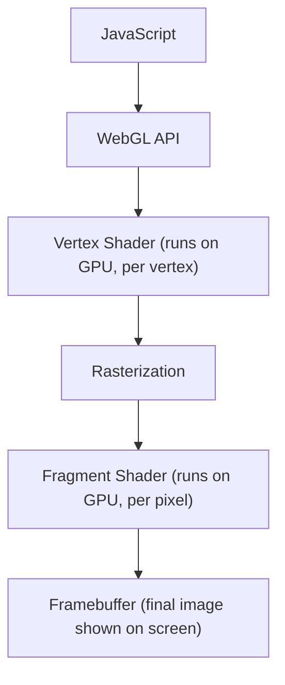

## WebGL

WebGL stands for Web Graphics Library. It is a JavaScript API that allows you to render interactive
2D and 3D graphics in the web browser without plugins. It's based on OpenGL ES 2.0, which is a lightweight
version of the OpenGL used on mobile and embedded systems.

- Runs directly in the browser using JavaScript
- Uses the GPU for rendering
- Cross-platform and cross-browser (Chrome, Firefox, Edge, Safari)
- Fully integrated with HTML5 and the DOM

WebGL is (so far) the only standard way to do high-performance 3D rendering on the web using the GPU.

Use Cases:
- 3D Games in the browser (e.g. Unity WebGL builds)
- Data visualisation (e.g. 3D graphs, terrain maps)
- 3D product previews (e.g. IKEA furniture)
- Augmented Reality (e.g. WebXR uses WebGL)
- Creative coding and generative art (e.g. ShaderToy)


### Pipeline

WebGL mirrors the programmable pipeline of OpenGL. The basic stages are:



Typical WebGL Pipeline Steps (Simplified)
1. Get a WebGL context from a <canvas> element
2. Write shaders in GLSL (vertex + fragment)
3. Compile shaders and link them into a program
4. Upload geometry data (vertices) to the GPU
5. Set up uniforms, attributes, and textures
6. Call gl.drawArrays() or gl.drawElements() to render


### Minimal WebGL Example (Triangle)

HTML
```html
<canvas id="glcanvas" width="640" height="480"></canvas>
<script src="main.js"></script>
```
main.js
```javascript
const canvas = document.getElementById('glcanvas');
const gl = canvas.getContext('webgl');

const vertexSource = `
attribute vec2 aPosition;
void main() {
    gl_Position = vec4(aPosition, 0.0, 1.0);
}`;
const fragmentSource = `
void main() {
    gl_FragColor = vec4(1.0, 0.2, 0.2, 1.0); // red
}`;

// compile shader
function compile(type, source) {
    const shader = gl.createShader(type);
    gl.shaderSource(shader, source);
    gl.compileShader(shader);
    return shader;
}

const vShader = compile(gl.VERTEX_SHADER, vertexSource);
const fShader = compile(gl.FRAGMENT_SHADER, fragmentSource);

// link program
const program = gl.createProgram();
gl.attachShader(program, vShader);
gl.attachShader(program, fShader);
gl.linkProgram(program);
gl.useProgram(program);

// geometry
const triangle = new Float32Array([
    0, 0.5,
   -0.5, -0.5,
    0.5, -0.5
]);

const buffer = gl.createBuffer();
gl.bindBuffer(gl.ARRAY_BUFFER, buffer);
gl.bufferData(gl.ARRAY_BUFFER, triangle, gl.STATIC_DRAW);

const aPosition = gl.getAttribLocation(program, 'aPosition');
gl.enableVertexAttribArray(aPosition);
gl.vertexAttribPointer(aPosition, 2, gl.FLOAT, false, 0, 0);

// render
gl.clearColor(0, 0, 0, 1);
gl.clear(gl.COLOR_BUFFER_BIT);
gl.drawArrays(gl.TRIANGLES, 0, 3);
```
This draws a red triangle to the canvas using WebGL.


### Working with 3D

For 3D rendering:
- You'll use matrices (model/view/projection) to transform 3D points
- You'll handle lighting and normal vectors
- You'll often load textures, and do camera control

To make this easier, many developers use helper libraries:

Popular WebGL Libraries
- Three.js – high-level, user-friendly 3D engine (https://threejs.org)
- Babylon.js – feature-rich 3D engine (https://www.babylonjs.com)
- regl, PicoGL.js, twgl – low-level minimalist tools for direct WebGL work

Strengths of WebGL
- Runs anywhere with a browser
- Uses GPU for fast, real-time rendering
- Good for interactive graphics, games, education, and demos
- Fully programmable — gives control over rendering pipeline

Weaknesses
- WebGL 1.0 is based on OpenGL ES 2.0 (no compute shaders, limited features)
- Verbose and low-level (without libraries like Three.js)
- Security and performance restrictions in browsers
- Cross-browser quirks, sometimes platform-specific bugs


### WebGL vs WebGPU

WebGL is:
- Mature, widely supported
- Based on OpenGL

WebGPU (upcoming):
- Based on Vulkan/Metal/Direct3D12
- More modern, supports compute shaders and better performance
- Still not fully available in all browsers


| Feature             | WebGL                                        |
|---------------------|----------------------------------------------|
| Language            | JavaScript + GLSL                            |
| GPU Usage           | Yes (runs shaders per vertex/pixel)          |
| Pipeline Control    | Programmable pipeline (like OpenGL ES 2.0)   |
| Libraries           | Three.js, Babylon.js, regl, PicoGL, twgl     |
| Use Cases           | Games, simulations, visualizations, AR/VR    |
| Modern Alternative  | WebGPU (next-gen graphics API for web)       |
