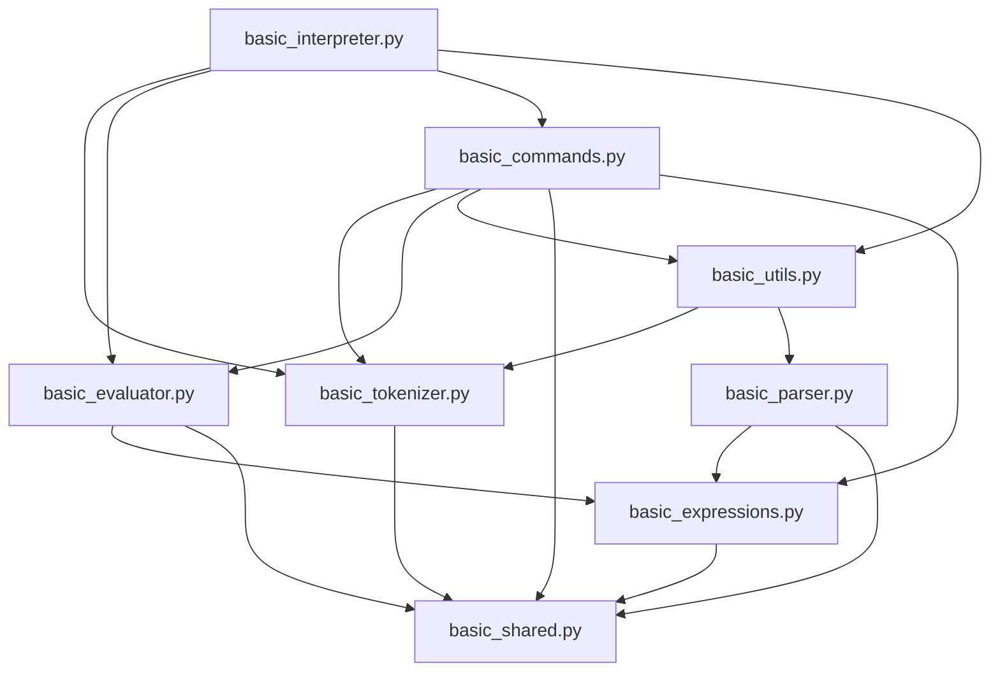
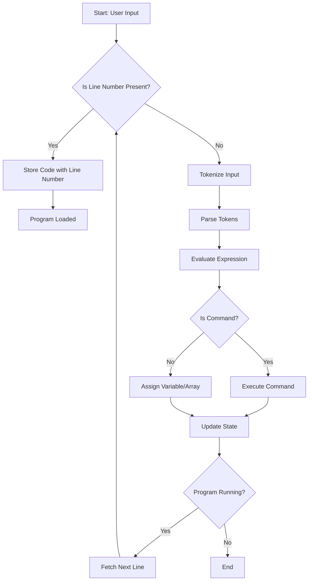
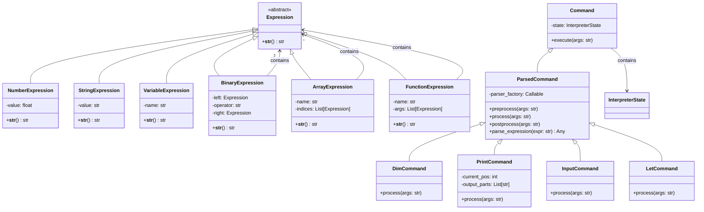

```mermaid
graph TD
    A[basic_interpreter.py] --> B[basic_tokenizer.py]
    A --> C[basic_evaluator.py]
    A --> D[basic_commands.py]
    A --> E[basic_utils.py]
    D --> B
    D --> C
    D --> E
    D --> F[basic_shared.py]
    D --> G[basic_expressions.py]
    C --> G
    C --> F
    B --> F
    E --> B
    E --> H[basic_parser.py]
    H --> G
    H --> F
    G --> F
```

```mermaid
graph TD
    A[Start: User Input] --> B{Is Line Number Present?}
    B -->|Yes| C[Store Code with Line Number]
    B -->|No| D[Tokenize Input]
    C --> E[Program Loaded]
    D --> F[Parse Tokens]
    F --> G[Evaluate Expression]
    G --> H{Is Command?}
    H -->|Yes| I[Execute Command]
    H -->|No| J[Assign Variable/Array]
    I --> K[Update State]
    J --> K
    K --> L{Program Running?}
    L -->|Yes| M[Fetch Next Line]
    M --> B
    L -->|No| N[End]
```

```mermaid
classDiagram
    class Expression {
        <<abstract>>
        +__str__() str
    }
    class NumberExpression {
        -value: float
        +__str__() str
    }
    class StringExpression {
        -value: str
        +__str__() str
    }
    class VariableExpression {
        -name: str
        +__str__() str
    }
    class BinaryExpression {
        -left: Expression
        -operator: str
        -right: Expression
        +__str__() str
    }
    class ArrayExpression {
        -name: str
        -indices: List[Expression]
        +__str__() str
    }
    class FunctionExpression {
        -name: str
        -args: List[Expression]
        +__str__() str
    }
    class Command {
        -state: InterpreterState
        +execute(args: str)
    }
    class ParsedCommand {
        -parser_factory: Callable
        +preprocess(args: str)
        +process(args: str)
        +postprocess(args: str)
        +parse_expression(expr: str) Any
    }
    class DimCommand {
        +process(args: str)
    }
    class PrintCommand {
        -current_pos: int
        -output_parts: List[str]
        +process(args: str)
    }
    class InputCommand {
        +process(args: str)
    }
    class LetCommand {
        +process(args: str)
    }

    Expression <|-- NumberExpression
    Expression <|-- StringExpression
    Expression <|-- VariableExpression
    Expression <|-- BinaryExpression
    Expression <|-- ArrayExpression
    Expression <|-- FunctionExpression
    BinaryExpression --> "2" Expression : contains
    ArrayExpression --> "*" Expression : contains
    FunctionExpression --> "*" Expression : contains
    Command <|-- ParsedCommand
    ParsedCommand <|-- DimCommand
    ParsedCommand <|-- PrintCommand
    ParsedCommand <|-- InputCommand
    ParsedCommand <|-- LetCommand
    Command --> InterpreterState : contains
```

