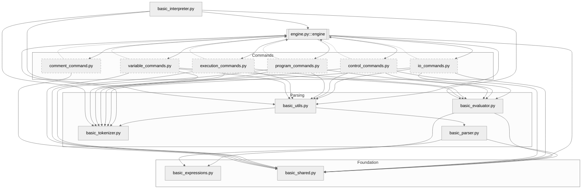

## PRIMILINARY: SPLIT

To split the `basic_commands.py` file into more modular components while maintaining the functionality
of the BASIC interpreter, you need to consider the logical groupings of commands and their dependencies.
Below, is a theoretical approach to splitting the file and describe the dependencies between the resulting
files and other parts of the system. There is also an outline how you can visualise the dependency
graph conceptually, as I cannot generate an actual image but can describe it for you to create or
understand.

### Theoretical Approach to Splitting `basic_commands.py`

The `basic_commands.py` file contains the core logic for interpreting BASIC commands, including the
`InterpreterEngine`, `CommandFactory`, and various command classes (e.g., `PrintCommand`, `LetCommand`,
`DimCommand`, etc.). The goal is to split it into smaller, cohesive modules based on the functionality
of the commands, while keeping the `InterpreterEngine` and `CommandFactory` in a central "engine" module.

1. *Core Engine Module (`engine.py`)*
   - *Purpose*: Contains the core execution logic and command creation mechanism.
   - *Contents*:
     - `InterpreterEngine`: Manages the execution of program lines, maintains state, and handles the
       run loop.
     - `CommandFactory`: Creates command instances based on command names and provides reserved
       keyword/function checks.
     - `Command` (abstract base class): Defines the interface for all commands.
     - `ParsedCommand` (abstract base class): Extends `Command` for commands that require expression
       parsing.
     - `InterpreterError` and `ExecutionError`: Exception classes for interpreter-specific errors.
     - `split_statements`: Utility function for splitting multi-statement lines.
   - *Rationale*: These components are central to the interpreter's operation and are tightly coupled.
     Keeping them together ensures that the execution engine remains cohesive and avoids unnecessary
     dependencies.

2. *I/O Commands Module (`io_commands.py`)*
   - *Purpose*: Handles commands related to input/output operations.
   - *Contents*:
     - `PrintCommand`: Handles output formatting and printing.
     - `InputCommand`: Manages user input and variable assignment.
   - *Rationale*: These commands deal with user interaction (console I/O) and share common functionality like
     parsing expressions and formatting output. Grouping them reduces the size of the main commands file and
     isolates I/O-specific logic.

3. *Program Control Commands Module (`control_commands.py`)*
   - *Purpose*: Manages commands that control program flow.
   - *Contents*:
     - `IfCommand`: Handles conditional branching.
     - `GotoCommand`: Jumps to a specific line.
     - `GosubCommand`: Calls a subroutine.
     - `ReturnCommand`: Returns from a subroutine.
     - `ForCommand`: Initiates a FOR loop.
     - `NextCommand`: Advances a FOR loop.
     - `WhileCommand`: Initiates a WHILE loop.
     - `WendCommand`: Ends a WHILE loop.
   - *Rationale*: These commands are responsible for altering the program's execution path (jumps, loops,
     conditionals). Grouping them together makes the control flow logic easier to maintain and test.

4. *Program Management Commands Module (`program_commands.py`)*
   - *Purpose*: Handles commands that manage the program itself (e.g., listing, saving, loading).
   - *Contents*:
     - `ListCommand`: Displays program lines.
     - `RenumberCommand`: Renumbers program lines.
     - `DeleteCommand`: Deletes program lines.
     - `SaveCommand`: Saves the program to a file.
     - `LoadCommand`: Loads a program from a file.
     - `NewCommand`: Clears the program and state.
   - *Rationale*: These commands manipulate the program's structure or storage (code and state). They
     are distinct from execution or I/O and form a logical group for program management.

5. *Execution Control Commands Module (`execution_commands.py`)*
   - *Purpose*: Manages commands that control the interpreter's execution state.
   - *Contents*:
     - `RunCommand`: Starts program execution.
     - `StopCommand`: Pauses execution.
     - `ContinueCommand`: Resumes execution.
     - `EndCommand`: Terminates execution.
     - `ByeCommand`: Exits the interpreter.
   - *Rationale*: These commands affect the interpreter's runtime state (start, stop, pause, exit).
     Grouping them isolates execution lifecycle logic.

6. *Variable and Array Commands Module (`variable_commands.py`)*
   - *Purpose*: Handles commands that manage variables and arrays.
   - *Contents*:
     - `LetCommand`: Assigns values to variables or arrays.
     - `DimCommand`: Declares arrays.
   - *Rationale*: These commands deal with data storage (variables and arrays) and share logic for
     parsing assignments and managing state. Separating them simplifies the handling of data-related operations.

7. *Comment Command Module (`comment_command.py`)*
   - *Purpose*: Handles the comment command.
   - *Contents*:
     - `RemCommand`: Ignores remarks/comments.
   - *Rationale*: The `RemCommand` is simple and standalone, doing nothing during execution. Isolating
     it in a small module avoids cluttering other modules, though it could optionally remain in
     `engine.py` due to its simplicity.

### Dependency Analysis

To understand how these new modules interact with each other and the existing files, let's analyse the
dependencies. The `basic_commands.py` file currently depends on several other files, and splitting it
will redistribute these dependencies. Below is a description of the dependencies for each proposed module
and their interactions with existing files.

#### 1. `engine.py`
- *Internal Dependencies*:
  - Contains `Command`, `ParsedCommand`, `InterpreterEngine`, `CommandFactory`, and `split_statements`,
    which are interdependent.
  - `CommandFactory` references all command classes (via `_commands` dictionary), requiring imports from
    other new modules (`io_commands`, `control_commands`, etc.).
- *Dependencies on Existing Files*:
  - `basic_shared.py`: Uses `InterpreterState` for managing state and `ParserError` for error handling.
  - `basic_tokenizer.py`: Uses `Token` and `Tokenizer` for parsing expressions in `InterpreterEngine`
    (via `ParsedCommand` subclasses).
  - `basic_utils.py`: Uses `create_parser` to create parsers for expression evaluation.
- *Dependencies on New Modules*:
  - Imports command classes from `io_commands.py`, `control_commands.py`, `program_commands.py`,
    `execution_commands.py`, `variable_commands.py`, and optionally `comment_command.py` to populate
    `CommandFactory._commands`.
- *Exported Dependencies*:
  - `Command` and `ParsedCommand` are base classes for all command classes in other modules.
  - `InterpreterEngine` and `CommandFactory` are used by `basic_interpreter.py` and potentially other
    command classes (e.g., `IfCommand` creates an `InterpreterEngine` instance).
  - `InterpreterError` and `ExecutionError` may be caught by other modules or `basic_interpreter.py`.

#### 2. `io_commands.py`
- *Internal Dependencies*:
  - `PrintCommand` and `InputCommand` inherit from `ParsedCommand`.
  - `InputCommand` references `LetCommand` for array assignments.
- *Dependencies on Existing Files*:
  - `basic_shared.py`: Uses `InterpreterState` for accessing variables and arrays.
  - `basic_tokenizer.py`: Uses `Tokenizer` and `Token` for expression parsing.
  - `basic_utils.py`: Uses `create_parser` for parsing expressions.
  - `basic_evaluator.py`: Uses `Evaluator` for evaluating expressions.
- *Dependencies on New Modules*:
  - `engine.py`: Inherits `ParsedCommand` and uses `InterpreterState`.
  - `variable_commands.py`: `InputCommand` creates a `LetCommand` instance for array assignments.
- *Exported Dependencies*:
  - `PrintCommand` and `InputCommand` are registered in `CommandFactory._commands` in `engine.py`.

#### 3. `control_commands.py`
- *Internal Dependencies*:
  - All commands (`IfCommand`, `GotoCommand`, etc.) inherit from `ParsedCommand`.
  - `IfCommand` creates an `InterpreterEngine` instance to execute THEN/ELSE clauses.
- *Dependencies on Existing Files*:
  - `basic_shared.py`: Uses `InterpreterState` for accessing variables, code, loops, whiles, and stack.
  - `basic_tokenizer.py`: Uses `Tokenizer` and `Token` for expression parsing.
  - `basic_utils.py`: Uses `create_parser` for parsing expressions.
  - `basic_evaluator.py`: Uses `Evaluator` for evaluating expressions.
- *Dependencies on New Modules*:
  - `engine.py`: Inherits `ParsedCommand`, uses `InterpreterState`, and `IfCommand` creates an
    `InterpreterEngine` instance.
- *Exported Dependencies*:
  - All command classes are registered in `CommandFactory._commands` in `engine.py`.

#### 4. `program_commands.py`
- *Internal Dependencies*:
  - All commands (`ListCommand`, `RenumberCommand`, etc.) inherit from `ParsedCommand` or `Command`.
  - `LoadCommand` creates an `InterpreterEngine` instance to parse lines.
- *Dependencies on Existing Files*:
  - `basic_shared.py`: Uses `InterpreterState` for accessing and modifying code.
  - `basic_tokenizer.py`: Uses `Tokenizer` and `Token` for expression parsing in `ListCommand`,
    `RenumberCommand`, and `DeleteCommand`.
  - `basic_utils.py`: Uses `create_parser` for parsing expressions.
  - `basic_evaluator.py`: Uses `Evaluator` for evaluating expressions in `ListCommand`,
    `RenumberCommand`, and `DeleteCommand`.
- *Dependencies on New Modules*:
  - `engine.py`: Inherits `ParsedCommand` or `Command`, uses `InterpreterState`, and `LoadCommand`
    creates an `InterpreterEngine` instance.
- *Exported Dependencies*:
  - All command classes are registered in `CommandFactory._commands` in `engine.py`.

#### 5. `execution_commands.py`
- *Internal Dependencies*:
  - `RunCommand` inherits from `ParsedCommand`; others inherit from `Command`.
  - `RunCommand` creates an `InterpreterEngine` instance to run the program.
- *Dependencies on Existing Files*:
  - `basic_shared.py`: Uses `InterpreterState` for accessing code and variables.
  - `basic_tokenizer.py`: Uses `Tokenizer` and `Token` for parsing start line in `RunCommand`.
  - `basic_utils.py`: Uses `create_parser` for parsing expressions in `RunCommand`.
  - `basic_evaluator.py`: Uses `Evaluator` for evaluating expressions in `RunCommand`.
- *Dependencies on New Modules*:
  - `engine.py`: Inherits `ParsedCommand` or `Command`, uses `InterpreterState`, and `RunCommand`
    creates an `InterpreterEngine` instance.
- *Exported Dependencies*:
  - All command classes are registered in `CommandFactory._commands` in `engine.py`.

#### 6. `variable_commands.py`
- *Internal Dependencies*:
  - `LetCommand` and `DimCommand` inherit from `ParsedCommand`.
- *Dependencies on Existing Files*:
  - `basic_shared.py`: Uses `InterpreterState` for accessing variables, arrays, and array dimensions.
  - `basic_tokenizer.py`: Uses `Tokenizer` and `Token` for parsing expressions and indices.
  - `basic_utils.py`: Uses `create_parser` for parsing expressions and indices.
  - `basic_evaluator.py`: Uses `Evaluator` for evaluating expressions and indices.
- *Dependencies on New Modules*:
  - `engine.py`: Inherits `ParsedCommand`, uses `InterpreterState`, and uses `CommandFactory.is_reserved`
    for validation.
- *Exported Dependencies*:
  - `LetCommand` and `DimCommand` are registered in `CommandFactory._commands` in `engine.py`.
  - `LetCommand` is used by `InputCommand` in `io_commands.py`.

#### 7. `comment_command.py`
- *Internal Dependencies*:
  - `RemCommand` inherits from `Command`.
- *Dependencies on Existing Files*:
  - `basic_shared.py`: Uses `InterpreterState` (though minimally, as it does nothing).
- *Dependencies on New Modules*:
  - `engine.py`: Inherits `Command` and uses `InterpreterState`.
- *Exported Dependencies*:
  - `RemCommand` is registered in `CommandFactory._commands` in `engine.py`.

#### Existing Files (Unchanged)
- *basic_interpreter.py*:
  - Depends on `engine.py` (`InterpreterEngine`, `CommandFactory`), `basic_tokenizer.py`
    (`Tokenizer`, `Token`), `basic_evaluator.py` (`Evaluator`), `basic_utils.py` (`create_parser`).
  - Uses `InterpreterEngine` to run programs and execute immediate commands.
- *basic_shared.py*:
  - Provides `InterpreterState` and `ParserError`, used by all modules.
- *basic_tokenizer.py*:
  - Provides `Tokenizer` and `Token`, used by modules that parse expressions (`io_commands`,
    `control_commands`, `program_commands`, `execution_commands`, `variable_commands`).
- *basic_parser.py*:
  - Provides `ParseBasic`, used indirectly via `basic_utils.create_parser`.
- *basic_expressions.py*:
  - Provides expression classes, used by `basic_parser.py` and `basic_evaluator.py`.
- *basic_evaluator.py*:
  - Depends on `basic_expressions.py` (expression classes), `basic_shared.py` (`InterpreterState`),
    used by modules that evaluate expressions.
- *basic_utils.py*:
  - Provides `create_parser`, depends on `basic_parser.py` and `basic_tokenizer.py`.

### Dependency Graph Description

### Recommendations for Splitting

1. *Start with `engine.py`*:
   - Extract `InterpreterEngine`, `CommandFactory`, `Command`, `ParsedCommand`, `InterpreterError`,
     `ExecutionError`, and `split_statements` into `engine.py`.
   - Update `CommandFactory._commands` to reference command classes from new modules (requires forward
     imports or lazy initialisation).

2. *Group Commands Logically*:
   - Create `io_commands.py` for `PrintCommand` and `InputCommand`.
   - Create `control_commands.py` for flow control commands.
   - Create `program_commands.py` for program management commands.
   - Create `execution_commands.py` for execution lifecycle commands.
   - Create `variable_commands.py` for variable/array commands.
   - Create `comment_command.py` for `RemCommand` (or keep it in `engine.py` if you prefer simplicity).

3. *Update Imports*:
   - Ensure each new module imports necessary dependencies (e.g., `ParsedCommand` from `engine.py`,
     `InterpreterState` from `basic_shared.py`).
   - Update `basic_interpreter.py` to import `InterpreterEngine` and `CommandFactory` from `engine.py`.

4. *Handle Cross-Module References*:
   - `InputCommand` depends on `LetCommand`, requiring an import from `variable_commands.py`.
   - `IfCommand`, `LoadCommand`, and `RunCommand` create `InterpreterEngine` instances, requiring an
     import from `engine.py`.
   - Use dependency injection or a registry pattern in `CommandFactory` to avoid circular imports
     (e.g., register command classes dynamically).

5. *Test Incrementally*:
   - Split one module at a time (e.g., start with `engine.py` and `io_commands.py`) and test the
     interpreter to ensure functionality is preserved.
   - Verify that commands like `IF`, `LOAD`, and `RUN` work correctly with the new `InterpreterEngine` import.

6. *Maintain State Consistency*:
   - All command modules access `InterpreterState` from `basic_shared.py`. Ensure that state
     modifications (e.g., variables, arrays, code) are consistent across modules.
   - Avoid duplicating state management logic in command classes.

7. *Consider Optional Merges*:
   - If `comment_command.py` feels too small, keep `RemCommand` in `engine.py`.
   - If the number of modules feels excessive, combine `execution_commands.py` and `program_commands.py`
     into a single `management_commands.py` module, as both deal with program lifecycle and structure.

### Potential Challenges
- *Circular Imports*: `CommandFactory` in `engine.py` needs to import command classes, but some commands
  (e.g., `IfCommand`) import `InterpreterEngine`. Use lazy imports or a registry pattern to resolve this.
- *Testing Overhead*: Splitting increases the number of files, requiring comprehensive tests to ensure
  all commands work as expected. Focus on unit tests for individual commands and integration tests for the engine.
- *Performance*: The additional imports may slightly increase startup time, but this should be negligible
  for an interpreter.

### Conclusion

Splitting `basic_commands.py` into `engine.py`, `io_commands.py`, `control_commands.py`, `program_commands.py`,
`execution_commands.py`, `variable_commands.py`, and optionally `comment_command.py` organizes the code into
logical, maintainable units. The dependency graph centers around `engine.py`, which orchestrates command execution,
and `basic_shared.py`, which provides shared state. By carefully managing imports and testing incrementally,
you can achieve a modular design without breaking the interpreter's functionality. To visualise the dependencies,
create a directed graph with `engine.py` as a central hub, command modules as satellites, and existing files
as foundational layers.

