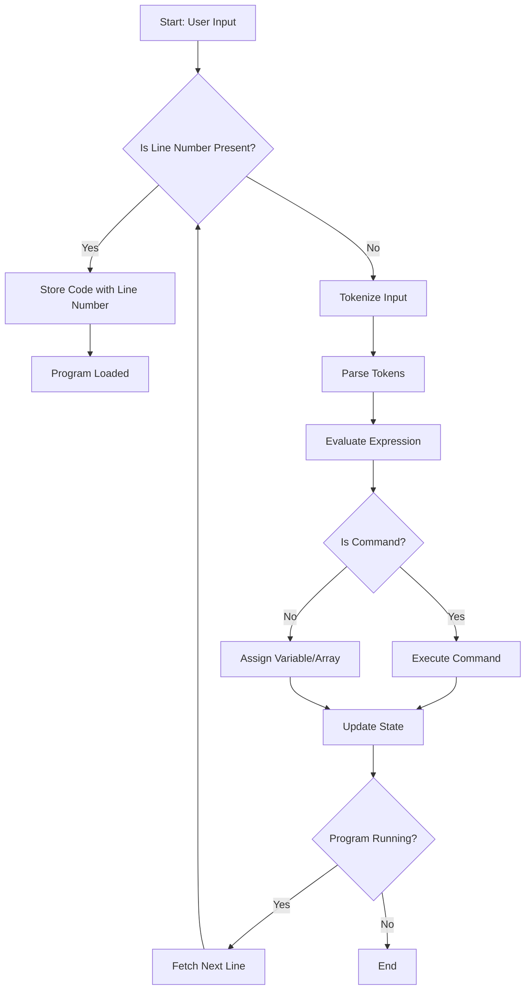

## The Structure of BASIC

*BASIC comes in many dialects.*

BASIC (Beginner’s All-purpose Symbolic Instruction Code) is not a single, standardised language[^stand] but
rather a family of related de facto programming languages. Since its creation in the 1960s at Dartmouth College,
BASIC has evolved into numerous dialects, each tailored to different platforms, educational goals, hardware
constraints, or vendor-specific features. Read more [history](./HISTORY.md) of the language.

Some dialects like Microsoft BASIC, QBASIC, GW-BASIC, Commodore BASIC, or BBC BASIC include graphical or sound
commands specific to the machines they ran on. Others, like FreeBASIC or VB.NET, introduced more modern language
constructs like structured programming, modules, and even object orientation.

Despite the diversity, most BASIC dialects share a few core traits, such as:
- A line-numbered program structure (in early versions),
- Simple syntax for variable assignment, arithmetic, and flow control,
- Built-in interactive interpreters allowing commands to be executed directly.

This diagram reflects the common logical flow found in many of these classic BASIC interpreters.

[^stand]: BASIC did have formal standards developed to bring consistency across implementations.
Two notable standards are: ANSI Minimal BASIC (ANSI X3.60-1978), and ISO Full BASIC (ISO/IEC 6373:1984).




### BASIC

The BASIC interpreter in [01](./01/) is a modern implementation of a classic BASIC language, designed to run
simple programs with features like variables, arrays, loops, conditionals, and input/output operations. Below
is a concise introduction covering its essentials, how it works, and its implementation.

- *Commands*: Supports standard BASIC commands like `PRINT`, `INPUT`, `LET`, `IF`, `FOR`, `NEXT`, `GOTO`, `GOSUB`,
  `DIM` (for arrays), `WHILE`, `WEND`, and utility commands like `LIST`, `SAVE`, `LOAD`, `RENUMBER`, and `BYE`.
- *Expressions*: Handles arithmetic (`+`, `-`, `*`, `/`), comparisons (`=`, `<>`, `<`, `>`, `<=`, `>=`), and functions
  (e.g., `SIN`, `ABS`, `RND`, `LEN`, `MID$`) for numbers and strings.
- *Variables and Arrays*: Supports numeric and string variables (e.g., `X`, `A$`) and 1D/2D arrays (e.g., `DIM A(10)`).
  Variables are dynamically typed and stored in a dictionary.
- *Program Structure*: Programs are line-numbered, stored as a dictionary mapping line numbers to code strings.
  Execution follows line numbers sequentially unless altered by `GOTO`, `GOSUB`, or loops.
- *Interactivity*: Runs in an interactive REPL (Read-Eval-Print Loop) or executes loaded programs. Users can pause
  (`STOP`), resume (`CONTINUE`), or trace execution (`TRACE`).
- *I/O*: Supports console-based input (`INPUT`) and output (`PRINT`) with formatting options like `TAB` and `USING`
  for numeric precision.

Programs can be entered line by line, loaded from files (`.bas` extension), or saved. The interpreter handles errors
gracefully, printing error messages for syntax issues or invalid operations.


### Implementation

The interpreter is written in Python and modularly structured across several files, each handling a specific aspect
of the system:

1. *Tokenizer (`basic_tokenizer.py`)*:
   - Converts input strings into tokens (e.g., `NUMBER`, `STRING`, `IDENTIFIER`, `OPERATOR`).
   - Uses regex and character-based parsing to handle numbers, strings, identifiers, and operators.
   - Skips whitespace and tracks token positions for error reporting.

2. *Parser (`basic_parser.py`)*:
   - Builds an Abstract Syntax Tree (AST) from tokens, represented as `Expression` subclasses (`NumberExpression`,
     `BinaryExpression`, `ArrayExpression`, etc.).
   - Implements a recursive descent parser to handle operator precedence (e.g., `*` before `+`) and nested
     expressions.
   - Supports reserved functions (e.g., `SIN`, `LEN`) and distinguishes between variables and arrays.

3. *Evaluator (`basic_evaluator.py`)*:
   - Evaluates AST expressions to produce values (numbers, strings, or array elements).
   - Handles arithmetic, comparisons, and function calls using Python’s `math` and `random` modules.
   - Manages array access with 1-based indexing, adjusting internally to 0-based for storage.

4. *Commands (`basic_commands.py`)*:
   - Defines command classes (e.g., `PrintCommand`, `LetCommand`, `ForCommand`) that encapsulate execution
     logic.
   - Uses a `CommandFactory` to map command names to classes, supporting both parsed commands (e.g., `PRINT`)
     and simple ones (e.g., `BYE`).
   - Handles program flow (e.g., `GOTO`, `FOR`, `WHILE`) using an `InterpreterState` to track variables,
     arrays, and line numbers.

5. *Interpreter Engine (`basic_interpreter.py`, `basic_commands.py`)*:
   - The `InterpreterEngine` manages program execution, maintaining state (line number, variables, stack)
     in `InterpreterState`.
   - Executes lines by tokenizing, parsing, and dispatching to appropriate commands.
   - Supports tracing, pausing, and resuming execution, with error handling for interrupts (`KeyboardInterrupt`).

6. *State Management (`basic_shared.py`)*:
   - `InterpreterState` stores program state: variables (`Dict[str, Any]`), arrays (`Dict[str, Dict[tuple, Any]]`),
     code (`Dict[int, str]`), loop info, and stack.
   - Provides methods to reset state while optionally preserving code.

7. *Utilities (`basic_utils.py`)*:
   - Helper functions, such as creating parsers, to integrate components.


### Execution Flow

1. *Input*: A line is entered (e.g., `10 PRINT "Hello"`) or loaded from a file.
2. *Tokenization*: The `Tokenizer` splits the line into tokens (e.g., `NUMBER:10`, `IDENTIFIER:PRINT`, `STRING:"Hello"`).
3. *Parsing*: If the line starts with a number, it’s stored in `state.code`. Otherwise, the `Parser` creates
   an AST for immediate execution.
4. *Command Execution*: The `InterpreterEngine` identifies the command (e.g., `PRINT`) and uses `CommandFactory`
   to instantiate it. The command’s `execute` method processes arguments, often evaluating expressions via `Evaluator`.
5. *State Update*: Results (e.g., variable assignments, line number changes) update `InterpreterState`.
6. *Program Flow*: The engine advances to the next line or jumps based on `GOTO`, `FOR`, etc., until the program
   ends (`END`, `BYE`, or no more lines).


### Implementation Features

- *Modularity*: Each component (tokenizer, parser, evaluator, commands) is self-contained, making it easy to extend or modify.
- *Error Handling*: Robust error reporting for syntax errors, undefined variables, or invalid array indices, with
  fallback behaviors (e.g., defaulting to 0).
- *1-Based Indexing*: Arrays use BASIC’s 1-based indexing, internally adjusted to 0-based for Python dictionaries.
- *Dynamic Typing*: Variables and array elements can hold numbers or strings, checked at runtime.
- *Debugging*: Debug output (e.g., `DEBUG: Evaluated...`) and tracing (`TRACE`) aid development and user understanding.


### Example

```basic
10 DIM A(5)
20 LET A(1) = 42
30 PRINT A(1)
40 FOR I = 1 TO 3
50 PRINT "Loop"; I
60 NEXT I
RUN
```
- Output: `42`, `Loop 1`, `Loop 2`, `Loop 3`.
- The interpreter declares an array, assigns a value, prints it,
and loops to print a sequence.


### Limitations

- No advanced graphics or sound, as it’s console-based.
- Limited function set compared to modern languages.
- Performance may degrade for large programs due to Python’s interpretive nature.

This BASIC interpreter is useful for educational purposes, retro computing enthusiasts, or simple scripting,
offering a faithful yet extensible implementation of a classic programming language. For more details, run `HELP`
in the interpreter or explore the command-specific code in `basic_commands.py`.

