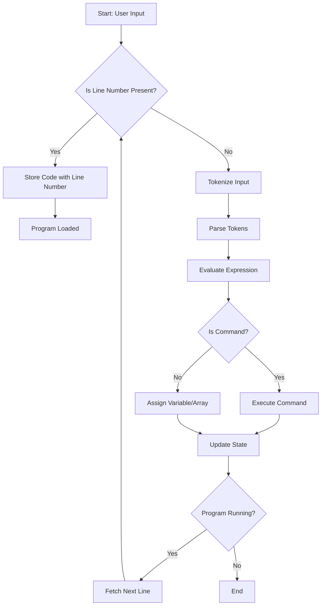

```mermaid
graph TD
    A[Start: User Input] --> B{Is Line Number Present?}
    B -->|Yes| C[Store Code with Line Number]
    B -->|No| D[Tokenize Input]
    C --> E[Program Loaded]
    D --> F[Parse Tokens]
    F --> G[Evaluate Expression]
    G --> H{Is Command?}
    H -->|Yes| I[Execute Command]
    H -->|No| J[Assign Variable/Array]
    I --> K[Update State]
    J --> K
    K --> L{Program Running?}
    L -->|Yes| M[Fetch Next Line]
    M --> B
    L -->|No| N[End]
```
