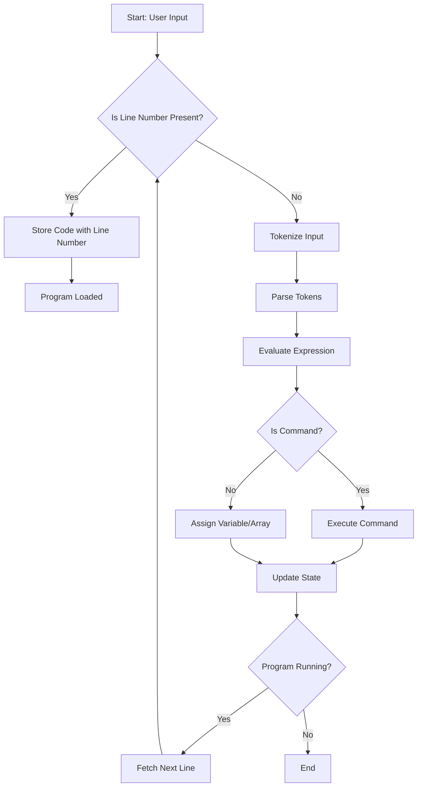

## The Structure of BASIC

*BASIC comes in many dialects.*

BASIC (Beginner’s All-purpose Symbolic Instruction Code) is not a single, standardised language[^stand] but
rather a family of related de facto programming languages. Since its creation in the 1960s at Dartmouth College,
BASIC has evolved into numerous dialects, each tailored to different platforms, educational goals, hardware
constraints, or vendor-specific features.

Some dialects like Microsoft BASIC, QBASIC, GW-BASIC, Commodore BASIC, or BBC BASIC include graphical or sound
commands specific to the machines they ran on. Others, like FreeBASIC or VB.NET, introduced more modern language
constructs like structured programming, modules, and even object orientation.

Despite the diversity, most BASIC dialects share a few core traits, such as:
- A line-numbered program structure (in early versions),
- Simple syntax for variable assignment, arithmetic, and flow control,
- Built-in interactive interpreters allowing commands to be executed directly.

This diagram reflects the common logical flow found in many of these classic BASIC interpreters.

[^stand]: BASIC did have formal standards developed to bring consistency across implementations.
Two notable standards are: ANSI Minimal BASIC (ANSI X3.60-1978), and ISO Full BASIC (ISO/IEC 6373:1984).

