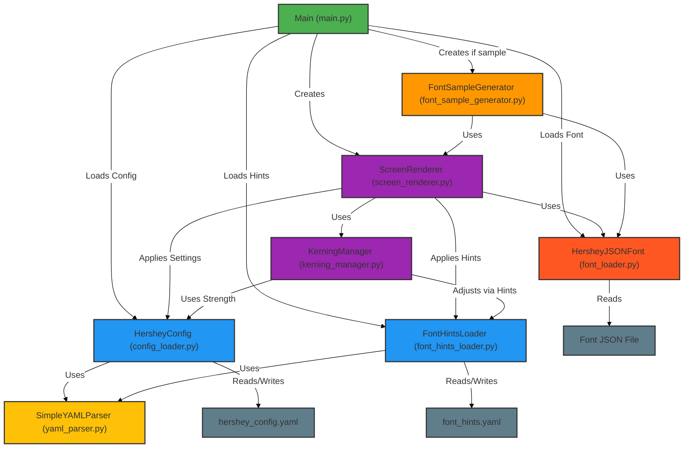

## Configuration and Hershey Fonts

This project is a *Hershey Font Renderer*, a Python-based application designed to render text
using Hershey vector fonts, which are stored in JSON format. The system leverages a modular
architecture to load fonts, apply rendering configurations, and adjust text appearance using
font hints and kerning. It provides flexibility through a custom YAML-based configuration system,
allowing users to customise rendering parameters such as scale, spacing, alignment, colors, and
more. The project includes command-line functionality for rendering text or generating font samples,
with error handling and logging for reliability.

The Hershey font glyph data is covered by a permissive use and redistribution license.

References:
* More on the Hershey Font in Wikipedia: https://en.wikipedia.org/wiki/Hershey_fonts
* Paul Bourke, parsing etc. https://paulbourke.net/dataformats/hershey/
* Modern updates, Kamal Mostafa: https://github.com/kamalmostafa/hershey-fonts
* From where the coding of data takes most inspiration, Jim Buzbee: https://www.batbox.org/font.html

The parser and renderer shown here are intentionally simplistic and perform poorly at their respective
tasks. In fact, they are deliberately minimal and not intended to serve as examples of how to build
efficient font parsers or renderers. Their primary purpose is to illustrate how configurable components
can be structured within an architecture, rather than to introduce the techniques of font rendering
or parsing.

*It is left as an exercise for the reader or student to improve both the configuration system and the
implementation of font rendering and parsing, particularly in relation to the Hershey fonts.*

Run a sample, and look for 'rendered.png':

```shell
/path/to/hershey> python3 src/main.py fonts/cursive.json --sample
```

The fonts have been converted from the 'jhf' format by James Hurt, to ordinary JSON files.
Fonts may have lost information in the translation. Rendering might also be buggy.


#### Components

1. *HersheyJSONFont (font_loader.py)*:
   - *Purpose*: Loads and parses Hershey font data from JSON files.
   - *Functionality*: Manages character strokes, metadata, and metrics (e.g., width, height, bounds,
     advance width). Uses a singleton pattern to ensure a single font instance.
   - *Role in Config*: Provides font data that interacts with configuration settings for scaling
     and spacing during rendering.

2. *HersheyConfig (config_loader.py)*:
   - *Purpose*: Manages configuration settings for rendering.
   - *Functionality*: Loads settings from a YAML file (e.g., `hershey_config.yaml`) or uses defaults.
     Supports sections like rendering (scale, spacing), layout (alignment, margins), colors, and kerning.
   - *Key Feature*: Deep merging of user-defined YAML configs with defaults for flexible customisation.

3. *FontHintsLoader (font_hints_loader.py)*:
   - *Purpose*: Loads font-specific rendering hints from YAML (e.g., `font_hints.yaml`).
   - *Functionality*: Adjusts rendering parameters (e.g., scale, offsets, kerning strength) based on
     font style (e.g., default, roman, gothic).
   - *Role in Config*: Enhances rendering by applying style-specific tweaks, merged with default hints.

4. *SimpleYAMLParser (yaml_parser.py)*:
   - *Purpose*: A lightweight, custom YAML parser.
   - *Functionality*: Parses YAML strings into dictionaries and serialises dictionaries back to YAML.
     Handles basic types (strings, booleans, numbers, null) and nested structures.
   - *Role in Config*: Enables loading of configuration and hint files without external dependencies.

5. *KerningManager (kerning_manager.py)*:
   - *Purpose*: Manages kerning adjustments for character pairs.
   - *Functionality*: Applies predefined kerning pairs (e.g., 'A' and 'V' adjust by -0.3) scaled by a
     strength factor from config and hints.
   - *Role in Config*: Uses configuration to toggle kerning and adjust its intensity.

6. *ScreenRenderer (screen_renderer.py)*:
   - *Purpose*: Renders text to images using PIL.
   - *Functionality*: Draws characters from font data, applies scaling, spacing, alignment, and colors.
     Supports antialiasing, kerning, and layout options (e.g., center, top).
   - *Role in Config*: Directly applies configuration and hint values to control rendering output.

7. *FontSampleGenerator (font_sample_generator.py)*:
   - *Purpose*: Generates visual samples of the font.
   - *Functionality*: Creates an image displaying uppercase, lowercase, digits, symbols, and sample
     sentences, adjusting scale to fit the canvas.
   - *Role in Config*: Relies on renderer settings from config for consistent appearance.

8. *Main Entry Point (main.py)*:
   - *Purpose*: Command-line interface for the application.
   - *Functionality*: Parses arguments to load font, config, and hints, then renders text or generates
     samples. Supports options for size, spacing, colors, and more.
   - *Role in Config*: Allows users to override config values via command-line flags.

#### Configuration Files

- *hershey_config.yaml*: Defines rendering defaults (e.g., scale: 2.5, char_spacing: 1.2, background: "white").

- *font_hints.yaml*: Specifies font-style-specific adjustments (e.g., roman style increases scale by 1.1x, adjusts kerning).


### Configuration Aspects in Software Architecture

Configuration is a critical aspect of software architecture, enabling flexibility, maintainability, and adaptability.

1. *Purpose of Configuration*:
   - *Flexibility*: Allows users or developers to modify behavior (e.g., font size, alignment) without changing code.
   - *Separation of Concerns*: Keeps logic (rendering, font loading) separate from settings, improving readability and modularity.
   - *Reusability*: A single codebase can support multiple use cases (e.g., different font styles, layouts) via config changes.
   - *Maintainability*: Centralises settings for easy updates, reducing the risk of hard-coded values scattered across the code.

2. *Configuration in This Project*:
   - *External Files*: Uses YAML files (`hershey_config.yaml`, `font_hints.yaml`) for human-readable, structured settings.
     The `SimpleYAMLParser` ensures independence from external libraries.
   - *Default Values*: `HersheyConfig` and `FontHintsLoader` provide sensible defaults, ensuring the system works without
     custom configs.
   - *Deep Merging*: Both classes use `_deep_merge` to blend user settings with defaults, preserving structure and
     allowing partial overrides.
   - *Runtime Overrides*: The `main.py` script allows command-line arguments (e.g., `--scale`, `--bg-color`) to override
     YAML or default values, offering runtime flexibility.
   - *Scoped Settings*: Configurations are organized into sections (e.g., rendering, layout, colors) and styles
     (e.g., roman, gothic), making them context-specific and manageable.
   - *Dynamic Application*: The `ScreenRenderer` applies config values (scale, spacing) and hints (offsets, kerning)
     dynamically, adjusting rendering in real time.

3. *Broader Architectural Principles*:
   - *Extensibility*: New config options or font styles can be added to YAML files without code changes, supporting
     future growth.
   - *Error Handling*: The system gracefully handles missing or invalid config files, falling back to defaults and
     logging issues.
   - *Modularity*: Configuration logic is encapsulated in `HersheyConfig` and `FontHints.loader`, decoupling it from
     rendering and font loading.
   - *User Empowerment*: Users can tweak rendering (e.g., line width, antialiasing) or save defaults to YAML, tailoring
     the tool to their needs.
   - *Scalability*: The config system scales to support additional parameters or complex font adjustments, as seen
     in kerning and hints.

4. *Trade-Offs*:
   - *Pros*: Easy to modify, supports multiple environments, reduces code duplication.
   - *Cons*: Parsing YAML adds overhead; complex configs may confuse users if not documented well.


### Diagram of the Structure

Below is a chart illustrating the project's structure and the flow of configuration data. It shows how components interact and how configuration and hints influence rendering.




### Explanation of the Diagram

- *Nodes*: Represent key classes and files, color-coded by role (green for entry point, blue for
  config/hints, yellow for utilities, orange for font, purple for rendering, gray for files).
- *Links*: Show interactions, such as loading config, applying settings, or using components.
- *Flow*: Starts at `main.py`, which loads config, hints, and font, then drives rendering or sample
  generation. Configuration flows from YAML files through parsers to influence rendering.

