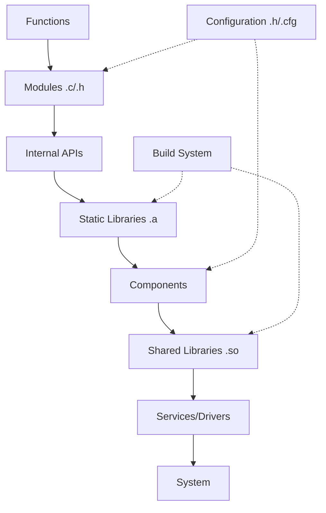

## C Code Hierarchy

*(From Atoms to Systems)*




### Level-by-Level Breakdown

1. Functions  
   - Atomic units of logic  
   - Example:  
     ```c
     int add(int a, int b) { return a + b; }
     ```

2. Modules (`.c` + `.h` pairs)  
   - Cohesive functional units  
   - Example Structure:  
     ```
     /math_utils
       ├── math_utils.h  // Public interface
       └── math_utils.c  // Implementation
     ```

3. Internal APIs  
   - Header-defined contracts between modules  
   - Example (`network.h`):  
     ```c
     #ifndef NETWORK_H
     #define NETWORK_H
     
     typedef struct Socket Socket; // opaque type
     Socket* socket_create();
     int socket_connect(Socket*, const char* host);
     #endif
     ```

4. Static Libraries (`.a` archives)  
   - Collections of compiled modules  
   - Creation:  
     ```bash
     ar rcs libmath.a add.o subtract.o multiply.o
     ```

5. Components  
   - Functional subsystems combining multiple libraries  
   - Example (Sensor Component):  
     ```
     /sensors
       ├── accelerometer/  // Library
       ├── gyroscope/     // Library 
       └── sensor_fusion.c // Component glue
     ```

6. Shared Libraries (`.so` files)  
   - Dynamically linkable components  
   - Example (Building):  
     ```bash
     gcc -shared -o libsensors.so sensors/*.o
     ```

7. Services/Drivers  
   - Deployable system units  
   - Examples:  
     - Character device driver (`/dev/sensor`)
     - Network daemon service

8. System  
   - Final linked executable  
   - Built with:  
     ```bash
     gcc main.c -L. -lsensors -lm -o robot_controller
     ```


#### Key Cross-Cutting Elements

Configuration  
- Compile-time: `#define` in headers  
- Runtime: `config.cfg` files parsed at startup

Build System  
- Makefile managing dependencies:  
  ```makefile
  CC = gcc
  CFLAGS = -I./include
  
  libmath.a: add.o subtract.o
      ar rcs $@ $^
  
  add.o: src/add.c include/math.h
      $(CC) $(CFLAGS) -c $< -o $@
  ```


__1. Physical → Logical Mapping__

|Filesystem               |Logical Concept|
|-------------            |-----------------|
|add.c                    |Function collection|
|math/                    |Module|
|include/math.h           |Internal API|
|lib/libmath.a            |Static Library|
|sensors/                 |Component|
|usr/lib/libsensors.so    |Shared Library|
|bin/robot_controller     |System|


__2. Compilation Stack__


__3. Interface Evolution__

```c
// Version 1.0 (math.h)
int add(int a, int b);

// Version 2.0 (Backwards compatible)
int add_ex(int a, int b, int flags); 

// Version 3.0 (Component API)
typedef struct MathContext MathContext;
MathContext* math_create_context();
int math_execute(MathContext*, int opcode, ...);
```


### Contrast with Other Interpretations

| Traditional View       | C-Centric Reality              |
|------------------------|---------------------------------|
| Functions → Modules    | *Functions are module members* |
| Components before libs | *Libraries build components*  |
| APIs as external        | *APIs start at header files*  |

### Why C is Different?
- No native package/module system
- Header files *are* API contracts
- Static linking is first-class citizen
- Shared libraries ≈ "deployable components"


__Linux Kernel Source Structure__

```
/ (Kernel)
├── arch/       /* Component: Architecture-specific */
├── drivers/    /* Component: Device drivers */
├── fs/         /* Component: File systems */
├── include/    /* Global APIs */
├── init/       /* Module: Boot code */
├── ipc/        /* Module: Inter-process comm */
├── kernel/     /* Core modules */
├── lib/        /* Static libraries */
├── mm/         /* Memory management component */
└── net/        /* Networking component */
```

Flow Analysis
1. *Functions*: `kernel/sched/core.c:schedule()`
2. *Module*: `kernel/sched/` (scheduler subsystem)
3. *Internal API*: `include/linux/sched.h`
4. *Static Lib*: `lib/string.c` → `libstring.a`
5. *Component*: `drivers/usb/` (USB subsystem)
6. *Shared Lib*: `drivers/net/wireless/ath.ko` (loadable module)
7. *System*: `vmlinuz` (final kernel image)


### Summary

| Level        | Artifact              | Tools              | Scope Example          |
|--------------|-----------------------|--------------------|------------------------|
| *Functions*  | `.c` implementations  | Compiler           | `memcpy()`             |
| *Modules*    | `.c/.h` pairs         | Preprocessor       | `list.c` + `list.h`    |
| *APIs*       | Header files          | `#include`         | `stdio.h`              |
| *Libraries*  | `.a` files            | `ar`, `ld`         | `libm.a`               |
| *Components* | Directory structures  | Makefile           | `drivers/net/`         |
| *Services*   | `.so`/`.ko` files     | `insmod`, `ldconfig` | `ext4.ko` (kernel module) |
| *System*     | Executable binary     | Linker             | `bash`, `httpd`        |


In C, the hierarchy emerges through *compilation units* and *linking stages* rather than
*language-enforced constructs*. The physical file organisation directly mirrors the conceptual
hierarchy, making C's modularization uniquely tied to its build system and file structure.

