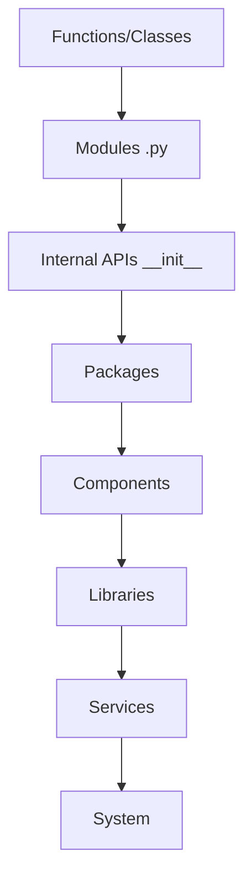
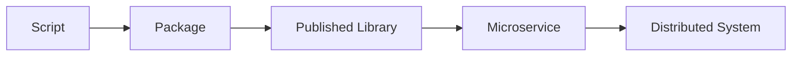

## Python Code Hierarchy

This hierarchy illustrates how Python projects scale from small scripts to complex, distributed systems. Understanding these levels and their interactions is key to building maintainable, scalable, and robust Python applications.


### Core Hierarchy Levels



#### Level-by-Level Breakdown

1.  **Functions/Classes**
    ```python
    # Atomic units
    def calculate_interest(principal: float) -> float:
        return principal * 0.05
    ```

2.  **Modules (.py files)**
    ```
    /project
      └── tax_calculator.py  # Contains related functions/classes
    ```

3.  **Internal APIs (\_\_init\_\_.py)**
    ```python
    # mypkg/__init__.py
    from .submodule import public_api
    __all__ = ['public_api']  # Controlled exports
    ```

4.  **Packages**
    ```
    /mypackage
      ├── __init__.py
      ├── subpkg1/
      └── subpkg2/
    ```

5.  **Components**
    ```
    /authentication
      ├── oauth/
      ├── jwt_handler.py
      └── permissions.py
    ```
    *A collection of related packages or modules that provide a specific, cohesive functionality within a larger application. Think of it as a pluggable, self-contained part of your system.*

6.  **Libraries**
    ```python
    # pyproject.toml
    [project]
    name = "financelib"
    version = "1.0.0"
    ```
    *A collection of reusable code (often one or more packages) designed to be imported and used by various applications. Libraries are typically distributed via package managers like PyPI.*

7.  **Services**
    ```python
    # FastAPI service
    from fastapi import FastAPI
    app = FastAPI()
    ```
    *An independently deployable unit of functionality that often exposes an API (e.g., HTTP, gRPC) and runs as a separate process. Services interact with each other to form a larger distributed system.*

8.  **System**
    ```
    deployed_system/
      ├── api_service/
      ├── task_worker/
      └── frontend/
    ```
    *The complete, deployed application environment, comprising multiple interacting services, databases, external integrations, and infrastructure.*


### Supporting Elements

* **Wheel**
    A pre-built distribution format for Python packages, designed for faster and more reliable installations compared to source distributions. It's essentially a zip archive with a `.whl` extension.

Virtual Environments
```bash
python -m venv .venv  # isolation boundary
source .venv/bin/activate
```
* *A self-contained directory containing a specific Python interpreter and its own set of installed packages, keeping dependencies for different projects separate.*

Configuration Management
```python
# config.py
import os
DB_URL = os.getenv("DATABASE_URL")
```
* *The practice of managing and accessing application settings and parameters, often separating them from the code itself (e.g., using environment variables, `.env` files, or dedicated configuration files).*


### Real-World Implementations

Flask Web Service
```
myflaskapp/
├── app/
│   ├── __init__.py
│   ├── routes.py       # Module
│   ├── models.py       # Module
│   └── templates/      # Component (e.g., UI assets)
├── tests/              # Component (testing suite)
├── requirements.txt    # Library dependencies
└── wsgi.py             # Service entry point (WSGI server interface)
```

Django
```
myproject/
├── manage.py
├── myapp/
│   ├── migrations/
│   ├── __init__.py
│   ├── admin.py
│   ├── apps.py
│   ├── models.py
│   ├── tests.py
│   └── views.py
├── myproject/
│   ├── __init__.py
│   ├── settings.py
│   ├── urls.py
│   └── wsgi.py
└── requirements.txt
```

Hierarchy Mapping
* **Function:** `views.index()`
* **Module:** `views.py`
* **Package:** `myapp/`
* **Component:** Entire `myapp` (MVC component)
* **Library:** `django` (external dependency)
* **Service:** WSGI application (`wsgi.py`)
* **System:** Django project + database + web server


### Hierarchy Comparison: Python vs C

| Aspect          | Python                    | C                    |
|:----------------|:--------------------------|:---------------------|
| Compilation     | Bytecode (`.pyc`)         | Machine code         |
| Linking         | Dynamic (imports)         | Static/shared libs   |
| Interface Def   | `__init__.py` + type hints| Header files         |
| Component Mgmt  | Packages via pip          | Makefiles/CMake      |


### Modern Python Features

Type Hint Contracts
```python
from typing import Protocol

class DataStore(Protocol):
    def save(self, data: bytes) -> str: ...
    def load(self, ref: str) -> bytes: ...
```
* *Formal specifications for object interfaces and data types, enabling static analysis tools (like MyPy) to catch potential errors before runtime and improving code readability.*

Async Components
```python
import aiohttp

async def fetch_data(url: str) -> dict:
    async with aiohttp.ClientSession() as session:
        async with session.get(url) as response:
            return await response.json()
```
* *Code designed to run concurrently without blocking the main execution thread, particularly useful for I/O-bound operations (like network requests, database calls) in web services and other applications.*


### Summary

| Level          | Python Artifact         | Example                  |
|:---------------|:------------------------|:-------------------------|
| Function       | `def`/`class`           | `calculate_tax()`        |
| Module         | `.py` file                | `tax_utils.py`           |
| Package        | `__init__.py` directory   | `mypackage/`             |
| Component      | Feature subpackage      | `authentication/`        |
| Library        | PyPI package            | `requests==2.31.0`       |
| Service        | ASGI/WSGI app           | FastAPI instance         |
| System         | Deployed environment    | Kubernetes cluster       |

*"A Python component should be small enough to fit in a developer's working memory,
but large enough to justify its existence as an independent unit."*

#### Critical Challenges

1.  **Circular Imports**
    * **Solution:** Restructure your code to break dependencies, or use late imports inside functions if absolutely necessary.

2.  **Namespace Collisions**
    ```python
    import pandas as pd  # Conventional alias
    from mypkg import utils as myutils  # Disambiguation
    ```
    * *Occur when two different modules or packages define the same name. Solutions include using aliasing during import or being explicit with fully qualified names.*

3.  **Dynamic Nature Risks**
    * **Mitigation:** Use type checkers (like MyPy) and linters (like Flake8, Black) to enforce code quality, catch errors early, and maintain consistency.


### Evolution Path



End State
```python
# modular Python system
from finance.components import tax_calculator  # internal component
from external.libs import currency_converter  # third-party lib
from cloud.providers.aws import lambda_handler  # service integration
```


