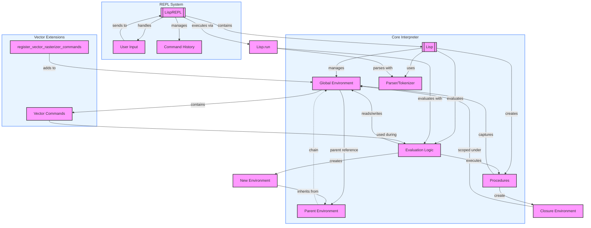
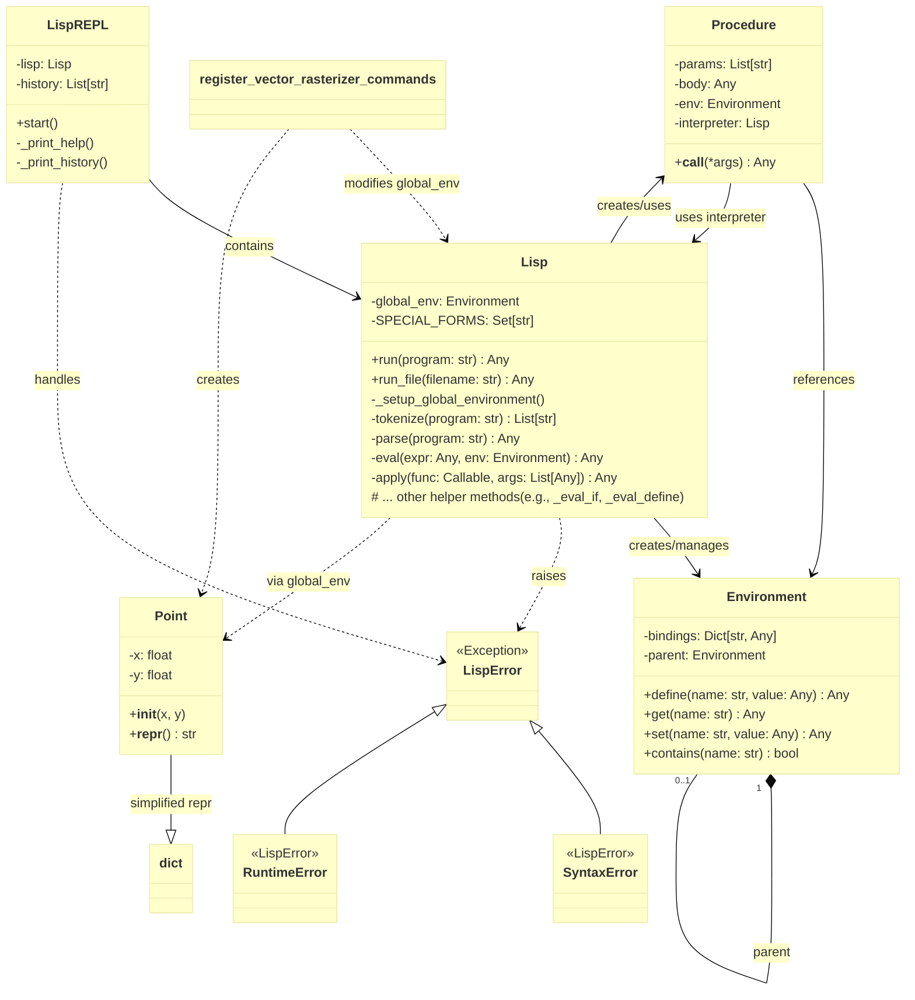

```mermaid
%% #{init: {'theme': 'base', 'themeVariables': { 'fontSize': '12px'}}}%%
flowchart TD
    %% Main Components
    subgraph Core[Core Interpreter]
        Lisp[[Lisp]] -->|manages| GlobalEnv[Global Environment]
        Lisp -->|uses| Parser[Parser/Tokenizer]
        Lisp -->|evaluates| Eval[Evaluation Logic]
        Lisp -->|creates| Procedures
        GlobalEnv -->|parent reference| ParentEnv[Parent Environment]
    end

    subgraph REPL[REPL System]
        LispREPL[[LispREPL]] -->|contains| Lisp
        LispREPL -->|handles| UserInput[User Input]
        LispREPL -->|manages| History[Command History]
    end

    subgraph Extensions[Vector Extensions]
        register_vector_rasterizer_commands -->|adds to| GlobalEnv
        GlobalEnv -->|contains| VectorCmds[Vector Commands]
    end

    %% Data Flow
    UserInput -->|sends to| LispREPL
    LispREPL -->|executes via| Lisp.run
    Lisp.run -->|parses with| Parser
    Lisp.run -->|evaluates with| Eval
    Eval -->|reads/writes| GlobalEnv
    Eval -->|creates| NewEnv[New Environment]
    NewEnv -->|inherits from| ParentEnv
    Eval -->|executes| Procedures
    Procedures -->|create| ClosureEnv[Closure Environment]

    %% Key Dependencies
    Procedures -->|captures| GlobalEnv
    ParentEnv -.->|chain| GlobalEnv
    ClosureEnv -->|scoped under| GlobalEnv
    VectorCmds -->|used during| Eval

    %% Annotations
    classDef node fill:#f9f,stroke:#333,stroke-width:2px;
    classDef cluster fill:#e8f4ff,stroke:#6699ff,stroke-width:2px;
    class Core,REPL,Extensions cluster;
```

```mermaid
%%{init: {'theme': 'base', 'themeVariables': { 'primaryColor': '#ffffcc', 'edgeLabelBackground':'#ffffff'}}}%%
classDiagram
    %% Class Definitions
    class LispError {
        <<Exception>>
    }
    class SyntaxError {
        <<LispError>>
    }
    class RuntimeError {
        <<LispError>>
    }
    
    class Environment {
        -bindings: Dict[str, Any]
        -parent: Environment
        +define(name: str, value: Any) Any
        +get(name: str) Any
        +set(name: str, value: Any) Any
        +contains(name: str) bool
    }

    class Procedure {
        -params: List[str]
        -body: Any
        -env: Environment
        -interpreter: Lisp
        +__call__(*args) Any
    }

    class Lisp {
        -global_env: Environment
        -SPECIAL_FORMS: Set[str]
        +run(program: str) Any
        +run_file(filename: str) Any
        -_setup_global_environment()
        -tokenize(program: str) List[str]
        -parse(program: str) Any
        -eval(expr: Any, env: Environment) Any
        -apply(func: Callable, args: List[Any]) Any
        # ... other helper methods (e.g., _eval_if, _eval_define)
    }

    class LispREPL {
        -lisp: Lisp
        -history: List[str]
        +start()
        -_print_help()
        -_print_history()
    }

    class Point {
        -x: float
        -y: float
        +__init__(x, y)
        +__repr__() str
    }

    %% Dependencies/Relationships
    LispError <|-- SyntaxError
    LispError <|-- RuntimeError

    Environment "1" *-- "0..1" Environment : parent

    Lisp --> Environment : creates/manages
    Lisp --> Procedure : creates/uses
    Lisp ..> LispError : raises

    Procedure --> Environment : references
    Procedure --> Lisp : uses interpreter

    LispREPL --> Lisp : contains
    LispREPL ..> LispError : handles

    register_vector_rasterizer_commands ..> Lisp : modifies global_env
    register_vector_rasterizer_commands ..> Point : creates

    Point --|> dict : simplified repr
    Lisp ..> Point : via global_env
```