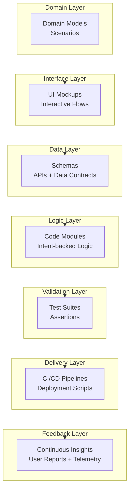
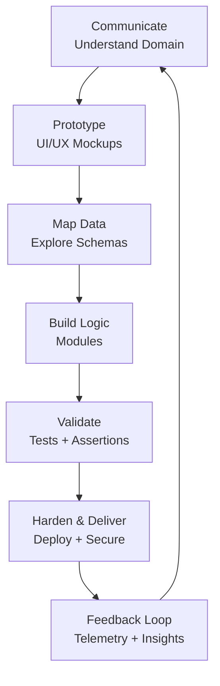
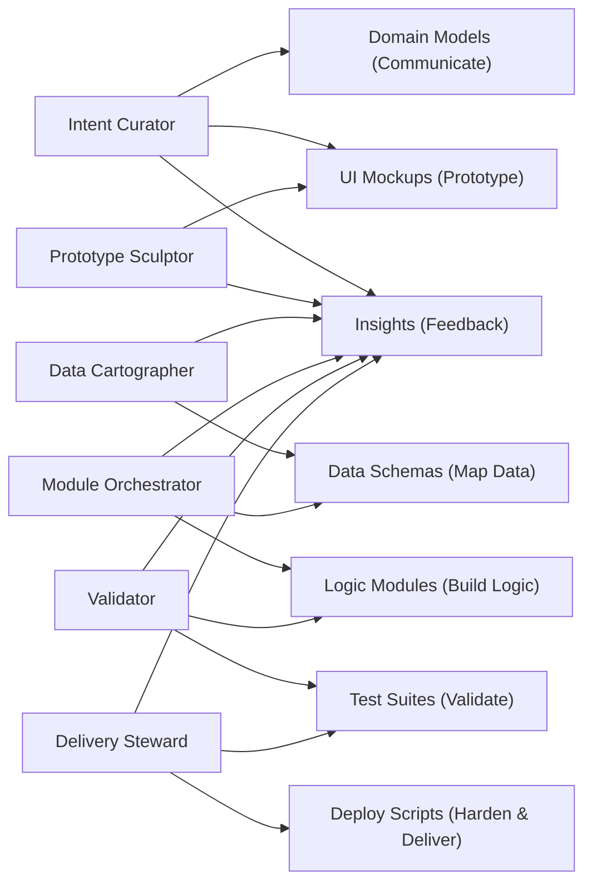

## IDEAS++: Architectural Layer

> The Code is Dead, Long Live the Code

We abstract from the previous more individual organic, dialogue-driven craft of "Crafting Programs"
with a structured, regenerable artifacts in IDEAS++ suggesting that now teams can build systems which
are both deeply human and technically robust, redefining software development for the AI age.
This take is mostly for illustrating how evolving development could shape also theoretical standpoints.
It is not a closed process that we must obey, rather a experimental course to explore.

LLMs dissolve static artifacts into dynamic, co-evolving artifacts:
*code*, *docs*, *tests*, and *design* merge into fluid, regenerable models.
The system architecture of LLM-augmented software development can be sketched as layers:

| Layer | Artifact Today (Static) | LLM-Era Artifact (Dynamic / Regenerable) | Key Role of LLM |
|-------|-------------------------|------------------------------------------|-----------------|
| *0. Domain* | Requirements, User Stories | Conversational Domain Models, Scenario Catalog | Summarisation, synthesis, reframing |
| *1. Interface* | Mockups, Wireframes | LLM-refined Interactive Mock Dialogs, Conversational UI specs | Generative prototyping, alignment |
| *2. Data* | Schemas, ERDs, APIs | Generative Data Contracts, Auto-profiled Data Landscapes | Schema extraction, sample generation |
| *3. Logic* | Source Code | Regenerable Code Templates, Intent-Backed Modules | Boilerplate gen, refactor assistance |
| *4. Validation* | Unit Tests, Test Plans | Intent-coupled Test Suites, Live Assertions | Test gen, fuzzing, validation assist |
| *5. Delivery* | CI/CD Scripts, Ops Docs | Adaptive Deploy Pipelines, Self-updating Runbooks | Script gen, config assistance |
| *6. Feedback* | User Reports, Changelogs | Continuous Insight Streams (Summarised feedback + telemetry) | Insight synthesis, trend summarisation |

### Workflow Example: Building a Recommendation Engine

To illustrate integration with the origin in crafting, consider the example of building a recommendation engine,
combining the iterative process of "Crafting Programs" with the layered structure of "IDEAS++":

1. *Communicate (Domain Layer)*:
   - *Activity*: Engage stakeholders to understand goals (e.g., personalised recommendations).
     LLMs generate conversational domain models and "What-If" scenarios (e.g., "What if users want explanations?").
   - *Artifact*: Regenerable domain model capturing intent and constraints.
   - *LLM Role*: Synthesise discussions, flag contradictions (e.g., "Scalability vs. real-time updates").

2. *Prototype (Interface Layer)*:
   - *Activity*: Build a simple UI mockup for recommendations. LLMs generate interactive dialogs and suggest
     a modular folder structure implying architectural patterns.
   - *Artifact*: Interactive UI scenarios and early code structure.
   - *LLM Role*: Simulate user interactions, propose design patterns (e.g., "Consider a REST API for flexibility").

3. *Map Data (Data Layer)*:
   - *Activity*: Analyse clickstream data. LLMs profile datasets, generate schemas, and flag risks (e.g.,
     "Data lacks diversity—consider mitigation").
   - *Artifact*: Generative data contracts and profiled data landscapes.
   - *LLM Role*: Extract schemas, simulate bottlenecks, and suggest data flows.

4. *Incremental Build (Logic Layer)*:
   - *Activity*: Implement a collaborative filter with real-time updates. LLMs scaffold code, propose
     WebSockets, and warn about tradeoffs (e.g., latency vs. scalability).
   - *Artifact*: Intent-backed code modules.
   - *LLM Role*: Refactor logic, inject tests, and enforce guardrails (e.g., "Avoid tight coupling").

5. *Validate (Validation Layer)*:
   - *Activity*: Simulate 10k concurrent users. LLMs generate test suites and highlight architectural
     drift (e.g., "Database locks under load—switch to async").
   - *Artifact*: Intent-coupled test suites and live assertions.
   - *LLM Role*: Generate tests, monitor coverage, and produce architecture diffs.

6. *Harden & Deliver (Delivery Layer)*:
   - *Activity*: Deploy the system with Terraform scripts and document decisions. LLMs generate
     runbooks and codify the architecture’s rationale.
   - *Artifact*: Adaptive pipelines and decision records.
   - *LLM Role*: Write scripts, check security patterns, and ensure documentation syncs with intent.

7. *Feedback Loop (Feedback Layer)*:
   - *Activity*: Collect user feedback and telemetry. LLMs summarize insights (e.g., "Users want
     faster load times") and suggest refinements (e.g., "Add caching layer").
   - *Artifact*: Continuous insight streams.
   - *LLM Role*: Synthesize trends, regenerate artifacts, and propose intent updates.

### Core Concept: Regenerable Artifacts

Instead of static artifacts--*requirements*, *code*, *tests*, *docs*, all disconnected--we build LLM-coupled,
regenerable artifacts that:
- Can be re-synthesised or auto-refreshed from *evolving goals*
- Stay synchronised (if code changes, tests and docs update semi-automatically, or manually)
- Embed *intent* alongside *implementation* (in the form of preliminary code)

| Phase | Artifacts | LLM Role |
|-------|-----------|----------|
| *Communicate (Domain)* | Conversational Domain Models | Extract domain language, goals, contradictions |
| *Prototype (Interface)* | Interactive Mock Dialogs, UI Scenarios | Generate UI flows, simulate interactions |
| *Map Data (Data)* | Generative Schemas, Data Profiles | Extract schemas, profile datasets, generate synthetic data |
| *Build Logic (Logic)* | Intent-backed Code Modules | Scaffold modules, refactor logic, inject tests |
| *Validate (Validation)* | Test suites tied to user intent | Generate tests from scenarios, monitor coverage |
| *Harden & Deliver (Delivery)* | Self-updating pipelines, secured configs | Write deployment scripts, check security patterns |
| *Feedback Loop (Feedback)* | Continuous Insight Streams (feedback + telemetry) | Summarise feedback, suggest refinements |

### Developer Role

| Role | Focus | LLM-augmented Task |
|------|-------|--------------------|
| *Intent Curator* | Maintain evolving goal/spec | Refactor prompts, validate LLM outputs |
| *Prototype Sculptor* | UI/UX flow + feedback | Rapid mock gen + demo |
| *Data Cartographer* | Data model + API integrator | Data profiling, schema synthesis |
| *Module Orchestrator* | Code module owner | Generate/refactor modules, bind data/logic |
| *Validator* | Testing + assurance | Gen+curate tests, review assertions |
| *Delivery Steward* | Deploy, secure | Script gen, infra-as-code supervision |

#### Summary
- The code is *not* central anymore--intent is.
- Artifacts (code, tests, docs) become views over *evolving intent models*.
- LLM is a *co-orchestrator*, regenerating artifacts as intent evolves.
- Architecture is *fluid*, enabling faster shifts and continuous synchronisation.

#### Role Interaction Diagram

#### LLM as the Glue

LLMs bridge the two views by serving as dynamic facilitators across all phases and layers. Their roles
integrate the hands-on, iterative crafting process with the regenerable artifact model:

- *Sense-Making and Synthesis*: In both views, LLMs extract intent, uncover contradictions, and translate
  vague ideas into actionable artifacts (e.g., domain models, UI flows, schemas).

- *Pattern Recognition and Proposal*: LLMs propose architectural patterns in "Crafting Programs" (e.g.,
  event sourcing, caching) and enforce guardrails in "IDEAS++" (e.g., stateless APIs, decoupled data layers).

- *Artifact Regeneration*: LLMs ensure artifacts remain synchronized with evolving intent, a core tenet
  of "IDEAS++," while supporting the iterative refinements of "Crafting Programs" (e.g., updating tests
  and docs as code changes).

- *Feedback Amplification*: LLMs analyze telemetry and user feedback to drive refinements, supporting both
  the feedback flywheel of "Crafting Programs" and the insight streams of "IDEAS++."

Integrating these views requires addressing ethical risks, as both highlight:

- *Overconfidence in LLMs*: Mitigate by prompting LLMs to explain reasoning (e.g., "Why recommend microservices?")
  and cross-checking outputs.

- *Bias in LLM Outputs*: Audit suggestions for default assumptions (e.g., cloud-native vs. on-prem) and
  diversify training data where possible.

- *Loss of Agency*: Ensure human architects curate intent and validate LLM-generated artifacts, maintaining
  control over critical decisions.

