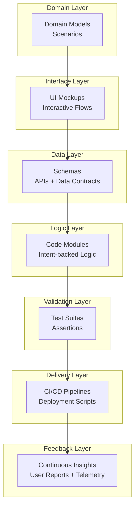
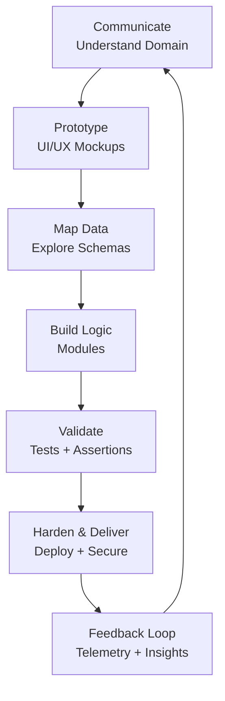

## IDEAS++: Architectural Layer

> The Code is Dead, Long Live the Code

LLMs dissolve static artifacts into dynamic, co-evolving artifacts:
*code*, *docs*, *tests*, and *design* merge into fluid, regenerable models.

The system architecture of LLM-augmented software development:

| Layer | Artifact Today (Static) | LLM-Era Artifact (Dynamic / Regenerable) | Key Role of LLM |
|-------|-------------------------|------------------------------------------|-----------------|
| *0. Domain* | Requirements, User Stories | Conversational Domain Models, Scenario Catalog | Summarisation, synthesis, reframing |
| *1. Interface* | Mockups, Wireframes | LLM-refined Interactive Mock Dialogs, Conversational UI specs | Generative prototyping, alignment |
| *2. Data* | Schemas, ERDs, APIs | Generative Data Contracts, Auto-profiled Data Landscapes | Schema extraction, sample generation |
| *3. Logic* | Source Code | Regenerable Code Templates, Intent-Backed Modules | Boilerplate gen, refactor assistance |
| *4. Validation* | Unit Tests, Test Plans | Intent-coupled Test Suites, Live Assertions | Test gen, fuzzing, validation assist |
| *5. Delivery* | CI/CD Scripts, Ops Docs | Adaptive Deploy Pipelines, Self-updating Runbooks | Script gen, config assistance |
| *6. Feedback* | User Reports, Changelogs | Continuous Insight Streams (Summarised feedback + telemetry) | Insight synthesis, trend summarisation |


### Core Concept: Regenerable Artifacts

Instead of static artifacts--requirements, code, tests, docs, all disconnected--we build LLM-coupled,
regenerable artifacts that:
- Can be re-synthesised or auto-refreshed from evolving goals
- Stay synchronised (if code changes, tests and docs update semi-automatically, or manually)
- Embed *intent* alongside *implementation* (in the form of preliminary code)


### Revised Phases — Architectural Activities

__1. Communicate (Domain)__

* Artifacts = Conversational Domain Models
* LLM Role = Extract domain language, goals, contradictions

__2. Prototype (Interface)__

* Artifacts = Interactive Mock Dialogs, UI Scenarios
* LLM Role = Generate UI flows, simulate interactions

__3. Map Data (Data)__

* Artifacts = Generative Schemas, Data Profiles
* LLM Role = Extract schemas, profile datasets, generate synthetic data

__4. Build Logic (Logic)__

* Artifacts = Intent-backed Code Modules
* LLM Role = Scaffold modules, refactor logic, inject tests

__5. Validate (Validation)__

* Artifacts = Test suites tied to user intent
* LLM Role = Generate tests from scenarios, monitor coverage

__6. Harden & Deliver (Delivery)__

* Artifacts = Self-updating pipelines, secured configs
* LLM Role = Write deployment scripts, check security patterns

__7. Feedback Loop (Feedback)__

* Artifacts = Continuous Insight Streams (feedback + telemetry)
* LLM Role = Summarise feedback, suggest refinements


| Phase | Artifacts | LLM Role |
|-------|-----------|----------|
| *Communicate (Domain)* | Conversational Domain Models | Extract domain language, goals, contradictions |
| *Prototype (Interface)* | Interactive Mock Dialogs, UI Scenarios | Generate UI flows, simulate interactions |
| *Map Data (Data)* | Generative Schemas, Data Profiles | Extract schemas, profile datasets, generate synthetic data |
| *Build Logic (Logic)* | Intent-backed Code Modules | Scaffold modules, refactor logic, inject tests |
| *Validate (Validation)* | Test suites tied to user intent | Generate tests from scenarios, monitor coverage |
| *Harden & Deliver (Delivery)* | Self-updating pipelines, secured configs | Write deployment scripts, check security patterns |
| *Feedback Loop (Feedback)* | Continuous Insight Streams (feedback + telemetry) | Summarise feedback, suggest refinements |


### Architecture Layering Diagram




### Developer Role

| Role | Focus | LLM-augmented Task |
|------|-------|--------------------|
| *Intent Curator* | Maintain evolving goal/spec | Refactor prompts, validate LLM outputs |
| *Prototype Sculptor* | UI/UX flow + feedback | Rapid mock gen + demo |
| *Data Cartographer* | Data model + API integrator | Data profiling, schema synthesis |
| *Module Orchestrator* | Code module owner | Generate/refactor modules, bind data/logic |
| *Validator* | Testing + assurance | Gen+curate tests, review assertions |
| *Delivery Steward* | Deploy, secure | Script gen, infra-as-code supervision |


Summary
- The code is not central anymore--intent is.
- Artifacts (code, tests, docs) become views over evolving intent models.
- LLM is a co-orchestrator, regenerating artifacts as intent evolves.
- Architecture is fluid, enabling faster shifts and continuous synchronisation.





### Role Interaction Diagram

```mermaid
graph LR
    %% Roles
    IC[Intent Curator]
    PS[Prototype Sculptor]
    DC[Data Cartographer]
    MO[Module Orchestrator]
    VA[Validator]
    DS[Delivery Steward]

    %% Layers / Artifacts
    DM[Domain Models <br/> (Communicate)]
    UI[UI Mockups <br/> (Prototype)]
    DA[Data Schemas <br/> (Map Data)]
    LM[Logic Modules <br/> (Build Logic)]
    TS[Test Suites <br/> (Validate)]
    DP[Deploy Scripts <br/> (Harden & Deliver)]
    FB[Insights <br/> (Feedback)]

    %% Interactions
    IC --> DM
    IC --> UI

    PS --> UI

    DC --> DA

    MO --> LM
    MO --> DA

    VA --> TS
    VA --> LM

    DS --> DP
    DS --> TS

    IC --> FB
    PS --> FB
    DC --> FB
    MO --> FB
    VA --> FB
    DS --> FB
```


