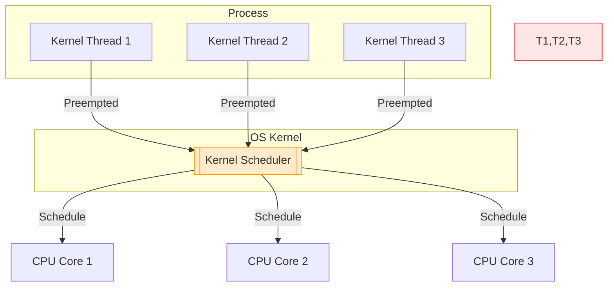
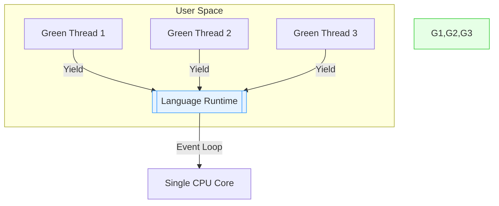
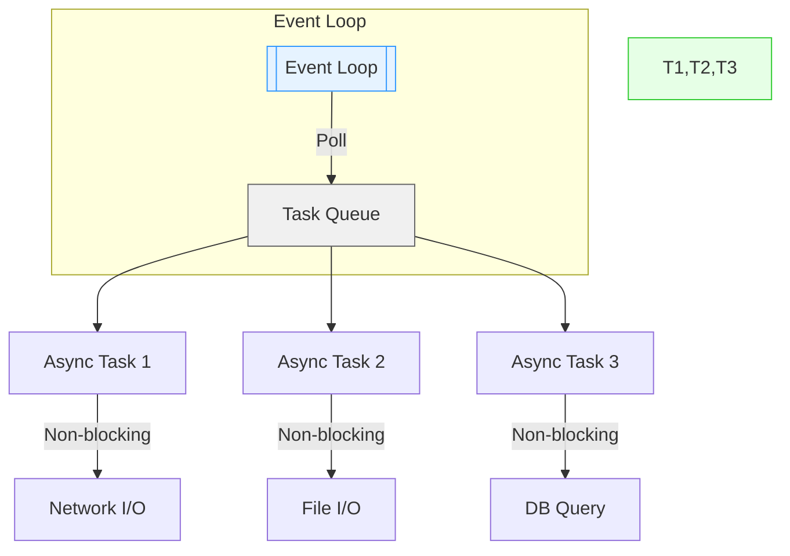

## Green Threads vs Kernel Threads

Concurrency lies at the heart of modern computing, balancing resource efficiency with performance.
Green threads and kernel threads represent two distinct approaches to achieving this balance, each
with unique strengths and trade-offs. This document explores their differences, historical evolution,
and practical applications, offering a clear guide for developers navigating concurrency models.


### Core Comparison

Green threads, managed in user-space by a runtime (e.g., a virtual machine or language), are lightweight
and flexible. Kernel threads, orchestrated by the operating system, offer robust parallelism but at a
higher cost. The table below highlights their key distinctions:

| Aspect                | Green Threads                                      | Kernel Threads                         |
|-----------------------|----------------------------------------------------|----------------------------------------|
| Management            | User-space runtime (e.g., VM, language)            | OS kernel                              |
| Scheduling            | Cooperative or custom preemptive                   | OS-controlled preemptive               |
| Context Switch Cost   | Low (no kernel involvement)                        | High (kernel mode transition)          |
| Parallelism           | Limited to one core unless mapped to kernel threads| True multi-core parallelism            |
| Memory Usage          | Small stack (~KB)                                  | Larger stack (~MB)                     |
| Blocking Operations   | Can stall process unless using async I/O           | Independent thread blocking            |
| Examples              | Go goroutines (hybrid), Erlang BEAM, early Java    | POSIX pthreads, Windows threads        |

*Note: Go's goroutines use an M:N hybrid model, mapping green threads to kernel threads for multi-core efficiency.*


### Key Differences in Depth

*Resource Overhead*. Green threads are lean, requiring just 1-10KB of memory per thread (Erlang's BEAM VM
achieves ~0.5KB). Kernel threads, by contrast, demand 1-10MB per thread (Linux defaults to 8MB), making them
less suitable for massive concurrency scenarios like handling thousands of simultaneous connections.

*Concurrency Model*. Green threads often rely on cooperative scheduling, where tasks explicitly yield control,
as shown in this simplified pseudo-code:

```python
def green_thread_task():
    while True:
        do_work()
        yield()  # cooperative yield
```

Kernel threads, managed by the OS, are preemptively scheduled, allowing seamless multitasking without
explicit yields:

```python
import threading
def kernel_thread_task():
    while True:
        do_work()  # OS handles preemption
```

*Failure Isolation*. A crash in a green thread typically affects the entire process, as they share the same
memory space. Kernel threads offer better isolation; a single thread's failure may not disrupt others, enhancing
robustness in critical systems.

*Scheduling Fairness*. Green threads depend on application-controlled scheduling, which risks task starvation
if poorly managed. Kernel threads benefit from OS-enforced fairness, ensuring equitable CPU allocation across tasks.


Kernel Threads and Cores:



Green Threads:




### Related Concurrency Constructs

Concurrency extends beyond threads, with several constructs complementing green and kernel threads:

- *Coroutines*: Stackless and cooperative, coroutines (e.g., Python's `async`/`await`) enable efficient task
  switching without the overhead of threads. Example:

```python
async def fetch_data():
    await non_blocking_io()
```

- *Fibers*: Windows-specific user-mode threads with manual scheduling, fibers resemble green threads but
  are OS-dependent. Example:

```cpp
void fiber_func() {
    ConvertThreadToFiber(NULL);
    // logic ..
}
```

- *Actors Model*: Popularised by Erlang and Elixir, actors are lightweight processes with isolated heaps
  and message-passing, ideal for fault-tolerant systems.

- *Async I/O*: Event-loop-driven models (e.g., Node.js, Rust's Tokio) excel in non-blocking operations.
  Example:

```rust
async fn handle_connection() {
    let data = socket.read().await;
}
```

- *Processes*: Offering strong isolation via separate memory spaces, processes (e.g., Python's `multiprocessing`)
  are heavyweight but robust for parallel tasks.


Async I/O:




### Modern Implementations

Today's concurrency models blend the best of green and kernel threads, leveraging hybrid approaches and async runtimes:

| Technology    | Mechanism                         | Characteristics                               |
|---------------|-----------------------------------|-----------------------------------------------|
| Go            | M:N goroutines                    | 2KB growable stacks, multi-core support       |
| Java Loom     | Virtual threads                   | JVM-managed, lightweight, kernel-mapped       |
| Erlang BEAM   | Preemptive green threads          | Microsecond scheduling, fault isolation       |
| Rust Tokio    | Async runtime with work-stealing  | Zero-cost abstractions, no garbage collection |


### Choosing the Right Model

Selecting between green and kernel threads depends on the use case:

- *Green Threads*: Ideal for high-concurrency scenarios (e.g., 10k+ connections) with predictable latency, such
  as web servers or real-time systems. Their lightweight nature minimises resource usage.

- *Kernel Threads*: Suited for CPU-intensive tasks requiring true parallelism, like video encoding or scientific
  computing, and when integrating with native libraries.

- *Hybrid Approaches* (e.g., Go, Java Loom): These combine lightweight concurrency with multi-core parallelism,
  making them versatile for cloud-native microservices and scalable applications.


### Historical Evolution

- Early Days (1960s-1970s).
Concurrency began with heavyweight processes in systems like IBM's OS/360. Dijkstra's 1967 paper on synchronisation
primitives laid theoretical groundwork, but practical concurrency awaited hardware capable of time-sharing.

- Kernel Threads (1980s).
The 1984 Mach microkernel introduced kernel-level threads, standardized as POSIX pthreads by 1995. These enabled
parallel execution across CPUs but suffered from high memory overhead and slow context switches, limiting scalability
to ~1000 threads.

- Green Threads (1990s).
The C10k problem—handling 10,000 concurrent connections—spurred user-space solutions. Modula-3 (1991), Java 1.0 (1996),
and Erlang's BEAM VM (1998) introduced green threads, offering micro-stacks (4KB) and cooperative scheduling. While adept
at massive concurrency, they struggled with blocking I/O and single-core limitations.

- Multicore Era (2000s).
As CPU cores multiplied, hybrid models emerged. Go's goroutines (2009) mapped green threads to kernel threads, while
Apple's Grand Central Dispatch (2007) popularised thread pools. Work-stealing schedulers and async I/O (e.g., epoll)
further optimised performance.

- Modern Era (2010s-Present).
Today's systems integrate lightweight concurrency with parallelism. Rust's async/await (2013), Java's Project Loom
(2017), and Python's native coroutines (2020) reflect a synthesis of green threads, kernel threads, and async I/O,
driven by the demands of cloud computing and microservices.


### Lessons from History

The evolution of threading reveals enduring truths:
- *Hardware Shapes Software*: Multicore CPUs necessitated hybrid concurrency models.
- *Safety Enables Scale*: Languages like Rust and Go demonstrate that memory safety fosters robust concurrency.
- *Pioneers Inspire*: Erlang's 1986 preemptive green threads prefigured modern microservices and serverless architectures.

From the monolithic processes of the 1960s to today's nimble async patterns, concurrency's journey underscores
a relentless drive for efficiency. Green threads, once a workaround for kernel limitations, now bridge the gap
between resource-constrained systems and the demands of a multicore, cloud-driven world.


#### Personal Reflection

I first encountered green threads while working with early versions of Java. At that time, event-driven
programming with Java Applets--a form of Java application designed primarily for the web, but now dead--was
initially quite perplexing. Understanding how the event loop and callbacks interacted in a single-threaded
environment took some effort.

Later, during my decade as a data journalist, I wrote about Erlang--a language developed in Sweden for managing
telephone switches. In one article, I mistakenly predicted Erlang's demise, based on rumors circulating in a
technical forum. A technical lead at Ericsson, however, corrected me and pointed out that Erlang was very much
alive and evolving. Interestingly, he also appreciated another aspect of my argument: I had praised Erlang's
concurrency model, suggesting that its lightweight process model could become increasingly relevant in the future.

Looking back, I now recognise that what I was observing is exactly the pattern described in the discussion above:
thousands of lightweight threads (or processes) working concurrently, each handling small, independent tasks for
clients. This architectural model--which emphasises scalability, fault--tolerance, and message-passing
concurrency--has proven foundational not only in telecom systems but also in modern web servers, distributed systems,
and cloud-native applications.

