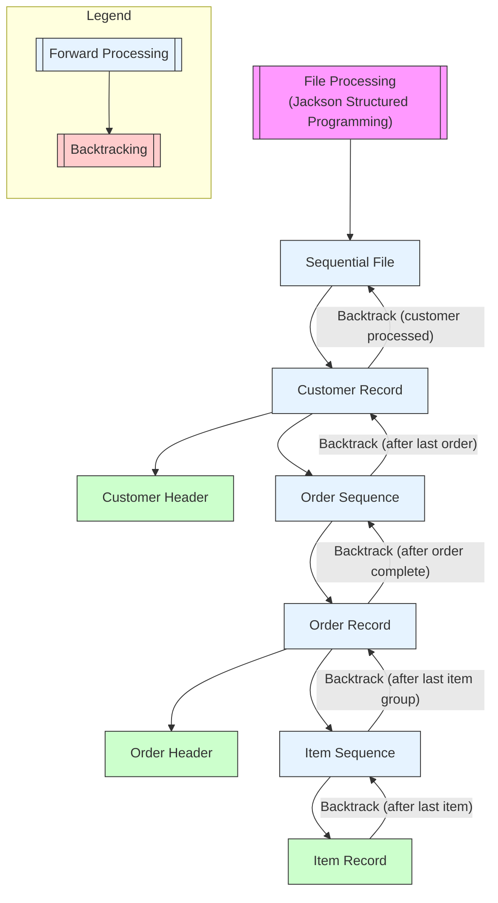
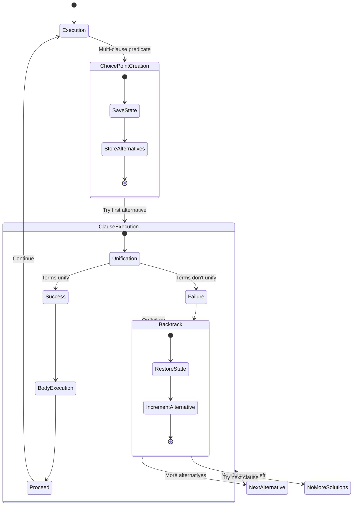
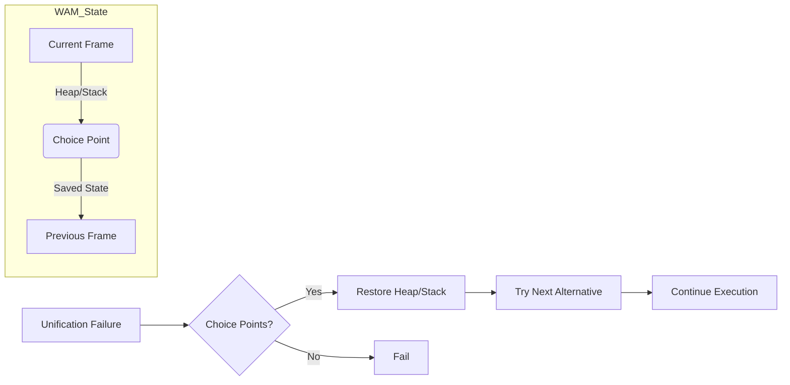
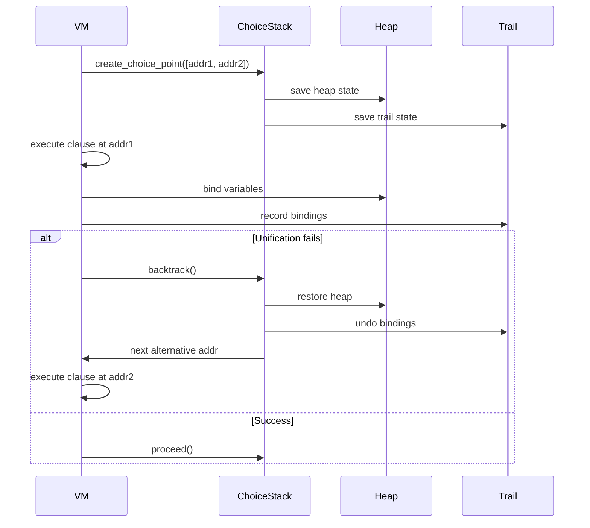
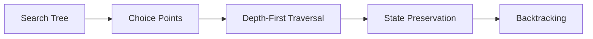
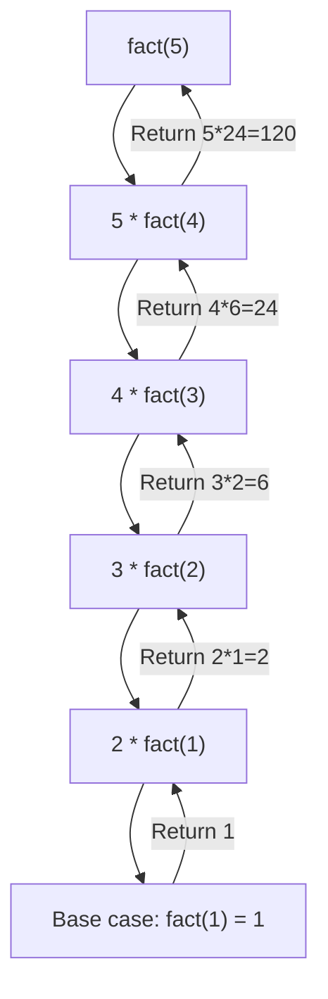

## Backtracking

The first time I encountered the concept of backtracking, it was not in the context most programmers today
would recognise--such as recursive algorithms solving puzzles or search problems--but rather in relation to
structured programming methods designed to improve software development in languages like BASIC or Pascal.
Specifically, it arose in the context of Jackson Structured Programming (JSP), a method that was influential
during the early 1980s. Especially in Sweden.

Michael A. Jackson introduced Jackson Structured Programming in his seminal book *Principles of Program Design*
(1975). The key idea behind JSP was to align the structure of a program closely with the structure of the data
it processed, particularly sequential file formats common in administrative and business applications. The
method emphasised program structures derived directly from data structures, usually represented as hierarchical
trees or sequences, iterations, and selections.

Where backtracking enters the picture is in the treatment of file structures that do not map cleanly into simple
linear control flows. In many business applications of that era, files were not merely flat sequences of uniform
records. Instead, they often had nested and repeating groups, akin to hierarchical or variably structured data
(imagine a customer file where a customer record contains a varying number of orders, and each order contains
a varying number of items). Processing such structures cleanly often required the program to descend into a
hierarchy (to process subrecords) and then ascend (to return to the higher-level structure)--in effect, navigating
forwards and backwards through the file structure.

In Jackson's approach, backtracking was not algorithmic backtracking in the modern sense (as in search trees or
constraint solving), but rather a structural traversal mechanism. The program needed to "backtrack" in the sense
of revisiting higher levels in the data hierarchy after processing lower levels. For example, after finishing
all items in an order, the program had to return to the "order" level to check if there were more orders for
that customer. This kind of logical navigation was a deterministic and systematic traversal, not speculative
as in search algorithms, but the term “backtracking” was used informally to describe this movement back up the
data structure.

Jackson's structured methods brought clarity to such problems by advocating explicit program design diagrams
that mirrored the data structures. These diagrams guided developers in systematically implementing the necessary
navigation, often leading to well-structured, iterative-recursive code patterns in procedural languages like
Pascal or COBOL. The method was especially relevant before the widespread availability of relational databases,
when sequential file processing dominated business computing.

In short, backtracking in Jackson Structured Programming referred to systematic reversal or return in hierarchical
data processing flows, driven by the necessity to process nested file structures accurately in procedural programs.

Reference:
* Jackson, M. A. (1975). *Principles of Program Design*. Academic Press.
* Ingevaldsson, L. (1977). *JSP - en praktisk metod för programkonstruktion*. Lund: Studentlitt.

### Backtracking in a Model of Logic Programming

This following diagram illustrates the control flow of a logic programming system
(e.g., Prolog) when handling predicates with multiple clauses:

1. *Initial Execution*  
   The system begins processing a query/predicate from the initial state ([*]).

2. *Choice Point Creation*  
   When encountering a multi-clause predicate:
   - System state is preserved (call stack, variables)
   - Alternative clauses are registered for potential backtracking

3. *Clause Execution Phase*  
   The first clause alternative is attempted through:
   - *Unification*: Attempt pattern matching between arguments
        - *Success*: Variables are bound, body execution proceeds
        - *Failure*: Triggers backtracking mechanism
   - *Body Execution*: Processes consequent goals if unification succeeds

4. *Backtracking Mechanism*  
   Activated when either unification fails or explicit backtracking is requested:
   - Restores previous execution state
   - Selects next available alternative clause
   - If no alternatives remain: Returns "no more solutions"

5. *Continuation*  
   Successful execution flows back to main processing (Execution state) to handle subsequent goals.

This matches the behavior of logic programming systems where multiple solutions are found through
systematic exploration of alternative execution paths.

### How Backtracking Works in a WAM

This diagram below visualises the state management and backtracking process in
*Warren's Abstract Machine* for logic programming:

1. *WAM State Components*  
   - *Current Frame*: Active execution context containing variable bindings and program counter  
   - *Choice Point*: Snapshot of machine state (heap/stack) at decision points  
   - *Heap/Stack*: Memory structures managing terms (heap) and control flow (stack)  
   - *Previous Frame*: Linked chain of prior execution states  

2. *Unification Failure Handling*  
   When unification fails:  
   - System checks for existing choice points  
   - Decision branches based on available backtracking options  

3. *Backtracking Process*  
   - *State Restoration*:  
     Heap/stack reset to saved state from choice point  
   - *Alternative Selection*:  
     Next unexplored code path is activated  
   - *Execution Continuation*:  
     Processing resumes with new alternative  

4. *Exhaustive Failure*  
   If no choice points remain:  
   - Computation terminates with global failure  
   - Indicates no valid solutions exist  

Concepts illustrated:  
- WAM's memory architecture for non-deterministic execution  
- Choice points as bookmarks for backtracking  
- State preservation/restoration mechanics  
- Heap-stack dichotomy in logic programming  
- Failure-driven backtracking workflow  

This reflects the WAM's approach to efficient Prolog implementation, where choice points enable
systematic backtracking while maintaining execution context through careful memory management.

- Choice Point Creation: Saves the machine state (heap, stack, trail) when encountering multiple clauses
- Backtracking Flow: Shows how failure triggers state restoration and alternative clause execution
- Data Preservation: Illustrates how variable bindings are tracked via the trail
- Multi-level Backtracking: Demonstrates nested choice points for complex queries

- create_choice_point() captures the execution state
- backtrack() restores from the most recent choice point
- The trail mechanism ensures variable bindings are properly undone
- Multiple solutions are found by systematically trying all alternatives

- Predicates with multiple clauses
- Nested queries with dependent solutions
- The "generate-and-test" paradigm of Prolog execution
- Efficient state restoration during backtracking

### General Backtracking Mechanism

*Definition*:  
A systematic way to explore all possible solutions by:
1. Making a choice (creating a *choice point*)
2. Proceeding until failure
3. Undoing the last choice (*backtracking*) and trying alternatives

1. *Choice Point Creation*  
   - When multiple paths exist (e.g., clauses in Prolog), save:
     - Current execution state (variables, stack, program counter)
     - Untried alternatives

2. *Execution*  
   - Proceed down one path until:
     - Success: Return solution
     - Failure: Trigger backtrack

3. *Backtracking*  
   - Restore saved state  
   - Try next alternative  
   - Repeat until all paths exhausted

*Example (Factorial)*:

### *Key Differences: General vs. WAM*
| Feature        | General Backtracking        | WAM Backtracking                     |
|----------------|-----------------------------|--------------------------------------|
| *State Saving* | Full copy of search state   | Selective (heap, trail, IP only)     |
| *Variables*    | No special handling         | Trail tracks bindings for undo       |
| *Control*      | Manual stack management     | Automatic via `choice_points` stack  |
| *Optimization* | None (naive)                | `CUT` operator prunes choice points  |

### Why This Matters in WAM
The implementation mirrors real Prolog engines by:
1. Minimizing state copying (only modified data via trail)  
2. Supporting nested choice points (e.g., `grandparent/2` calling `parent/2`)  
3. Enabling "green" backtracking (without full recursion unwinding)  

The trail mechanism is particularly clever—it only records *changes* to variables, making undo operations O(1) per binding.

