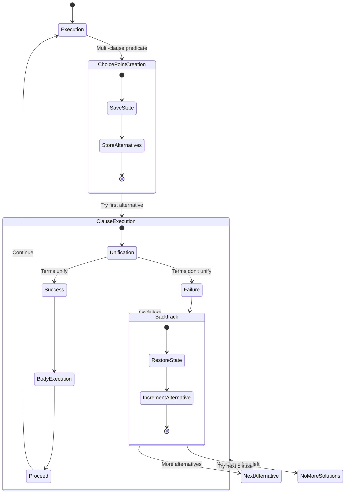
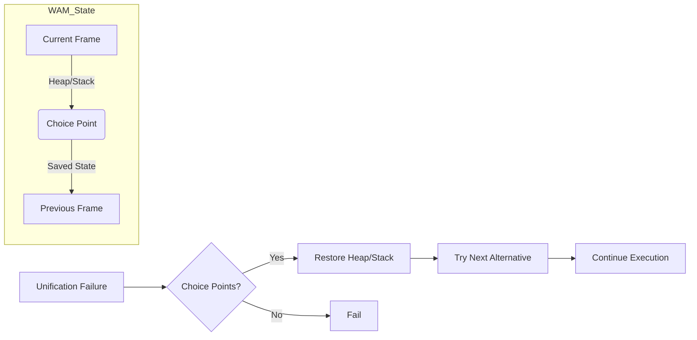
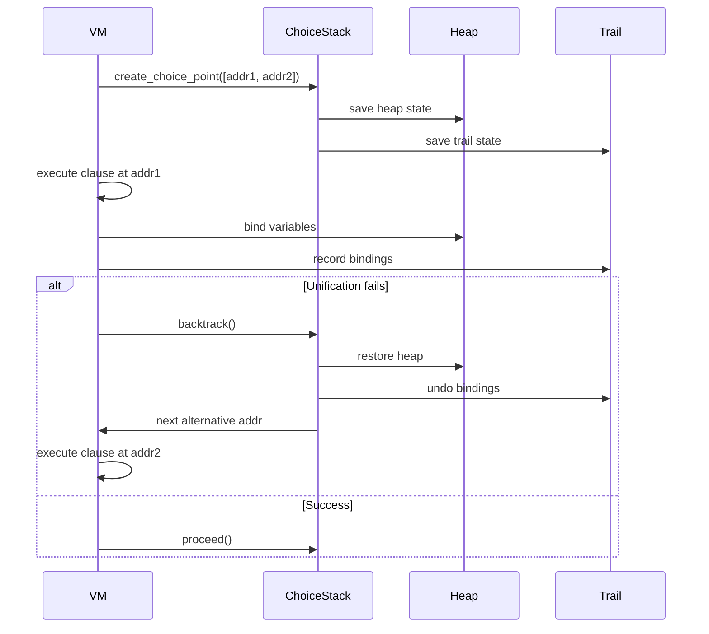

- Choice Point Creation: Saves the machine state (heap, stack, trail) when encountering multiple clauses
- Backtracking Flow: Shows how failure triggers state restoration and alternative clause execution
- Data Preservation: Illustrates how variable bindings are tracked via the trail
- Multi-level Backtracking: Demonstrates nested choice points for complex queries


- create_choice_point() captures the execution state
- backtrack() restores from the most recent choice point
- The trail mechanism ensures variable bindings are properly undone
- Multiple solutions are found by systematically trying all alternatives


- Predicates with multiple clauses
- Nested queries with dependent solutions
- The "generate-and-test" paradigm of Prolog execution
- Efficient state restoration during backtracking


### General Backtracking Mechanism

*Definition*:  
A systematic way to explore all possible solutions by:
1. Making a choice (creating a *choice point*)
2. Proceeding until failure
3. Undoing the last choice (*backtracking*) and trying alternatives


1. *Choice Point Creation*  
   - When multiple paths exist (e.g., clauses in Prolog), save:
     - Current execution state (variables, stack, program counter)
     - Untried alternatives

2. *Execution*  
   - Proceed down one path until:
     - Success: Return solution
     - Failure: Trigger backtrack

3. *Backtracking*  
   - Restore saved state  
   - Try next alternative  
   - Repeat until all paths exhausted


*Example (Factorial)*:
```mermaid
flowchart TD
    A[fact(5)] --> B[5 * fact(4)]
    B --> C[4 * fact(3)]
    C -->|Backtrack| D[Base case: fact(1)=1]
```


### *Key Differences: General vs. WAM*
| Feature        | General Backtracking        | WAM Backtracking                     |
|----------------|-----------------------------|--------------------------------------|
| *State Saving* | Full copy of search state   | Selective (heap, trail, IP only)     |
| *Variables*    | No special handling         | Trail tracks bindings for undo       |
| *Control*      | Manual stack management     | Automatic via `choice_points` stack  |
| *Optimization* | None (naive)                | `CUT` operator prunes choice points  |


### Why This Matters in WAM
The implementation mirrors real Prolog engines by:
1. Minimizing state copying (only modified data via trail)  
2. Supporting nested choice points (e.g., `grandparent/2` calling `parent/2`)  
3. Enabling "green" backtracking (without full recursion unwinding)  

The trail mechanism is particularly clever—it only records *changes* to variables, making undo operations O(1) per binding.


