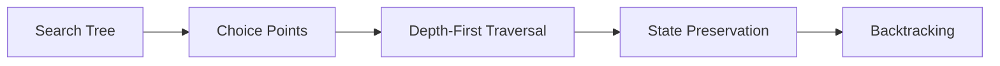
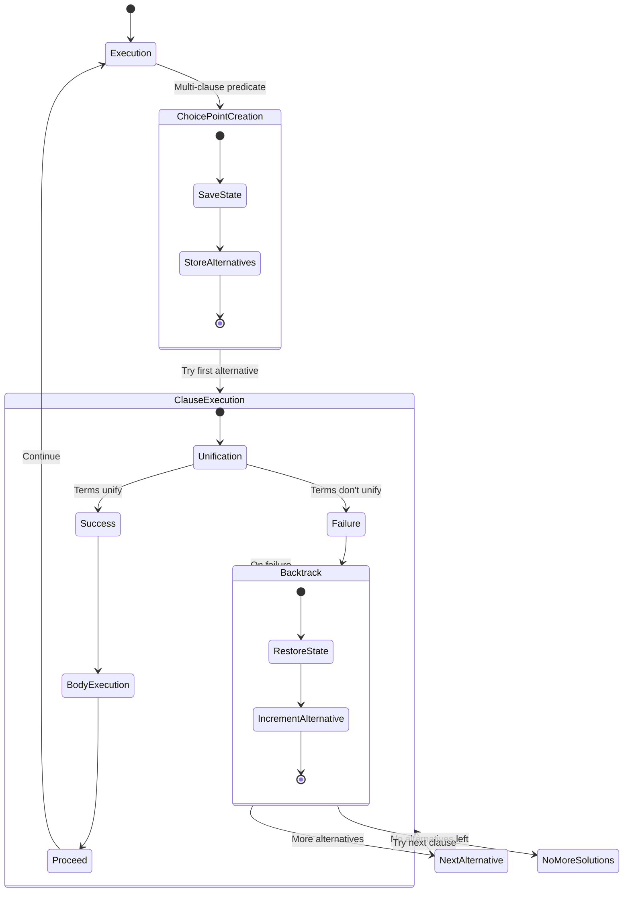
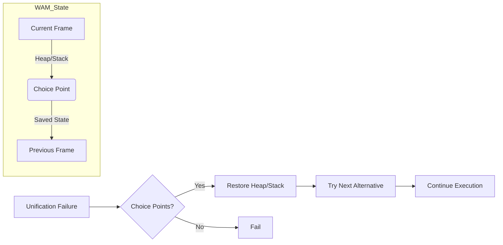
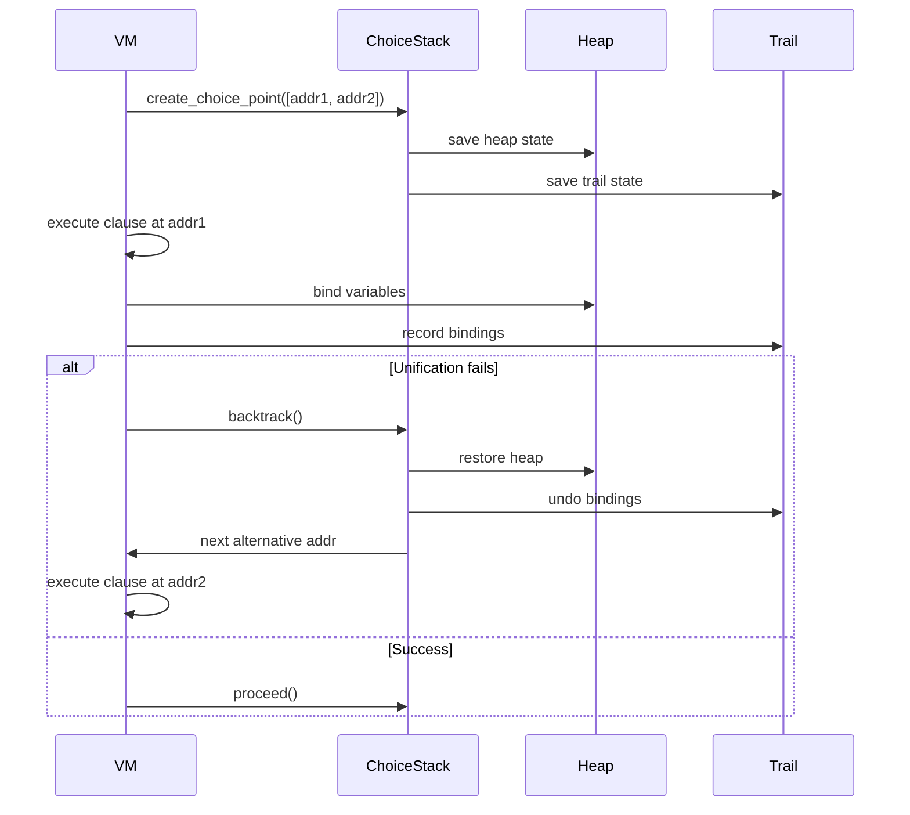

## Backtracking

The first time I encountered the concept of backtracking, it was not in the context most programmers today
would recognise--such as recursive algorithms solving puzzles or search problems, see samples in the
folder--but rather in relation to structured programming methods designed to improve software development
in languages like BASIC or Pascal. Specifically, it arose in the context of *Jackson Structured Programming*
(JSP), a method that was influential during the early 1980s. Especially in Sweden.

Michael A. Jackson introduced Jackson Structured Programming (JSP) in his 1975 book *Principles of Program Design*.
JSP aligns a program's structure with the data it processes, particularly sequential and hierarchical file formats
prevalent in business applications. The method derives program control flows—sequences, iterations, and
selections--from data structures, represented as hierarchical diagrams, ensuring clarity and maintainability.

Backtracking in JSP addresses the complexities of processing nested data structures, such as customer records
containing variable orders, each with multiple items. Unlike algorithmic backtracking (e.g., in search or
constraint solving), JSP’s backtracking is a deterministic traversal mechanism. It involves descending into
a data hierarchy to process subrecords and ascending to higher levels, as when returning from items to orders,
then to customers. This navigation, often implemented via nested loops or recursion in languages like COBOL or
Pascal, is guided by JSP's structure diagrams.

JSP employs backtracking to resolve "recognition difficulties" and structure clashes, where input and output
data structures misalign. For instance, a program may use POSIT to assume a data structure and proceed, and
QUIT to backtrack to a prior state if the assumption fails, enabling a "backtracking parser" for ambiguous data
formats. This systematic approach ensures accurate processing of complex files, common before relational databases
when sequential file processing dominated.

Jackson’s diagrams map these traversals, producing clean, iterative-recursive code patterns. While JSP's relevance
has waned with modern databases, its principles, including backtracking for hierarchical navigation and parsing,
remain applicable in data processing and are supported by tools like Jackson Workbench. Thus, backtracking in JSP
is a structured, data-driven reversal mechanism, distinct from speculative algorithms, tailored to the era’s file
processing needs.

Reference:
* Jackson, M. A. (1975). *Principles of Program Design*. Academic Press.
* Ingevaldsson, L. (1977). *JSP - en praktisk metod för programkonstruktion*. Lund: Studentlitt.

### General Backtracking Mechanism

*Definition*:  
A systematic way to explore all possible solutions by:
1. Making a choice (creating a *choice point*)
2. Proceeding until failure
3. Undoing the last choice (*backtracking*) and trying alternatives

1. *Choice Point Creation*  
   - When multiple paths exist (e.g., clauses in Prolog), save:
     - Current execution state (variables, stack, program counter)
     - Untried alternatives

2. *Execution*  
   - Proceed down one path until:
     - Success: Return solution
     - Failure: Trigger backtrack

3. *Backtracking*  
   - Restore saved state  
   - Try next alternative  
   - Repeat until all paths exhausted

There are some examples to follow along to understand the rather simple mechanics of backtracking.
See e.g. N-Queens problem using backtracking, or Sudoku, both in HTML/JS and Python.

### Backtracking in a Model of Logic Programming

This following diagram illustrates the control flow of a logic programming system
(e.g., Prolog) when handling predicates with multiple clauses:

1. *Initial Execution*  
   The system begins processing a query/predicate from the initial state ([*]).

2. *Choice Point Creation*  
   When encountering a multi-clause predicate:
   - System state is preserved (call stack, variables)
   - Alternative clauses are registered for potential backtracking

3. *Clause Execution Phase*  
   The first clause alternative is attempted through:
   - *Unification*: Attempt pattern matching between arguments
        - *Success*: Variables are bound, body execution proceeds
        - *Failure*: Triggers backtracking mechanism
   - *Body Execution*: Processes consequent goals if unification succeeds

4. *Backtracking Mechanism*  
   Activated when either unification fails or explicit backtracking is requested:
   - Restores previous execution state
   - Selects next available alternative clause
   - If no alternatives remain: Returns "no more solutions"

5. *Continuation*  
   Successful execution flows back to main processing (Execution state) to handle subsequent goals.

This matches the behavior of logic programming systems where multiple solutions are found through
systematic exploration of alternative execution paths.

Reference:
* Clocksin, W.F. & Mellish, C.S. (1981). *Programming in Prolog*. New York: Springer-Vlg.

### How Backtracking Works in a WAM

This diagram below visualises the state management and backtracking process in
*Warren's Abstract Machine* for logic programming. You can find a simple implementation
in ch05 of [WAM](../../../ch05/code/wam/):

1. *WAM State Components*  
   - *Current Frame*: Active execution context containing variable bindings and program counter  
   - *Choice Point*: Snapshot of machine state (heap/stack) at decision points  
   - *Heap/Stack*: Memory structures managing terms (heap) and control flow (stack)  
   - *Previous Frame*: Linked chain of prior execution states  

2. *Unification Failure Handling*  
   When unification fails:  
   - System checks for existing choice points  
   - Decision branches based on available backtracking options  

3. *Backtracking Process*  
   - *State Restoration*:  
     Heap/stack reset to saved state from choice point  
   - *Alternative Selection*:  
     Next unexplored code path is activated  
   - *Execution Continuation*:  
     Processing resumes with new alternative  

4. *Exhaustive Failure*  
   If no choice points remain:  
   - Computation terminates with global failure  
   - Indicates no valid solutions exist  

Concepts illustrated:  
- WAM's memory architecture for non-deterministic execution  
- Choice points as bookmarks for backtracking  
- State preservation/restoration mechanics  
- Heap-stack dichotomy in logic programming  
- Failure-driven backtracking workflow  

This reflects the WAM's approach to efficient Prolog implementation, where choice points enable
systematic backtracking while maintaining execution context through careful memory management.

The Warren Abstract Machine (WAM) executes logic programs through coordinated state management
between its core components. When encountering a multi-clause predicate, the virtual machine
initiates _choice point creation_ by invoking `create_choice_point()`, which simultaneously
preserves the heap's memory state through the ChoiceStack and records variable bindings in the
Trail. As execution proceeds to the first clause address (addr1), variable bindings are committed
to the Heap while being tracked in the Trail to enable future undoing. Should _unification fail_
during clause execution, the system triggers `backtrack()`--this restoration process rolls back
the Heap to its saved state, uses the Trail to reset temporary variable bindings, and directs
execution to the next alternative clause address (addr2) from the ChoiceStack. Successful execution
instead invokes `proceed()`, maintaining forward progress without state restoration. This mechanism
supports _multi-level backtracking_ through nested choice point stacking, essential for complex
queries with interdependent solutions. The Trail's meticulous binding records ensure variable
integrity during backtracking cycles, while the Heap/Stack dichotomy enables efficient stat
 snapshots. This architecture directly enables Prolog's characteristic _generate-and-test_ paradigm,
 where alternative execution paths are systematically explored through failure-driven backtracking
 until all solutions are exhausted or execution successfully completes.

### Differences: General vs. WAM
| Feature        | General Backtracking        | WAM Backtracking                     |
|----------------|-----------------------------|--------------------------------------|
| *State Saving* | Full copy of search state   | Selective (heap, trail, IP only)     |
| *Variables*    | No special handling         | Trail tracks bindings for undo       |
| *Control*      | Manual stack management     | Automatic via `choice_points` stack  |
| *Optimisation* | None (naive)                | `CUT` operator prunes choice points  |

### Why This Matters in WAM
The implementation mirrors real Prolog engines by:
1. Minimising state copying (only modified data via trail)  
2. Supporting nested choice points (e.g., `grandparent/2` calling `parent/2`)  
3. Enabling "green" backtracking (without full recursion unwinding)  

The trail mechanism is particularly clever—it only records *changes* to variables, making undo operations O(1) per binding.

