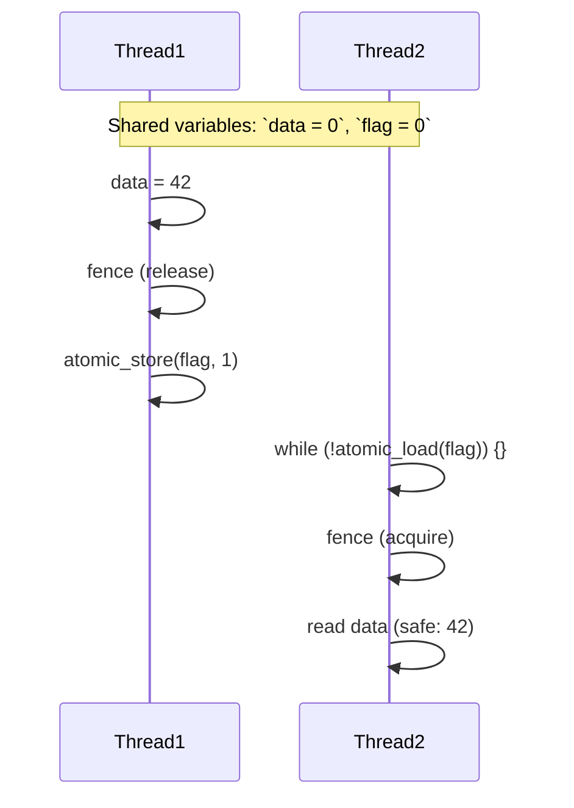

## Memory Barrier

A memory barrier (also called a fence) is a low-level synchronization primitive that
prevents certain types of reordering of memory operations by either the compiler, the
CPU, or both.

Modern CPUs and compilers reorder instructions for performance. This is usually harmless
in single-threaded programs. But in multi-threaded contexts, such reordering can break
assumptions about visibility and ordering of reads and writes to shared memory.

Memory barriers force ordering. They ensure that:
- Writes before the barrier become visible to other threads before any writes after the barrier.
- Reads after the barrier are not moved before the barrier.

They do not block threads like mutexes--they only affect ordering, not atomicity or blocking.




### Types of Memory Barriers

In C11, barriers are used through the <stdatomic.h> library, which provides two main mechanisms:


__1. Atomic Memory Orderings__

You can specify memory order explicitly in atomic_load_explicit and atomic_store_explicit:

```c

atomic_store_explicit(&x, 42, memory_order_release);   // store with release semantics

int y = atomic_load_explicit(&x, memory_order_acquire); // load with acquire semantics

```

The combination of release on the writer side and acquire on the reader side ensures that:
- All prior writes by the writer thread are visible to the reader thread after the load.

This is the release–acquire synchronisation idiom.

Other orderings include:
- `memory_order_relaxed`: no guarantees (but still atomic)
- `memory_order_seq_cst`: strongest, total program order across threads
- `memory_order_acq_rel`: both acquire and release in one operation
- `memory_order_consume`: data dependency only (seldom supported, best avoided)


__2. Memory Fences__

Sometimes, you don’t want to use atomic variables directly but still need a memory barrier. Use:

```c
atomic_thread_fence(memory_order_acquire);
atomic_thread_fence(memory_order_release);
atomic_thread_fence(memory_order_seq_cst);
```

These prevent the compiler and CPU from reordering memory operations around them.

Example:

```c
// write shared data
data = 123;

// prevent reordering of data write and flag write
atomic_thread_fence(memory_order_release);

// set flag
atomic_store(&flag, 1);

On the reader side:

// spin until flag is set
while (atomic_load(&flag) == 0)
    ; // spin

// prevent reordering of flag read and data read
atomic_thread_fence(memory_order_acquire);

// safe to read data
printf("Data = %d\n", data);
```


### Memory Barriers and the Hardware

Each architecture implements barriers differently:
- x86: strong memory model; loads/stores already fairly ordered.
  Only a few fences needed (MFENCE, LFENCE, SFENCE).
- ARM, POWER: weak memory models; loads and stores may reorder
  aggressively. Explicit barriers (DMB, DSB) often needed.

This is why C11 introduces portable fence and atomic semantics that
map to the right assembly instructions per platform.


In Summary
- Memory barriers prevent reordering of memory operations.
- They do not make operations atomic or threads wait.
- Use atomic_thread_fence or the memory orderings in atomic
  operations to implement lock-free coordination.
- They’re essential in low-level systems programming (e.g.,
  kernel code, lock-free queues, concurrent algorithms).

If you write multithreaded C code without mutexes, you must understand
memory ordering--or risk subtle, hard-to-debug bugs that might appear
only on some architectures or under certain loads.

