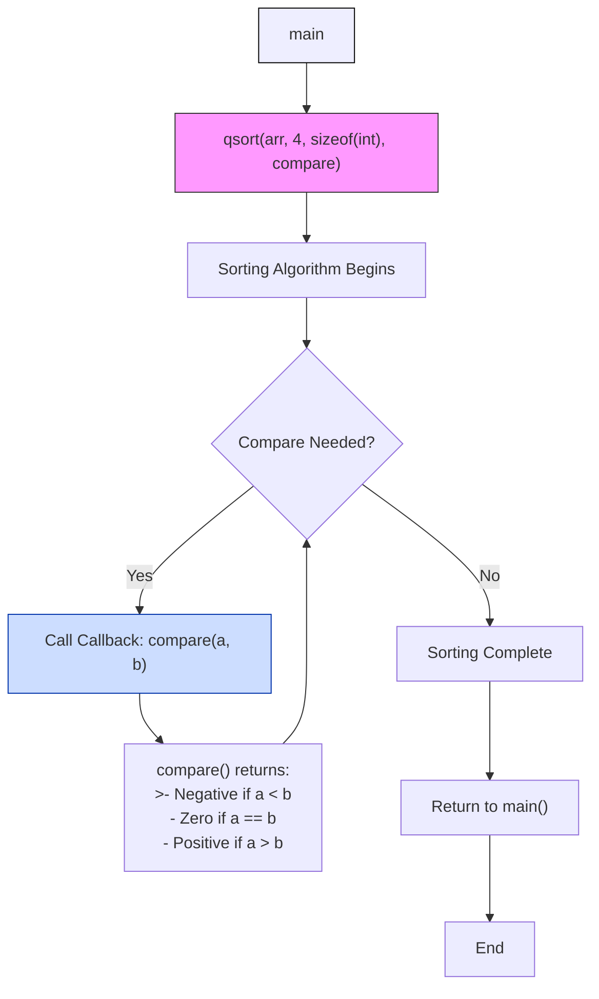

## Callback

A *callback* is a function passed as an argument to another function, which is then
invoked ("called back") at a specific time or after a particular operation completes.
Callbacks enable *asynchronous behaviour*, *event-driven programming*, and *customisable logic*
without modifying the original function. They are widely used for handling I/O
operations, events, or asynchronous tasks.

Historically, callbacks originated in low-level systems programming and early event-driven
models, where they were used to defer execution or handle asynchronous events—such as
interrupts in C or function pointers in procedural APIs. These early callbacks were manual
and error-prone, often lacking type safety or structured error handling. As programming
paradigms evolved, particularly with object-oriented and functional languages, callbacks
became more formalised through constructs like interfaces, delegates, and lambdas.

Today, in modern environments like JavaScript, Python, and asynchronous frameworks,
callbacks are integrated into promises, async/await syntax, and reactive streams,
offering more composable, readable, and error-resilient approaches to asynchronous
and event-driven programming.

*Purpose*: 
  - *Inversion of Control*: Let the callee decide when to execute your code.
  - *Asynchrony*: Continue execution without blocking (e.g., waiting for a
    file read to finish).
  - *Reusability*: Decouple logic (e.g., a sorting algorithm letting you define
    how to compare items).

*Use Cases*: Event handling, asynchronous operations (HTTP requests, timers), and customising
library/framework behaviour.


### Callbacks in JavaScript

JavaScript uses callbacks extensively for asynchronous operations and event handling due
to its single-threaded, non-blocking nature.

*Example 1: Asynchronous Timer*
```javascript
setTimeout(() => {
  console.log("This runs after 1 second.");
}, 1000);
```

*Example 2: Event Listener*
```javascript
document.querySelector("button").addEventListener("click", () => {
  console.log("Button clicked!");
});
```

*Example 3: Node.js File Read*
```javascript
const fs = require('fs');
fs.readFile('file.txt', 'utf8', (err, data) => {
  if (err) throw err;
  console.log(data); // executed after the file is read.
});
```

*Challenges*: Nested callbacks can lead to "callback hell" (deeply nested,
hard-to-read code). Modern solutions like Promises and `async/await` mitigate this.


### Callbacks in Python

Python uses callbacks for event-driven frameworks, asynchronous tasks, and threading.

*Example 1: GUI Event Handling (Tkinter)*
```python
import tkinter as tk

def on_click():
    print("Button clicked!")

button = tk.Button(command=on_click)
button.pack()
```

*Example 2: Threading with Callbacks*
```python
from threading import Thread

def long_task(callback):
    # simulate work
    result = "Done"
    callback(result)

def done(result):
    print(result)

Thread(target=long_task, args=(done,)).start()
```

*Example 3: Asyncio (Alternative to Callbacks)*
```python
import asyncio

async def main():
    await asyncio.sleep(1)
    print("This runs after 1 second.")

asyncio.run(main())  # coroutines instead of callbacks.
```

*Note*: Python increasingly favours coroutines (via `async/await`) over callbacks for async code.


### Callbacks in C

C implements callbacks using *function pointers*, as it lacks built-in support for closures or objects.

*Example 1: Sorting with `qsort`*
```c
#include <stdio.h>
#include <stdlib.h>

// Comparison callback (matches signature int (*)(const void*, const void*))
int compare(const void* a, const void* b) {
    return (*(int*)a - *(int*)b);
}

int main() {
    int arr[] = {5, 2, 8, 1};
    qsort(arr, 4, sizeof(int), compare); // Pass function pointer
    return 0;
}
```

*Example 2: Event Handling (GTK)*
```c
#include <gtk/gtk.h>

void on_button_click(GtkWidget* widget, gpointer data) {
    g_print("Button clicked!\n");
}

int main(int argc, char* argv[]) {
    gtk_init(&argc, &argv);
    GtkWidget* button = gtk_button_new_with_label("Click Me");
    g_signal_connect(button, "clicked", G_CALLBACK(on_button_click), NULL);
    // .. show window and start event loop
}
```

*Limitations*: 
- No closures: State must be passed via `void*` parameters.
- Function pointers have strict signatures.


### Takeaways

- *JavaScript*: Callbacks are central to async/event-driven code but can lead to complexity.
  Modern code uses Promises/`async/await`.
- *Python*: Used in GUIs, threading, and older async code. Newer codebases prefer coroutines.
- *C*: Callbacks via function pointers, often seen in libraries for sorting, event systems,
  or customisation.

Callbacks remain a foundational concept for flexible and non-blocking code across programming paradigms.


### Example: Qsort again in C




1. main Function (Start):
   - Calls `qsort` with the array and `compare` callback
   - `qsort(arr, 4, sizeof(int), compare)`

2. Sorting Process:
   - `qsort` implements the quick sort algorithm
   - Repeatedly calls the `compare` callback to determine element order

3. Callback Invocation (Blue Node):
   ```c
   int compare(const void* a, const void* b) {
       return (*(int*)a - *(int*)b);
   }
   ```
   - Called multiple times during sorting
   - Returns comparison result to guide sorting

4. Sorting Completion:
   - Returns control to `main`
   - Final sorted array: `[1, 2, 5, 8]`

This demonstrates how C uses function pointers for:
- Customizable sorting behavior
- Algorithm extensibility
- Separation of sorting logic from comparison logic

The callback pattern here is synchronous--`compare` is
called immediately during the `qsort` execution.

