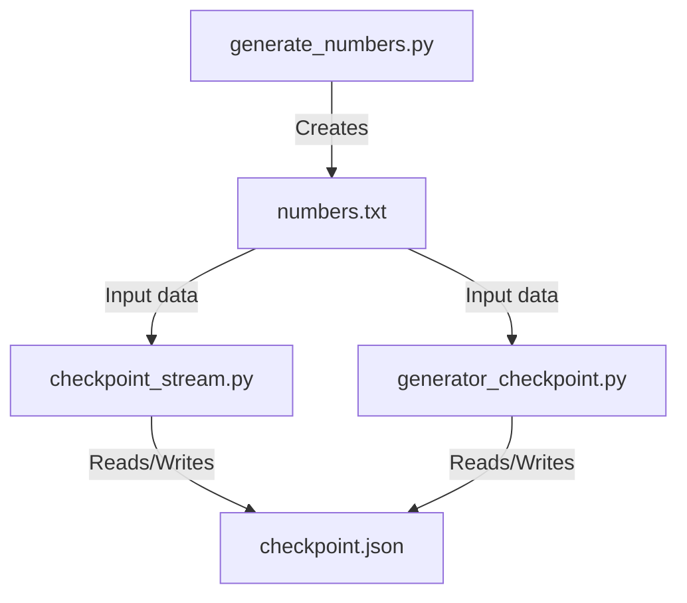
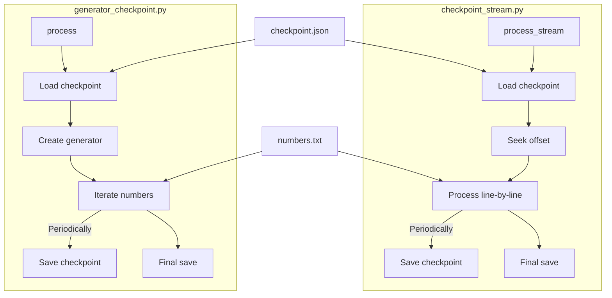
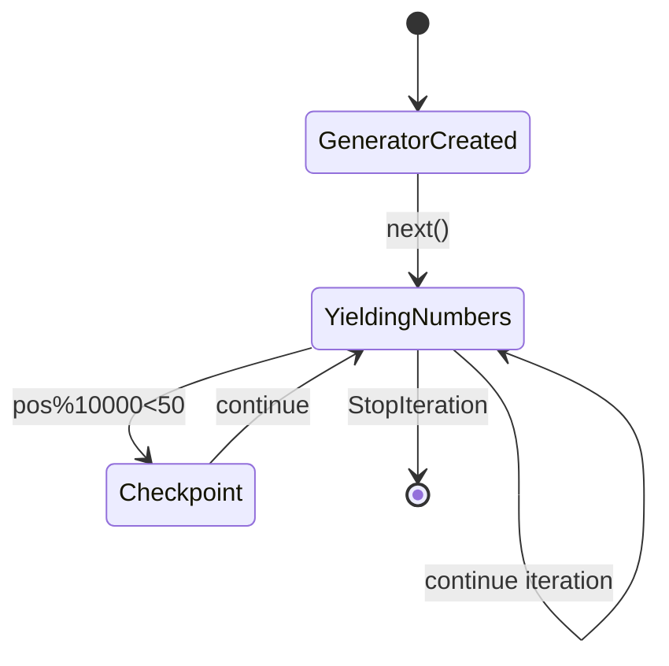
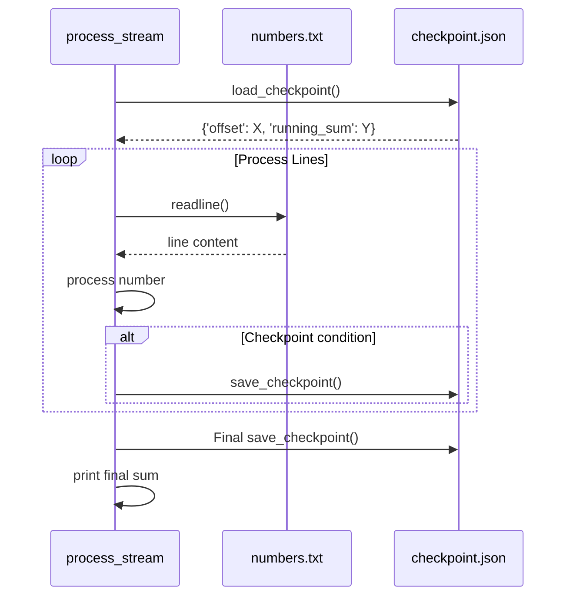

## What is a checkpoint?

A checkpoint is a saved snapshot of a program’s state at a given point in time,
so that execution can be resumed later from that point instead of starting over.

In streaming, batch processing, or long computations, checkpoints prevent having
to reprocess everything from scratch if interrupted (crash, shutdown, etc.).
Typical checkpointed state includes:
– the position in the data (offset, index)
– intermediate results (like running sum)

A script saves a checkpoint periodically, then on restart, loads the checkpoint
and continues where it left off.


### Checkpoint Sample

*Related script:* If you are interested in how checkpointing works in an
*async coroutine-based* setup, see [sample of coroutine](./../coroutine/).
Both scripts demonstrate the same core idea, but with different Python mechanisms.


#### Typical workflow

1. Generate data file once

```shell
python3 generate_numbers.py
```

2. Run the processor script: *resume-able* processing

```shell
python3 generator_checkpoint.py
```

3. To start fresh, delete checkpoint.json.
Processor will start from the beginning of the file.

```shell
rm checkpoint.json
python3 generator_checkpoint.py
```

__Stopping the script mid-run__

While `generator_checkpoint.py` is running, you can *stop it manually* to simulate an
unexpected interruption (like a crash).  This will allow you to test whether the
*checkpointing* works as expected.

To stop the script cleanly:

- On *Mac/Linux*: Press `Ctrl+C`
- On *Windows* (in Command Prompt): Press `Ctrl+C`

This sends a *KeyboardInterrupt* to the Python program, which will terminate it immediately.  
When you restart the script with:

```bash
python3 generator_checkpoint.py
```
.. it should resume from where it left off by reading the checkpoint.json file.

If you want to *start over completely* (ignoring old checkpoints), delete the checkpoint.json
file in the working directory before restarting the script:

```shell
rm checkpoint.json
python3 generator_checkpoint.py
```


#### `generate_numbers.py`

*Purpose*: Creates a large file of numbers for processing (numbers.txt).

What it does:
– Generates random integers and writes them line by line to a file.

How to use:
Run it once to create your data source.

```shell
python3 generate_numbers.py
```

This creates numbers.txt in the same folder.
By default, it generates 1 million random numbers (changeable in the script).

You only need to run this *once*, the file stays usable for other scripts.


#### `checkpoint_stream.py`

*Purpose*: Defines utility functions for checkpoint handling and streaming the file.

What it contains:
– load_checkpoint(): loads saved position and running sum from checkpoint.json.
– save_checkpoint(offset, running_sum): saves current position and sum to checkpoint.json.
– number_stream(filename, offset): generator that yields (position, number) starting
  at given offset.

How to use:
You *don't run* this file directly.
It provides functions imported by other scripts (like generator_checkpoint.py).
Think of it as a library module.


#### `generator_checkpoint.py`

*Purpose*: Processes numbers.txt with checkpointing: sums the numbers in a streaming
fashion and saves progress.

What it does:
– Loads numbers.txt, starting from the last saved checkpoint
– Sums the numbers
– Periodically saves current position and sum to checkpoint.json
– On completion, writes final sum

How to use:
Run it whenever you want to process (or resume processing):

```shell
python3 generator_checkpoint.py
```

If it crashes or you stop it midway, rerunning it resumes from the last saved checkpoint
automatically (doesn't restart from zero).

'checkpoint.json' stores the last position and current sum, so progress is preserved.


#### Bottom line

These scripts illustrate checkpointing with
- Data file generation (generate_numbers.py)
- Checkpoint handling library (checkpoint_stream.py)
- Stream processor with checkpoints (generator_checkpoint.py)


#### 1. System Overview Diagram



#### 2. Execution Flow Comparison



#### 3. Generator State Diagram: generator_checkpoint.py



#### 4. Detailed Stream Processing Sequence: checkpoint_stream.py



Differences highlighted:

1. `checkpoint_stream.py` uses:
   - Simple file streaming with direct position tracking
   - Crude modulo check (`tell() % 1000 < len(line)`) for checkpoint timing
   - All processing in one tight loop

2. `generator_checkpoint.py` uses:
   - Generator pattern (`yield`) to separate iteration from processing
   - Cleaner position-based checkpointing (`pos % 10000 < 50`)
   - More modular design with separate number_stream generator

Both approaches:
- Share the same 'checkpoint.json' mechanism
- Process the same 'numbers.txt' input
- Maintain running sum with periodic saves
- Handle resumption from last checkpoint

The generator version provides better separation of concerns while the streaming
version is more straightforward for simple cases. The checkpoint condition logic
differs slightly but achieves similar results.
