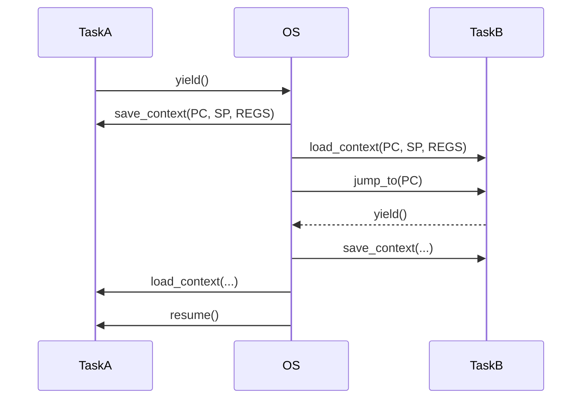

## Context Switch

A context switch is the process of storing the state of a currently running task (process or thread)
so that it can be resumed later, and restoring the state of another task so it can run. This is a
fundamental mechanism in multitasking operating systems.

The context of a task includes:
- CPU registers (program counter, stack pointer, general-purpose registers)
- Memory mappings (page tables)
- Open file descriptors
- Scheduling information
- For threads: the thread-local stack and instruction pointer

A context switch:
- Saves the context of the current task.
- Loads the context of the next task.
- Transfers control (via low-level code, often in assembly).


In pseudo-c code:

```c
typedef struct {
    int pc;
    int sp;
    int registers[8];
} Context;

Context taskA_ctx, taskB_ctx;
Context* current;
Context* next;

void save_context(Context* ctx);
void load_context(Context* ctx);

void scheduler() {
    save_context(current);
    if (current == &taskA_ctx) next = &taskB_ctx;
    else next = &taskA_ctx;
    current = next;
    load_context(current);
}
```



### Uses

1. Preemptive Multitasking
- The OS switches between tasks at regular intervals or upon events
  (e.g., I/O, interrupts).
- Enables multiple programs to run "simultaneously" on a single CPU.

2. Blocking Operations
- When a process waits for I/O, the OS switches to another ready process
  to avoid wasting CPU time.

3. User-level Thread Libraries / Coroutines
- Context switches can be implemented in user space for lightweight
  concurrency (e.g., in async runtimes).

4. System Calls / Interrupts
- Switch between user mode and kernel mode contexts.


### In C and Assembly

In a real OS, context switching is implemented in *assembly*, especially:
- Saving registers to the process control block (PCB).
- Loading the next process's context.

In C, high-level *simulations* can be done using setjmp/longjmp, or POSIX ucontext.h.
This is *not* true multithreading, but it behaves like a cooperative coroutine scheduler,
where the "context switch" is explicitly triggered with longjmp.

In this case we use cooperative context switching (coroutines). In this model, tasks
(coroutines) run until they voluntarily yield control to a scheduler, which then decides
the next task to run. This contrasts with preemptive switching, where an external mechanism
(e.g., OS timer) interrupts tasks.

```c
#include <stdio.h>
#include <setjmp.h>

// Global jump buffers for each task and the main scheduler
jmp_buf ctx_main, ctx_a, ctx_b;

// Task states to track completion
int a_done = 0, b_done = 0;
// Track the last task that ran (0 = none, 1 = A, 2 = B)
int last_task = 0;

void taskA() {
    static int i = 0;  // Static to persist state across calls
    while (i < 3) {
        printf("Task A: %d\n", i);
        i++;
        if (setjmp(ctx_a) == 0) {  // Save context, yield to main
            longjmp(ctx_main, 1);   // 1 means "yield"
        }
        return;  // Return to main after resuming to allow switch
    }
    printf("Task A: Completed\n");
    a_done = 1;
    longjmp(ctx_main, 2);  // 2 means "done"
}

void taskB() {
    static int i = 0;  // Static to persist state across calls
    while (i < 3) {
        printf("Task B: %d\n", i);
        i++;
        if (setjmp(ctx_b) == 0) {  // Save context, yield to main
            longjmp(ctx_main, 1);   // 1 means "yield"
        }
        return;  // Return to main after resuming to allow switch
    }
    printf("Task B: Completed\n");
    b_done = 1;
    longjmp(ctx_main, 2);  // 2 means "done"
}

int main() {
    int val;  // To store return value from setjmp

    // Initial setup: start Task A
    if (setjmp(ctx_main) == 0) {
        last_task = 1;  // Mark Task A as running
        taskA();
    }

    // Main scheduler loop
    while (!a_done || !b_done) {
        val = setjmp(ctx_main);  // Save main context
        if (val == 0) {          // Initial call: decide which task to run
            if (last_task == 0 || last_task == 2) {
                if (!a_done) {
                    last_task = 1;  // Mark Task A as running
                    taskA();
                }
            } else if (last_task == 1) {
                if (!b_done) {
                    last_task = 2;  // Mark Task B as running
                    taskB();
                }
            }
        } else if (val == 1) {   // Task yielded
            // Switch to the other task based on last_task
            if (last_task == 1 && !b_done) {
                last_task = 2;  // Switch to Task B
                taskB();
            } else if (last_task == 2 && !a_done) {
                last_task = 1;  // Switch to Task A
                taskA();
            }
        } else if (val == 2) {   // Task finished
            // Continue to check completion and switch
            if (last_task == 1 && !a_done) {
                last_task = 1;
                taskA();
            } else if (last_task == 2 && !b_done) {
                last_task = 2;
                taskB();
            }
        } else {
            fprintf(stderr, "Error: Unexpected value %d\n", val);
            return 1;
        }
    }

    printf("All done\n");
    return 0;
}
```

This *illustrates* the context switch with [coroutines](./../coroutine/).

```
1. [MAIN FLOW]
   Setup → SaveContext (setjmp)
     |
     ├─(initial)→ ChooseTask
     |   ├─→ Run TaskA if should
     |   └─→ Run TaskB if should
     |
     ├─(val==1)→ HandleYield → SwitchTask
     |               ├─→ TaskA if last was B
     |               └─→ TaskB if last was A
     |
     └─(val==2)→ HandleComplete → CheckDone
                     ├─→ Exit if both done
                     └─→ ChooseTask if work remains

2. [TASK FLOWS]
   TaskA:
     Run → Yield point (setjmp)
       ├─(yield)→ MainYield
       └─(complete)→ MainComplete
   
   TaskB: 
     (same structure as TaskA)
```

### Context Switch vs Coroutine

| Feature       | Context Switch (Kernel/Thread)       | Coroutine (User-space)                |
|---------------|--------------------------------------|---------------------------------------|
| Level         | Kernel-level (preemptive)            | User-level (cooperative)              |
| Triggered by  | Timer interrupt, blocking syscalls   | Explicit yield/await/return           |
| Cost          | High (register + stack + memory mgmt)| Low (usually stack + program counter) |
| Managed by    | OS scheduler                         | User code / runtime                   |
| Examples      | Threads, processes                   | async/await, yield, green threads     |

Coroutines are a form of user-level context switch. Coroutines manually save and restore execution
state (e.g., where to continue after yield). This is the same principle as a context switch--but
in user space, without involving the OS.

You can even simulate coroutine-like context switching in C using:
- setjmp/longjmp for saving and restoring register state (see above)
- Separate stacks
- A scheduler loop


### Performance Cost

Context switches are relatively expensive:
- Saving/restoring CPU state
- Cache invalidation (loss of locality)
- TLB[^tlb] flushes (on full address space switches)

That's why high-frequency context switches (e.g., due to too many threads)
can degrade performance.

[^tlb]: The TLB (Translation Lookaside Buffer) is a small, fast cache in the CPU that stores recent
virtual-to-physical memory address translations to speed up memory access. A TLB flush clears this
cache, typically during a context switch or when page tables change, which can temporarily degrade
performance until it's repopulated.

### Summary

- A context switch allows the CPU to share its time among multiple processes or threads.
- It is a core feature of multitasking OS kernels.
- It requires saving and restoring complete CPU and memory context.
- It’s used in kernels, coroutine systems, and async runtimes.

Beyond cooperative context switching (as seen in coroutines above), there are other approaches.


### Other Context Switch Solutions

#### Preemptive Context Switching

- *Description*: The operating system (OS) or a runtime environment forcibly interrupts a running
  task after a time slice (or upon a higher-priority event) to switch to another task.
  Tasks don’t need to yield voluntarily.
- *Key Features*:
  - Controlled by a scheduler in the OS kernel, often using timers (e.g., a hardware interrupt every 10ms).
  - Saves the full context (registers, program counter, stack pointer, etc.) to memory and loads another
    task’s context.
  - Ensures fairness and responsiveness, even if a task is computationally heavy or misbehaves.
- *Examples*:
  - *OS Threads*: In systems like Linux, Windows, or macOS, threads (lightweight processes) are preemptively
    scheduled. The OS uses a timer interrupt to switch between threads.
  - *Priority-Based Scheduling*: A higher-priority thread (e.g., handling I/O) can preempt a lower-priority one.
- *Pros*:
  - Prevents one task from hogging the CPU.
  - Good for real-time systems where timing is critical.
- *Cons*:
  - Higher overhead due to frequent context saves/restores.
  - Requires synchronization (e.g., locks) to avoid race conditions.
- *Use Case*: Multitasking in modern OSes (e.g., running a browser, music player, and editor simultaneously).


#### Hardware-Based Context Switching

- *Description*: The hardware itself performs or assists with context switching, often in response
  to interrupts or specialized instructions, bypassing or supplementing OS involvement.
- *Key Features*:
  - Triggered by hardware events (e.g., interrupts from I/O devices, timers, or exceptions).
  - Some CPUs have dedicated instructions or registers to save/restore context rapidly.
  - Often works in tandem with the OS but is faster due to hardware support.
- *Examples*:
  - *Interrupt Handling*: A device (e.g., keyboard) triggers an interrupt, causing the CPU to save
    the current context, run an interrupt service routine (ISR), and restore the context.
  - *Hyper-Threading*: Intel CPUs with Hyper-Threading switch between thread contexts within the
    same core, storing multiple thread states in hardware.
- *Pros*:
  - Extremely fast due to hardware optimization.
  - Essential for real-time responses to external events.
- *Cons*:
  - Limited to what hardware supports.
  - Still requires software (e.g., OS) for full scheduling.
- *Use Case*: Real-time embedded systems, device drivers, or high-performance computing.


#### Software Interrupt (Trap-Based) Context Switching

- *Description*: A task triggers a software interrupt (trap or system call) to request OS services,
  prompting a context switch to the kernel or another process.
- *Key Features*:
  - Initiated by a program via a syscall (e.g., `fork`, `read`, `yield` in some systems).
  - The OS saves the user process’s context, switches to kernel mode, handles the request, and
    may switch to another process.
  - Blends cooperative and preemptive traits: the task initiates, but the OS decides the next step.
- *Examples*:
  - *System Calls*: In Linux, a process calling `sched_yield()` voluntarily yields, and the kernel
    may switch to another process.
  - *Exceptions*: A page fault triggers a switch to the kernel to handle memory allocation.
- *Pros*:
  - Allows user programs to interact with the OS safely.
  - Flexible scheduling by the kernel.
- *Cons*:
  - Overhead of mode switching (user to kernel and back).
  - Complex implementation in the OS.
- *Use Case*: Process management in Unix-like systems, I/O operations.


### User-Level Context Switching

- *Description*: Context switching is handled entirely in user space, without involving the OS kernel,
  often for threads or lightweight tasks.
- *Key Features*:
  - A user-level library or runtime manages the switch, saving/restoring context (e.g., stack, registers).
  - Faster than kernel-level switching, as no system calls or mode switches are needed.
  - Can be cooperative (tasks yield) or preemptive (with a user-level timer).
- *Examples*:
  - *User Threads*: Libraries like POSIX `ucontext` (e.g., `makecontext`, `swapcontext`) or green threads
    in Java (early versions) manage context switching in user space.
  - *Fiber Libraries*: Windows Fibers or Boost.Coroutine in C++ allow user-defined context switching.
- *Pros*:
  - Low overhead, no kernel involvement.
  - Customizable for specific applications.
- *Cons*:
  - Doesn’t leverage OS scheduling or hardware.
  - Can’t handle blocking system calls well without extra work.
- *Use Case*: High-performance applications, game engines, or lightweight concurrency (e.g., Erlang’s actor model).


#### Comparison

| Type                  | Control        | Overhead | Speed        | Use Case Example              |
|-----------------------|----------------|----------|--------------|-------------------------------|
| Preemptive            | OS/Scheduler   | High     | Moderate     | OS threads, real-time systems |
| Cooperative           | Task           | Low      | Fast         | Coroutines, event loops       |
| Hardware-Based        | Hardware       | Very Low | Very Fast    | Interrupts, Hyper-Threading   |
| Software Interrupt    | Task + OS      | Moderate | Moderate     | System calls, exceptions      |
| User-Level            | User Program   | Low      | Fast         | Fibers, user threads          |


#### Context and Evolution

- *Historical Note*: Early systems (e.g., 1980s MS-DOS) often used cooperative switching, but modern
  OSes (Linux, Windows) favour preemptive switching for robustness and responsiveness.
- *Hybrid Approaches*: Some systems combine types, e.g., Go’s goroutines are user-level coroutines but
  can be preempted by the runtime scheduler.

Each type suits different needs. Preemptive switching dominates in general-purpose OSes for fairness and
multitasking, while cooperative switching (like coroutines) excels in lightweight, controlled environments.
Hardware and user-level approaches optimise speed, and software interrupts bridge user and kernel spaces.

