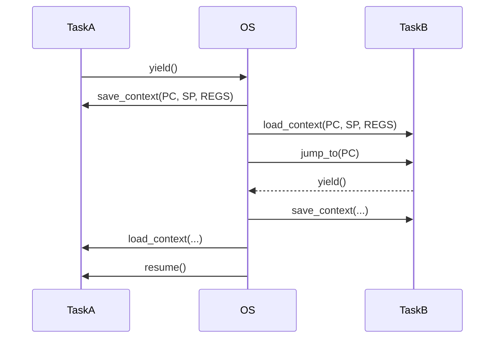

## Context Switch

A context switch is the process of storing the state of a currently running task (process or thread)
so that it can be resumed later, and restoring the state of another task so it can run. This is a
fundamental mechanism in multitasking operating systems.

The context of a task includes:
- CPU registers (program counter, stack pointer, general-purpose registers)
- Memory mappings (page tables)
- Open file descriptors
- Scheduling information
- For threads: the thread-local stack and instruction pointer

A context switch:
- Saves the context of the current task.
- Loads the context of the next task.
- Transfers control (via low-level code, often in assembly).




### Uses

1. Preemptive Multitasking
- The OS switches between tasks at regular intervals or upon events
  (e.g., I/O, interrupts).
- Enables multiple programs to run "simultaneously" on a single CPU.

2. Blocking Operations
- When a process waits for I/O, the OS switches to another ready process
  to avoid wasting CPU time.

3. User-level Thread Libraries / Coroutines
- Context switches can be implemented in user space for lightweight
  concurrency (e.g., in async runtimes).

4. System Calls / Interrupts
- Switch between user mode and kernel mode contexts.


### In C and Assembly

In a real OS, context switching is implemented in *assembly*, especially:
- Saving registers to the process control block (PCB).
- Loading the next process's context.

In C, high-level *simulations* can be done using setjmp/longjmp, or POSIX ucontext.h.
This is *not* true multithreading, but it behaves like a cooperative coroutine scheduler,
where the "context switch" is explicitly triggered with longjmp.

Cooperative Context Switching (Coroutines):

```c
#include <stdio.h>
#include <setjmp.h>

jmp_buf ctx_main, ctx_a, ctx_b;

void taskA() {
    for (int i = 0; i < 3; ++i) {
        printf("Task A: %d\n", i);
        if (!setjmp(ctx_a))
            longjmp(ctx_main, 1);
    }
    longjmp(ctx_main, 2);  // Exit
}

void taskB() {
    for (int i = 0; i < 3; ++i) {
        printf("Task B: %d\n", i);
        if (!setjmp(ctx_b))
            longjmp(ctx_main, 1);
    }
    longjmp(ctx_main, 2);  // Exit
}

int main() {
    int state = 0;
    int a_done = 0, b_done = 0;

    while (1) {
        if (!setjmp(ctx_main)) {
            if (!a_done) taskA();
        } else if (state == 2) {
            a_done = 1;
        }

        if (!setjmp(ctx_main)) {
            if (!b_done) taskB();
        } else if (state == 2) {
            b_done = 1;
        }

        if (a_done && b_done) break;
    }

    printf("All done\n");
    return 0;
}
```

This *illustrates* the context switch with [coroutines](./../coroutine/).

### Context Switch vs Coroutine

| Feature       | Context Switch (Kernel/Thread)       | Coroutine (User-space)                |
|---------------|--------------------------------------|---------------------------------------|
| Level         | Kernel-level (preemptive)            | User-level (cooperative)              |
| Triggered by  | Timer interrupt, blocking syscalls   | Explicit yield/await/return           |
| Cost          | High (register + stack + memory mgmt)| Low (usually stack + program counter) |
| Managed by    | OS scheduler                         | User code / runtime                   |
| Examples      | Threads, processes                   | async/await, yield, green threads     |

Coroutines are a form of user-level context switch. Coroutines manually save and restore execution
state (e.g., where to continue after yield). This is the same principle as a context switch--but
in user space, without involving the OS.

You can even simulate coroutine-like context switching in C using:
- setjmp/longjmp for saving and restoring register state
- Separate stacks
- A scheduler loop


### Performance Cost

Context switches are relatively expensive:
- Saving/restoring CPU state
- Cache invalidation (loss of locality)
- TLB flushes (on full address space switches)

That's why high-frequency context switches (e.g., due to too many threads)
can degrade performance.


### Summary

- A context switch allows the CPU to share its time among multiple processes or threads.
- It is a core feature of multitasking OS kernels.
- It requires saving and restoring complete CPU and memory context.
- It’s used in kernels, coroutine systems, and async runtimes.

