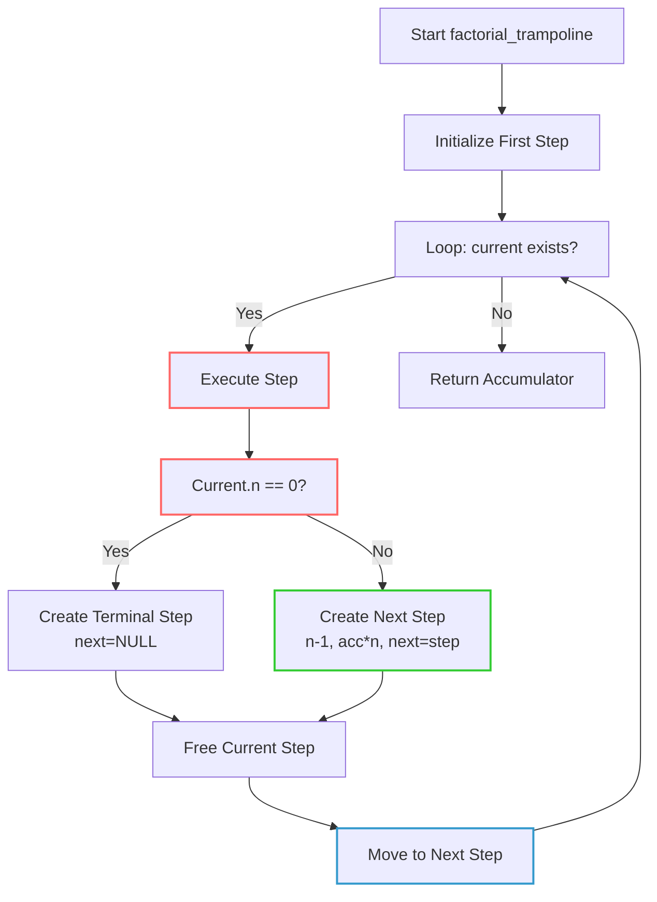

## Continuations

A continuation is a programming concept that represents the "rest of the computation" or "what to do next"
as a first-class object that can be manipulated. In essence, a continuation captures the current state of
execution and provides a means to resume that execution from the captured point.

Characteristics of Continuations

1. *Control Flow Representation*: Continuations explicitly represent the control flow of a program.
2. *First-Class Values*: They can be passed as arguments, returned from functions, and stored in data structures.
3. *State Preservation*: They encapsulate both the execution state and the remaining computation.
4. *Control Transfer*: They enable non-local control transfer (similar to exceptions but more powerful).

#### Continuation-Passing Style (CPS)

Continuation-passing style is a programming paradigm where functions don't return values directly.[^cc] Instead,
they accept an additional argument--a continuation function--that represents what should happen with the result.

[^cc]: You might have experience or read about `call/cc`. This is a runtime primitive that captures the current
continuation as a first-class value for later invocation, while CPS is a programming style where functions receive
an explicit continuation argument instead of returning normally.

```c
// Direct style
int factorial(int n) {
    if (n == 0) return 1;
    else return n * factorial(n - 1);
}

// Continuation-passing style
void factorial_cps(int n, void (*continuation)(int result)) {
    if (n == 0) continuation(1);
    else {
        void handle_recursive_result(int rec_result) {
            continuation(n * rec_result);
        }
        factorial_cps(n - 1, handle_recursive_result);
    }
}
```

#### The Trampoline Pattern

The [trampoline pattern](./../trampoline/) is a technique used to implement recursion in an iterative way,
avoiding stack overflow for deeply recursive computations. It's particularly useful in languages without
tail-call optimisation.

How Trampolining Works:
1. Functions return a thunk (a delayed computation) instead of making recursive calls.
2. A "trampoline" function repeatedly executes these thunks until a concrete result is reached.
3. This converts recursive calls from using the call stack to using the heap.


### The Specific Implementation

The code is an excellent example of combining continuation-passing style with the trampoline pattern in C.
Let's break it down:

The Step Struct as a Continuation:

```c
typedef struct Step {
    int n;  // Current state
    long long accumulator;  // Intermediate result
    struct Step* (*next)(struct Step*);  // What to do next
} Step;
```

This `Step` struct is essentially a continuation because it:
- Captures the current state (`n` and `accumulator`)
- Contains a function pointer (`next`) that describes how to proceed with the computation


The Step Function as a Thunk Generator:

```c
Step* step(Step* current) {
    // ..
    if (current->n == 0) {
        // Base case: create final step with result
        next_step->n = current->n;
        next_step->accumulator = current->accumulator;
        next_step->next = NULL;
    } else {
        // Recursive case: create next computation step
        next_step->n = current->n - 1;
        next_step->accumulator = current->accumulator * current->n;
        next_step->next = step;
    }
    return next_step;
}
```

Instead of directly computing the result through recursion, this function:
1. Examines the current state
2. Creates a new state that represents the next step of computation
3. Returns this state without executing it immediately

The Trampoline Loop:

```c
while (current != NULL && current->next != NULL) {
    next_step = current->next(current);
    free(current);
    current = next_step;
}
```

This loop is the "trampoline" that:
1. Takes the current step (continuation)
2. Executes it to get the next step
3. Moves to that next step
4. Repeats until a base case is reached (when `next` is NULL)




Benefits:

1. Stack Safety: By using trampolining, the factorial implementation can handle much larger
   inputs without stack overflow compared to a naive recursive implementation.

2. Explicit Control Flow: The computation steps are made explicit as data structures, making
   it easier to reason about the algorithm's behaviour.

3. Memory Management Control: You have explicit control over memory allocation and deallocation
   for each step.

4. Potential for Advanced Control Flow: This pattern can be extended to implement more complex
   control flow mechanisms like coroutines, generators, or cooperative multitasking.


Considerations and Extensions:

1. Performance Overhead: This approach introduces overhead from heap allocations and function pointer calls.

2. Memoization: To make this a true [dynamic programming](./../../../ch03/dyn/) solution, you could add a
   lookup table to avoid redundant calculations.

3. Error Handling: The continuation pattern can be extended to handle errors in a structured way.

4. Asynchronous Programming: This pattern forms the foundation for many asynchronous programming models.

This implementation demonstrates how powerful low-level programming concepts can be applied even in a
simple algorithm like factorial, showcasing the flexibility and expressiveness of C when combined with
advanced programming paradigms.
