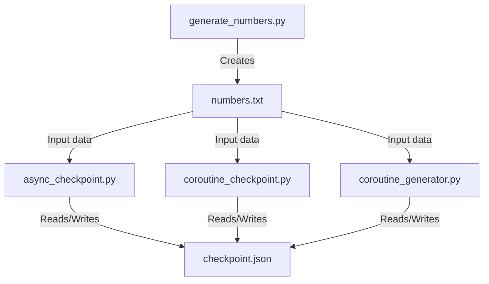
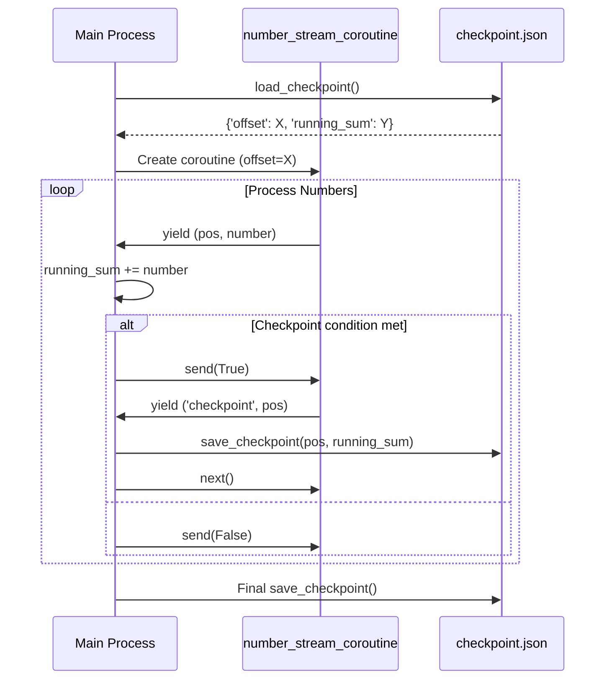
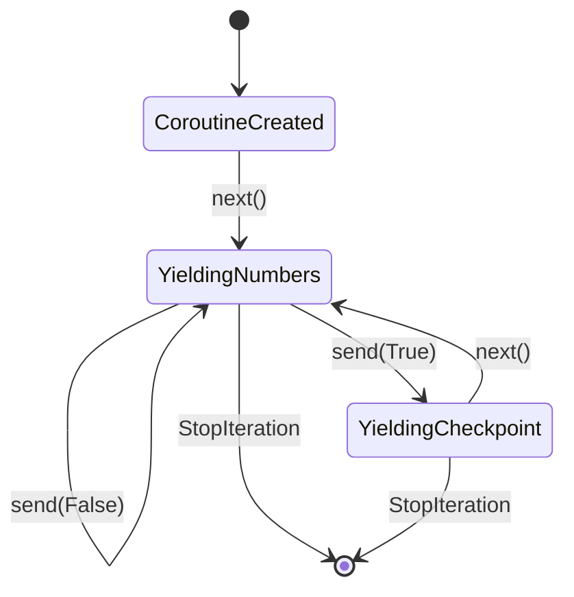
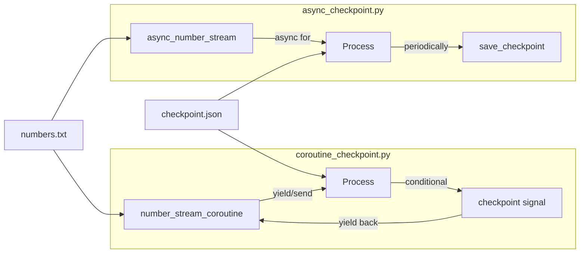

## Coroutine Sample

*Related script:* If you are interested in a *plain generator-based* version of
checkpointing, see [sample of checkpointing](./../checkpoint/).
Both folders of scripts demonstrate the same core idea, but with different Python
mechanisms.


#### How to use

1. Ensure you have numbers.txt from:

```shell
python3 generate_numbers.py
```

2. Run the coroutine checkpoint processor:

```shell
python3 async_checkpoint.py
```

3. Like the generator version:
– If stopped or crashed, rerun to resume
– Delete checkpoint.json to reset

```shell
rm checkpoint.json
python3 async_checkpoint.py
```


__Stopping the script mid-run__

While `async_checkpoint.py` is running, you can *stop it manually* to simulate
an unexpected interruption (like a crash). This allows you to verify whether the
*checkpointing* mechanism works correctly in the coroutine-based version.

To stop the script cleanly:

- On *Mac/Linux*: Press `Ctrl+C`
- On *Windows* (in Command Prompt): Press `Ctrl+C`

This sends a *KeyboardInterrupt* to the Python program, which will terminate it immediately.  
When you restart the script with:

```bash
python3 async_checkpoint.py
```
.. it should resume from where it left off by reading the checkpoint.json file.


If you want to start over completely (ignoring old checkpoints):

```shell
rm checkpoint.json
python3 async_checkpoint.py
```

Note: Both this script and related scripts use the same checkpoint.json mechanism as in the checkpoint sample.
Deleting the file resets progress for all checkpoint-based scripts.


#### `async_checkpoint.py`

*Purpose*: Processes numbers.txt asynchronously with checkpointing--same goal as generator_checkpoint.py,
but using Python coroutines to illustrate non-blocking, structured concurrency.

What it does:
– Loads numbers.txt, starting from the last checkpoint
– Uses async generators to yield numbers
– Periodically awaits checkpoint saving
– On completion, writes final sum

The difference is style of execution, not end result. It demonstrates how checkpointing fits into
coroutine-based processing.

Key features:
- async def number_stream(filename, offset): async generator version
- await asyncio.sleep(0): cooperative yielding (simulates a larger async context)
- await save_checkpoint(pos, running_sum): async checkpoint write (although file I/O is blocking, it’s wrapped as awaitable to keep the coroutine pattern)

#### Bottom line

async_checkpoint.py does the same job as generator_checkpoint.py, but shows how
*coroutines* and async generators can structure checkpointed streaming cleanly--useful
for concurrent workloads where you mix I/O or multiple tasks.

#### When to use which?

| Script                  | Style                       | Why?                                                                |
|-------------------------|-----------------------------|---------------------------------------------------------------------|
| generator_checkpoint.py | Plain generator             | Simple, minimal dependencies                                        |
| async_checkpoint.py     | Coroutine / async generator | If integrating into larger async system (e.g. network I/O, other coroutines) |


#### 1. System Overview Diagram



#### 2. Coroutine Flow Diagram: coroutine_checkpoint.py



#### 3. Coroutine State Diagram



#### 4. Async vs Coroutine Comparison



Observations:
1. All processing scripts depend on `numbers.txt` (generated by `generate_numbers.py`)
2. Both approaches use the same checkpoint.json mechanism but with different control flows
3. The coroutine version has explicit two-way communication (yield/send) while async uses implicit event loop
4. The coroutine has distinct states (yielding numbers vs yielding checkpoint signals)

