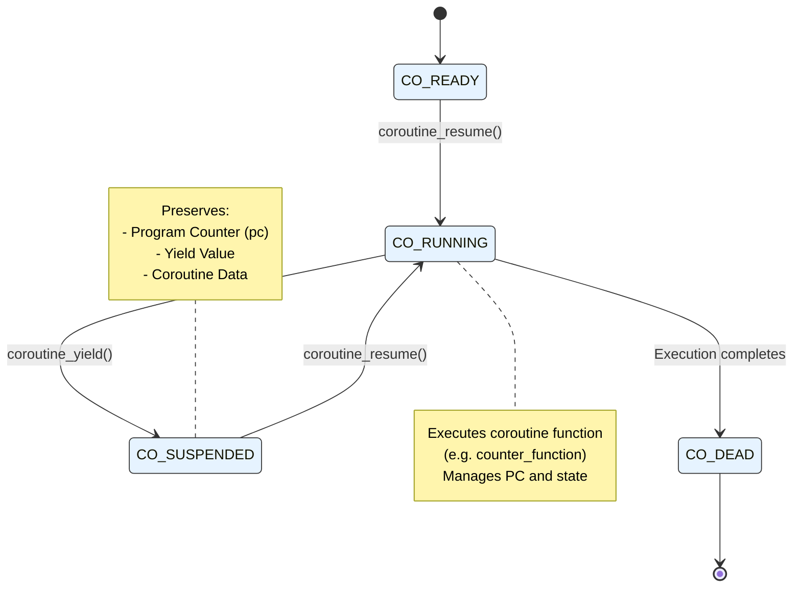
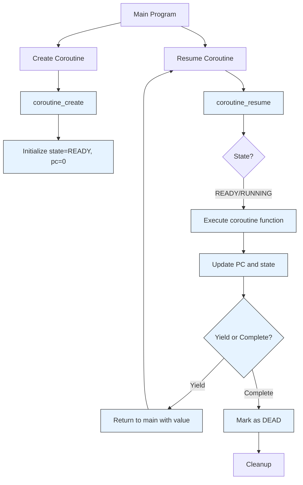

## Count 2

- The state machine lifecycle of a coroutine
- The main operations (create, resume, yield)
- Preservation of execution context between suspensions
- Interaction between main program and coroutines

