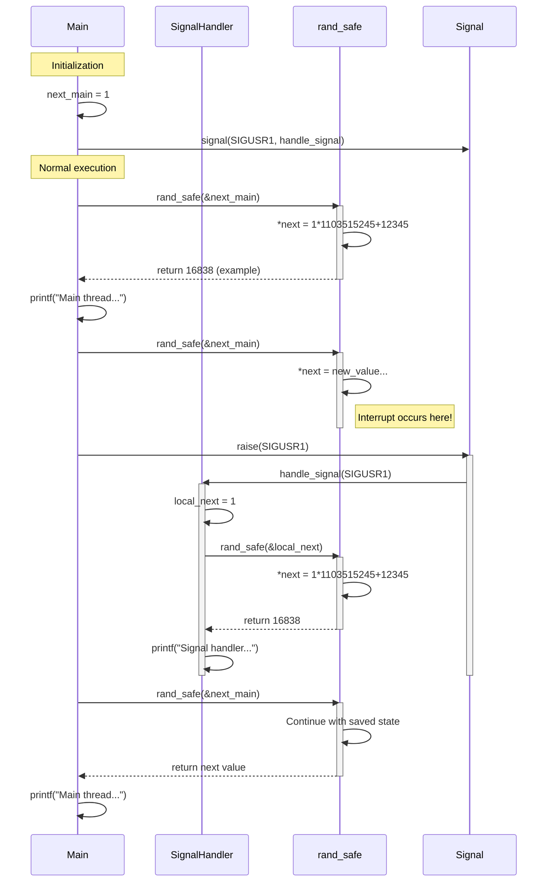
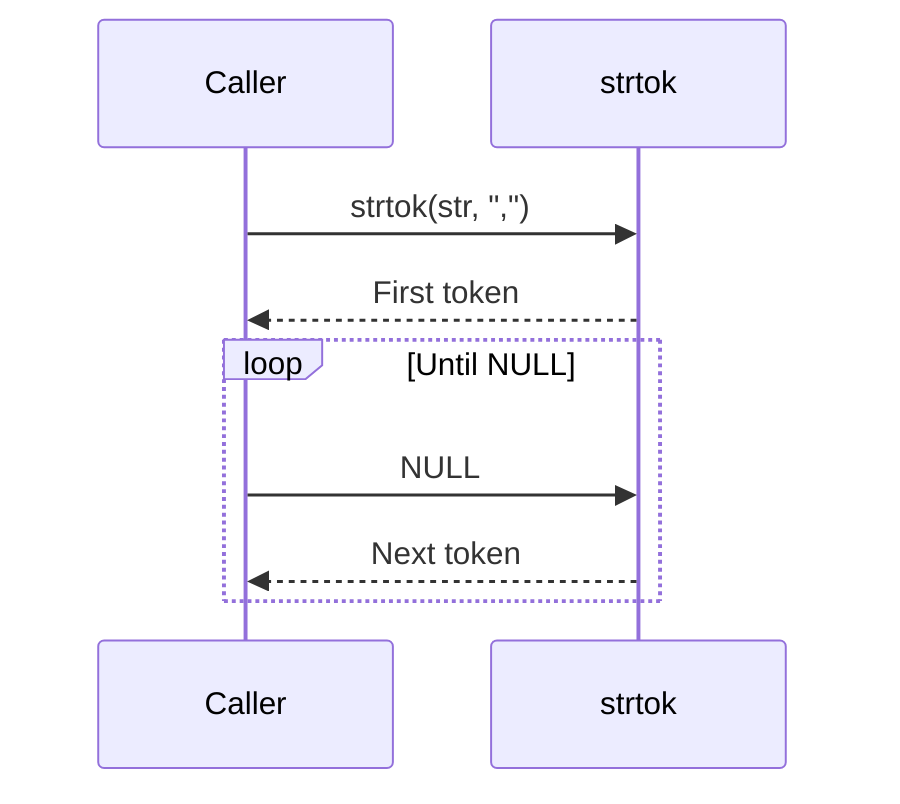

## Re-entrant Functions

A re-entrant function is one that can be safely interrupted (e.g., by a signal or
hardware interrupt) and called again ("re-entered") before the previous invocation
has completed, without causing problems or corruption of data.

1. *No static or global variables*: They don't rely on persistent data
   between calls
2. *Don't modify their own code*: Important in some embedded systems
3. *Only work with data provided by caller*: All data comes from parameters
4. *Don't call non-re-entrant functions*: Must maintain the re-entrancy
   through the entire call chain


### Example

Here's a simple example contrasting non-re-entrant and re-entrant versions
of a function. First the *unsafe*:

```c
// static variable - not re-entrant
int count_calls() {
    static int call_count = 0;  // static variable persists between calls
    return ++call_count;
}
```

If this function is interrupted and called again before completing, the `call_count`
could be corrupted. We then have the *safe*, the re-entrant version:

```c
// re-entrant version - all state is passed in by caller
int count_calls_reentrant(int* call_count) {
    return ++(*call_count);
}

// usage
int my_count = 0;
count_calls_reentrant(&my_count);  // safe even if interrupted
```


### Common Re-entrant Functions in C Standard Library

Many standard library functions have re-entrant versions, typically with an `_r` suffix:

- `rand()` vs `rand_r()`
- `strtok()` vs `strtok_r()`
- `asctime()` vs `asctime_r()`


### Thread Safety vs. Re-entrancy

While related, they're *not* identical:
- *Re-entrant*: Safe when called from interrupt/signal handlers
- *Thread-safe*: Safe when called from multiple threads

Thus, *all re-entrant functions are thread-safe, but not all thread-safe functions are re-entrant*.


### When to Use Re-entrant Functions

1. Signal handlers
2. Interrupt service routines (ISRs)
3. Recursive algorithms
4. Multi-threaded applications where thread safety isn't sufficient

Understanding re-entrancy is crucial for writing robust systems programming code,
especially in embedded systems or operating system development.


### Extended Example: Random Numbers

Here are complete examples demonstrating both unsafe and safe versions of functions,
highlighting the key differences. First the unsafe:


```c
#include <stdio.h>
#include <stdlib.h>
#include <unistd.h>
#include <signal.h>

// global state - makes function non-re-entrant
static unsigned long next = 1;

// unsafe random number generator
int rand_unsafe(void) {
    next = next * 1103515245 + 12345;
    return (unsigned int)(next/65536) % 32768;
}

void handle_signal(int sig) {
    printf("Signal handler called! Random num in handler: %d\n", rand_unsafe());
}

int main() {
    signal(SIGUSR1, handle_signal);
    
    printf("Main thread random num: %d\n", rand_unsafe());
    printf("Main thread random num: %d\n", rand_unsafe());
    
    // simulate interrupt during execution
    raise(SIGUSR1);
    
    printf("Main thread random num: %d\n", rand_unsafe());
    return 0;
}
```

The Re-entrant, or *safe* version:

```c
#include <stdio.h>
#include <stdlib.h>
#include <unistd.h>
#include <signal.h>

// re-entrant random number generator
int rand_safe(unsigned long *next) {
    *next = *next * 1103515245 + 12345;
    return (unsigned int)(*next/65536) % 32768;
}

void handle_signal(int sig) {
    unsigned long local_next = 1;  // each caller maintains its own state
    printf("Signal handler called! Random num in handler: %d\n", 
           rand_safe(&local_next));
}

int main() {
    unsigned long next_main = 1;  // main thread's state

    signal(SIGUSR1, handle_signal);

    printf("Main thread random num: %d\n", rand_safe(&next_main));
    printf("Main thread random num: %d\n", rand_safe(&next_main));

    // simulate interrupt during execution
    raise(SIGUSR1);

    printf("Main thread random num: %d\n", rand_safe(&next_main));
    return 0;
}
```



### Extended Example: String Tokenizer

Unsafe:

```c
#include <stdio.h>
#include <string.h>

int main() {
    char str[] = "Hello,World,How,Are,You";
    char *token;
    
    // first call uses the string
    token = strtok(str, ",");
    while(token != NULL) {
        printf("Main: %s\n", token);
        
        // if interrupted here, the internal state would be corrupted
        token = strtok(NULL, ",");
    }
    
    return 0;
}
```

Re-entrant (safe) version:

```c
#include <stdio.h>
#include <string.h>

int main() {
    char str[] = "Hello,World,How,Are,You";
    char *saveptr;  // each caller maintains its own context
    char *token;
    
    // first call uses the string
    token = strtok_r(str, ",", &saveptr);
    while(token != NULL) {
        printf("Main: %s\n", token);
        
        // safe even if interrupted, as state is explicitly passed
        token = strtok_r(NULL, ",", &saveptr);
    }
    
    return 0;
}
```




### Differences

1. *State Management*:
   - Unsafe: Uses static/global variables or hidden internal state
   - Safe: All state is explicitly passed by the caller

2. *Interrupt Safety*:
   - Unsafe: Can be corrupted if interrupted and re-entered
   - Safe: Maintains integrity even when interrupted

3. *Thread Safety*:
   - Unsafe: Not thread-safe (shared state)
   - Safe: Thread-safe when each thread uses its own state

4. *Function Signature*:
   - Unsafe: Typically simpler signatures
   - Safe: Often requires additional parameters for state management

These examples demonstrate why re-entrant functions are essential for
signal handlers, interrupt service routines, and multi-threaded applications.

