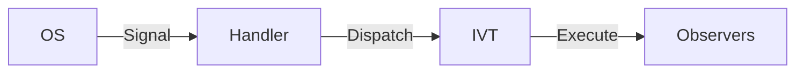
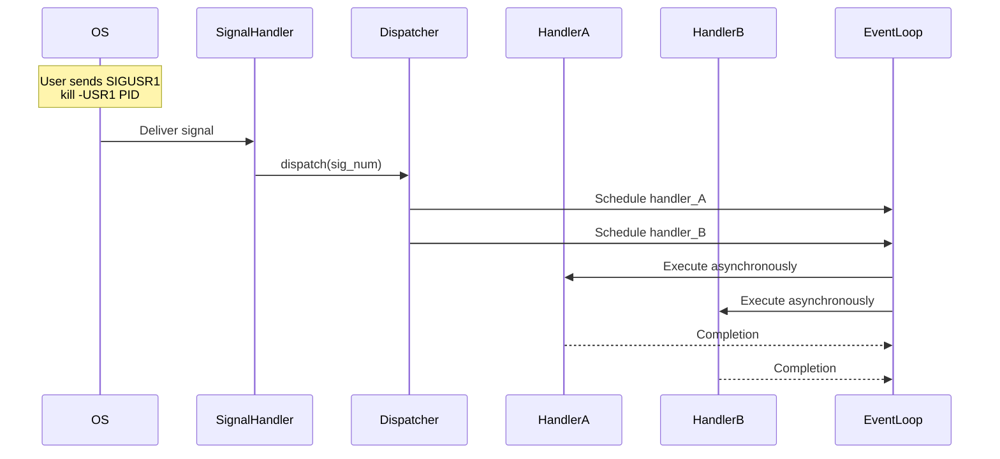
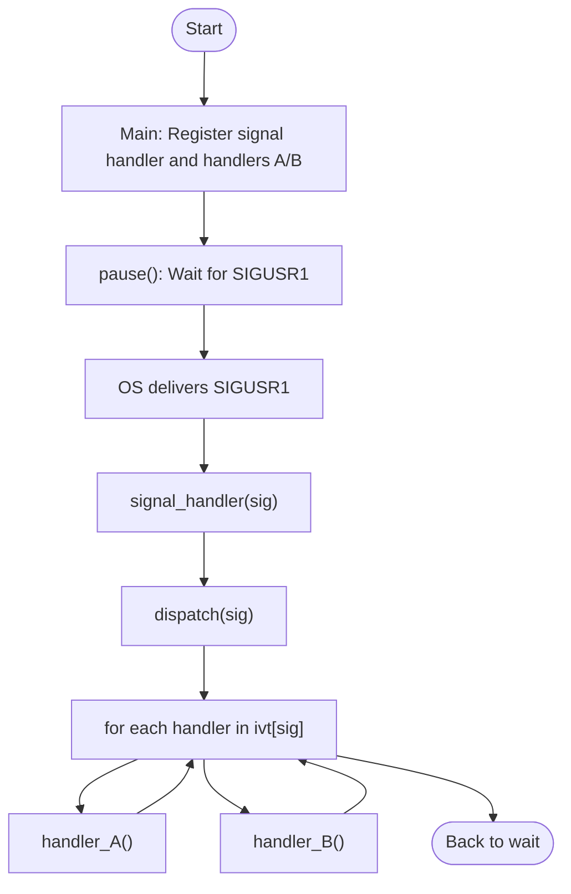

## Signals in Unix

As we get closer to the hardware and OS, the less general the descriptions tend to be. In this case
we will have a look at signals in the Unix system.

Signals are software interrupts that provide a way to handle asynchronous events in Unix-like systems.
They represent a basic form of inter-process communication (IPC) where:

- *Origins*: Can come from the kernel, other processes, or the process itself
- *Purposes*: Used for process control, error handling, and event notification
- *Examples*:
  - `SIGINT` (Ctrl+C termination)
  - `SIGKILL` (forceful termination)
  - `SIGUSR1/SIGUSR2` (user-defined signals)


#### 1. Signal Handling Architecture


#### 2. Python vs C Implementations

| Characteristic     | Python Version              | C Version                          |
|--------------------|-----------------------------|------------------------------------|
| *Registration*     | `signal.signal()`           | `sigaction()`                      |
| *Concurrency*      | Asyncio event loop          | POSIX threads                      |
| *Safety*           | No special restrictions     | Async-signal-safe requirements     |
| *Queueing*         | Built-in `queue.Queue`      | Manual ring buffer implementation  |
| *Latency*          | Higher (GIL limitations)    | Lower (true parallelism)           |


#### 3. Core Components Explained

*Interrupt Vector Table (IVT)*
- Acts as a registry mapping signals to handlers
- Enables the Observer pattern (multiple handlers per signal)
- Implemented as:

  ```python
  # Python
  class InterruptDispatcher:
      def __init__(self):
          self.table: Dict[int, List[Callable]] = {} 
  ```

  ```c
  // C
  typedef struct {
      Handler handlers[MAX_HANDLERS];
      int count;
  } SignalHandlerList;
  ```

*Async Execution Models*

- *Python*: Uses asyncio's event loop
  ```python
  async def _run_async(handler):
      await asyncio.sleep(0)  # yield to event loop
      handler()
  ```

- *C*: Uses pthreads
  ```c
  void* thread_wrapper(void* arg) {
      Handler h = (Handler)arg;
      h();
      return NULL;
  }
  ```

### Practical Usage

1. *Python Example*:
   ```python
   # register handler
   dispatcher.register(signal.SIGUSR1, handler_A)
   
   # send test signal from terminal:
   # kill -USR1 <pid>
   ```

2. *C Example*:
   ```c
   // register handler
   register_handler(SIGUSR1, handler_A);
   
   // compile and test:
   // gcc -pthread signal.c -o signal
   // ./signal
   ```

### Considerations

1. *Safety Constraints*:
   - In C, signal handlers have severe restrictions (can't call most library functions)
   - Python handlers have no restrictions but are subject to GIL

2. *Real-world Applications*:
   - Process lifecycle management
   - Custom IPC mechanisms
   - System monitoring tools
   - Graceful shutdown handlers

3. *Advanced Patterns*:
   - Signal masking (blocking certain signals during critical sections)
   - Signal queues (proper ordering of received signals)
   - Process groups (signaling multiple processes)

The examples demonstrate progressively more sophisticated implementations from basic
synchronous handling to threaded queue-based systems, mirroring how real operating
systems manage interrupts.


### Example: sig.py

- A simple interrupt dispatch table (like an Interrupt Vector Table)
- Registering handlers (observers)
- Reacting to a Unix signal (e.g., SIGUSR1)
- Dispatching to all observers asynchronously


```python
import signal
import asyncio
import os
from typing import Callable, Dict, List

# Interrupt Vector Table (IVT)
class InterruptDispatcher:
    def __init__(self):
        self.table: Dict[int, List[Callable[[], None]]] = {}

    def register(self, sig: int, handler: Callable[[], None]):
        if sig not in self.table:
            self.table[sig] = []
        self.table[sig].append(handler)

    def dispatch(self, sig: int):
        print(f"[IVT] Signal {sig} received. Dispatching...")
        for handler in self.table.get(sig, []):
            asyncio.ensure_future(self._run_async(handler))

    async def _run_async(self, handler: Callable[[], None]):
        await asyncio.sleep(0)  # yield to event loop
        handler()

# global dispatcher instance
dispatcher = InterruptDispatcher()

# connect dispatcher to OS-level signal
def signal_handler(sig_num, frame):
    dispatcher.dispatch(sig_num)

# register signal handler for SIGUSR1
signal.signal(signal.SIGUSR1, signal_handler)

# example: async-safe observer handlers
def handler_A():
    print("Handler A reacting to signal!")

def handler_B():
    print("Handler B doing something else!")

# register observers to SIGUSR1
dispatcher.register(signal.SIGUSR1, handler_A)
dispatcher.register(signal.SIGUSR1, handler_B)

# run a simple event loop to await signals
async def main():
    print(f"Send SIGUSR1 using: kill -USR1 {os.getpid()}")
    while True:
        await asyncio.sleep(1)

if __name__ == "__main__":
    try:
        asyncio.run(main())
    except KeyboardInterrupt:
        print("Shutting down.")
```


| Concept                 | Code Implementation                                                                 | Key Characteristics                                                                 |
|-------------------------|-------------------------------------------------------------------------------------|------------------------------------------------------------------------------------|
| *Signal Handler*      | `signal.signal(signal.SIGUSR1, signal_handler)`<br>`def signal_handler(sig_num, frame):` | OS-to-Python bridge, immediately delegates to dispatcher                           |
| *Async Routine*       | `asyncio.ensure_future(handler())`<br>`await asyncio.sleep(0)`                         | Non-blocking execution via event loop                                              |
| *Unix Signal*         | `signal.SIGUSR1`<br>`kill -USR1 {os.getpid()}`                                        | External interrupt trigger                                                        |
| *Observer Pattern*    | `dispatcher.register(sig, handler)`<br>`dispatcher.table[sig].append(handler)`         | Multiple handlers per signal<br>Decoupled publishers/subscribers                  |
| *Interrupt Vector Table* | `dispatcher.table: Dict[int, List[Callable]]`                                        | Signal-to-handlers mapping<br>Dynamic registration system                          |
| *Async Safety*        | `await asyncio.sleep(0)` in `_run_async()`                                            | Prevents handler blocking signal delivery                                          |
| *Event Loop*          | `asyncio.run(main())`<br>`while True: await asyncio.sleep(1)`                         | Central async coordinator<br>Executes handlers as tasks                            |
| *Handler Execution*   | `handler_A()`, `handler_B()`                                                          | Arbitrary user-defined logic<br>Runs in undetermined order                         |


__Relationships__

1. *Signal Flow*:  
   `OS → signal_handler → dispatcher.dispatch() → EventLoop → Handlers`

2. *Registration*:  
   `dispatcher.register()` populates the IVT (`dispatcher.table`)

3. *Async Guarantees*:  
   The `await sleep(0)` yields control to the event loop immediately, maintaining async safety.


__Test__

1. Run the script: python3 sig.py

2. In another terminal: kill -USR1 <PID> where PID is printed at startup.

3. Observe handler_A and handler_B being called asynchronously.





### Example sig.c

C version of the same idea: a simplified Interrupt Vector Table (IVT) that supports:
- Signal handling (e.g., SIGUSR1)
- Observer pattern (multiple handlers per signal)
- A dispatch table (mimicking IVT)
- Asynchronous-ish behavior using sigaction and fork() (true async needs threads or kernel support)


```c
#include <stdio.h>
#include <stdlib.h>
#include <signal.h>
#include <unistd.h>

#define MAX_HANDLERS 10
#define MAX_SIGNALS  32

// pointer type for handlers
typedef void (*Handler)();

// Interrupt Vector Table: array of handler lists per signal
typedef struct {
    Handler handlers[MAX_HANDLERS];
    int count;
} SignalHandlerList;

SignalHandlerList ivt[MAX_SIGNALS];

// register a handler for a signal
void register_handler(int sig, Handler h) {
    if (sig >= MAX_SIGNALS) return;
    if (ivt[sig].count < MAX_HANDLERS) {
        ivt[sig].handlers[ivt[sig].count++] = h;
    }
}

// dispatcher called from signal handler
void dispatch(int sig) {
    printf("[IVT] Signal %d received. Dispatching...\n", sig);
    for (int i = 0; i < ivt[sig].count; i++) {
        if (ivt[sig].handlers[i]) {
            ivt[sig].handlers[i]();
        }
    }
}

// real signal handler installed via sigaction
void signal_handler(int sig) {
    dispatch(sig);
}

// example handlers
void handler_A() {
    printf("Handler A responding to signal!\n");
}

void handler_B() {
    printf("Handler B taking action!\n");
}

int main() {
    printf("PID: %d\n", getpid());
    printf("Send SIGUSR1 using: kill -USR1 %d\n", getpid());

    // register signal and handlers
    struct sigaction sa;
    sa.sa_handler = signal_handler;
    sa.sa_flags = SA_RESTART;
    sigemptyset(&sa.sa_mask);
    sigaction(SIGUSR1, &sa, NULL);

    register_handler(SIGUSR1, handler_A);
    register_handler(SIGUSR1, handler_B);

    // forever
    while (1) {
        pause();  // wait for signal
    }

    return 0;
}
```


To Test
1. Compile:

```shell
gcc -o signal_dispatcher signal_dispatcher.c
```

2. Run:

```shell
./signal_dispatcher
```

3. In another terminal:

```shell
kill -USR1 <pid>
```


| Concept                  | C Implementation                                          |
|--------------------------|-----------------------------------------------------------|
| *Signal Handler*         | `sigaction()` with `signal_handler`                       |
| *Async Routine*          | Not truly async — uses `pause()` and responds immediately |
| *Observer Pattern*       | `register_handler()` adds to list per signal              |
| *Interrupt Vector Table* | `ivt[]` (table of handler lists)                          |
| *Unix Signals*           | `SIGUSR1` sent via `kill`                                 |
| *Concurrency*            | Synchronous signal handling (non-threaded)                |
| *Memory Management*      | Manual (via `malloc`/`free`)                              |
| *Safety*                 | Must be signal-safe (no `printf`, etc.)                   |


__Characteristics__

1. *Low-Level Control*: Direct OS signal handling via `sigaction()`

2. *Immediate Response*: Signals interrupt process execution (no queuing)

3. *Restrictions*: 
   - Handlers must be async-signal-safe
   - No buffering - drops signals during handler execution

4. *Portability*: POSIX-standard (works on Linux/BSD/Unix-like systems)





__Description__

- *Main flow*: `main()` registers `signal_handler` for `SIGUSR1`, adds `handler_A` and `handler_B` to the IVT.
- *Signal dispatch*: When the signal is delivered, `signal_handler` calls `dispatch`, which iterates over all registered handlers in the IVT and invokes them.
- *Loop behaviour*: After handling, the program returns to `pause()` and waits for the next signal.


Skip ? For comparison with the Python version:

| Aspect            | C Version                     | Python Version               |
|-------------------|-------------------------------|------------------------------|
| Signal Safety     | Strict requirements           | No restrictions              |
| Latency           | Microsecond response          | Millisecond+ due to GIL      |
| Handler Complexity| Limited to signal-safe ops    | Can use full Python stdlib   |


### Example: Pthread

Here’s a pthread-based C version of an Interrupt Vector Table (IVT)-style signal dispatcher. This version uses:
- pthread to launch concurrent handlers
- sigaction to receive signals
- A dispatch table to allow multiple registered handlers per signal
- The Observer pattern to notify all handlers

This simulates asynchronous signal response more closely.

```c
#include <stdio.h>
#include <stdlib.h>
#include <signal.h>
#include <unistd.h>
#include <pthread.h>

#define MAX_HANDLERS 10
#define MAX_SIGNALS  32

typedef void (*Handler)();

typedef struct {
    Handler handlers[MAX_HANDLERS];
    int count;
} SignalHandlerList;

SignalHandlerList ivt[MAX_SIGNALS];

// register a handler for a signal
void register_handler(int sig, Handler h) {
    if (sig >= MAX_SIGNALS) return;
    if (ivt[sig].count < MAX_HANDLERS) {
        ivt[sig].handlers[ivt[sig].count++] = h;
    }
}

// thread wrapper for handler call
void* thread_wrapper(void* arg) {
    Handler h = (Handler)arg;
    h();
    return NULL;
}

// dispatcher called from signal handler
void dispatch(int sig) {
    printf("[IVT] Signal %d received. Dispatching in threads...\n", sig);

    for (int i = 0; i < ivt[sig].count; i++) {
        pthread_t tid;
        if (pthread_create(&tid, NULL, thread_wrapper, (void*)ivt[sig].handlers[i]) == 0) {
            pthread_detach(tid);  // don't wait for the thread
        }
    }
}

// real signal handler installed via sigaction
void signal_handler(int sig) {
    dispatch(sig);
}

// example handlers
void handler_A() {
    printf("Handler A (thread %lu) reacting!\n", pthread_self());
}

void handler_B() {
    printf("Handler B (thread %lu) doing work!\n", pthread_self());
}

int main() {
    printf("PID: %d\n", getpid());
    printf("Send SIGUSR1 using: kill -USR1 %d\n", getpid());

    // register signal and handlers
    struct sigaction sa;
    sa.sa_handler = signal_handler;
    sa.sa_flags = SA_RESTART;
    sigemptyset(&sa.sa_mask);
    sigaction(SIGUSR1, &sa, NULL);

    register_handler(SIGUSR1, handler_A);
    register_handler(SIGUSR1, handler_B);

    // wait for signals
    while (1) {
        pause();  // sleep until signal received
    }

    return 0;
}
```


To Build and Run

```shell
gcc -o signal_pthread signal_pthread.c -pthread
./signal_pthread
```

Then from another terminal:

```shell
kill -USR1 <pid>
```


| Concept                  | Implementation                                           |
|--------------------------|----------------------------------------------------------|
| *Async Routine*          | Each handler runs in its own detached `pthread`          |
| *Observer Pattern*       | `register_handler()` tracks all listeners                |
| *Interrupt Vector Table* | `ivt[]` dispatches by signal number                      |
| *Signal Handler*         | `sigaction()` invokes `dispatch()`                       |
| *Real-world Simulation*  | Threads mimic concurrent handler execution (like IRQs)   |


__Differences from Previous__

1. *Threads vs AsyncIO*: Uses POSIX threads (`pthread`) instead of Python's event loop  

2. *System-Level Registration*: Employs `sigaction()` rather than Python's `signal.signal()`  

3. *Concurrency Model*: Simulates hardware interrupts via true parallel threads  

4. *Memory Management*: Requires explicit thread lifecycle handling  


### Example: Queue


Full C Implementation queue with pthread

```c
#include <stdio.h>
#include <stdlib.h>
#include <signal.h>
#include <unistd.h>
#include <pthread.h>

#define QUEUE_SIZE 10
#define MAX_SIGNALS 32

typedef struct {
    int queue[QUEUE_SIZE];
    int head, tail, count;
    pthread_mutex_t mutex;
    pthread_cond_t cond;
} SignalQueue;

SignalQueue queues[MAX_SIGNALS];

void enqueue(SignalQueue *q, int value) {
    pthread_mutex_lock(&q->mutex);
    if (q->count < QUEUE_SIZE) {
        q->queue[q->tail] = value;
        q->tail = (q->tail + 1) % QUEUE_SIZE;
        q->count++;
        pthread_cond_signal(&q->cond);
    }
    pthread_mutex_unlock(&q->mutex);
}

void* signal_worker(void *arg) {
    int sig = *(int*)arg;
    SignalQueue *q = &queues[sig];
    while (1) {
        pthread_mutex_lock(&q->mutex);
        while (q->count == 0) {
            pthread_cond_wait(&q->cond, &q->mutex);
        }
        int val = q->queue[q->head];
        q->head = (q->head + 1) % QUEUE_SIZE;
        q->count--;
        pthread_mutex_unlock(&q->mutex);
        printf("Handled signal %d from queue\n", val);
    }
    return NULL;
}

void signal_handler(int sig) {
    enqueue(&queues[sig], sig);
}

void setup(int sig) {
    struct sigaction sa;
    sa.sa_handler = signal_handler;
    sa.sa_flags = SA_RESTART;
    sigemptyset(&sa.sa_mask);
    sigaction(sig, &sa, NULL);
}

int main() {
    printf("PID: %d\n", getpid());

    for (int i = 0; i < MAX_SIGNALS; i++) {
        pthread_mutex_init(&queues[i].mutex, NULL);
        pthread_cond_init(&queues[i].cond, NULL);
        queues[i].head = queues[i].tail = queues[i].count = 0;
    }

    // two signal handlers
    int sigs[] = {SIGUSR1, SIGUSR2};
    for (int i = 0; i < 2; i++) {
        setup(sigs[i]);
        pthread_t tid;
        pthread_create(&tid, NULL, signal_worker, &sigs[i]);
        pthread_detach(tid);
    }

    // main thread sleeps
    while (1) pause();
}
```


Python Equivalent Using signal, queue, threading

```python
import queue
import signal
import threading
import time
import os

# setup queues per signal
signal_queues = {
    signal.SIGUSR1: queue.Queue(),
    signal.SIGUSR2: queue.Queue()
}

# signal handler that enqueues
def signal_handler(signum, frame):
    if signum in signal_queues:
        signal_queues[signum].put(signum)
        print(f"Enqueued signal {signum}")

# worker function
def signal_worker(signum):
    q = signal_queues[signum]
    while True:
        sig = q.get()
        print(f"Handled signal {sig} in worker")
        q.task_done()

# register and start threads
def setup_signal_handling():
    for sig in signal_queues:
        signal.signal(sig, signal_handler)
        thread = threading.Thread(target=signal_worker, args=(sig,), daemon=True)
        thread.start()

setup_signal_handling()
print(f"Python process PID: {os.getpid()}")
print("Send SIGUSR1 or SIGUSR2 to this process using:")
print(f"  kill -USR1 {os.getpid()}")
print(f"  kill -USR2 {os.getpid()}")

while True:
    time.sleep(1)
```


| Feature          | C (POSIX) Implementation            | Python Version                |
|------------------|-------------------------------------|-------------------------------|
| *Signal binding* | `sigaction()` system call           | `signal.signal()`             |
| *Queuing*        | Manual ring buffer + mutex/cond     | `queue.Queue` (thread-safe)   |
| *Multithreading* | `pthread_create()`                  | `threading.Thread`            |
| *Usage*          | Real OS signals (hardware/software) | Works on Unix systems         |
| *Memory Model*   | Manual allocation (`malloc/free`)   | Automatic GC management       |
| *Concurrency*    | True parallelism (kernel threads)   | GIL-limited parallelism       |
| *Safety*         | Requires explicit synchronization   | Built-in thread safety        |
| *Portability*    | POSIX-compliant systems only        | Cross-platform (Unix/Windows) |


__Differences__

1. *Performance*:  
   - C version handles true concurrent interrupts  
   - Python version has GIL bottleneck but simpler synchronization

2. *Implementation Complexity*:  
   - C requires manual memory/thread management  
   - Python uses high-level abstractions

3. *Signal Fidelity*:  
   - C version captures low-level OS signals exactly  
   - Python's signal handling runs in interpreter context

