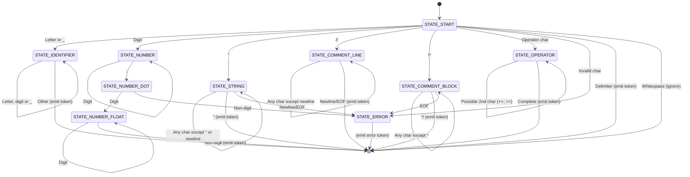

## Lexer State Diagram

```mermaid
stateDiagram-v2
    [*] --> STATE_START

    %% Identifier path
    STATE_START --> STATE_IDENTIFIER: Letter or _
    STATE_IDENTIFIER --> STATE_IDENTIFIER: Letter, digit or _
    STATE_IDENTIFIER --> [*]: Other (emit token)

    %% Number path
    STATE_START --> STATE_NUMBER: Digit
    STATE_NUMBER --> STATE_NUMBER: Digit
    STATE_NUMBER --> STATE_NUMBER_DOT: .
    STATE_NUMBER_DOT --> STATE_NUMBER_FLOAT: Digit
    STATE_NUMBER_FLOAT --> STATE_NUMBER_FLOAT: Digit
    STATE_NUMBER_FLOAT --> [*]: Non-digit (emit token)
    STATE_NUMBER_DOT --> STATE_ERROR: Non-digit

    %% String path
    STATE_START --> STATE_STRING: "
    STATE_STRING --> STATE_STRING: Any char except " or newline
    STATE_STRING --> [*]: " (emit token)
    STATE_STRING --> STATE_ERROR: Newline/EOF

    %% Comment paths
    STATE_START --> STATE_COMMENT_LINE: //
    STATE_COMMENT_LINE --> STATE_COMMENT_LINE: Any char except newline
    STATE_COMMENT_LINE --> [*]: Newline/EOF (emit token)
    
    STATE_START --> STATE_COMMENT_BLOCK: /*
    STATE_COMMENT_BLOCK --> STATE_COMMENT_BLOCK: Any char except *
    STATE_COMMENT_BLOCK --> [*]: */ (emit token)
    STATE_COMMENT_BLOCK --> STATE_ERROR: EOF

    %% Operators
    STATE_START --> STATE_OPERATOR: Operator char
    STATE_OPERATOR --> STATE_OPERATOR: Possible 2nd char (++, ==)
    STATE_OPERATOR --> [*]: Complete (emit token)

    %% Error handling
    STATE_START --> STATE_ERROR: Invalid char
    STATE_ERROR --> [*]: (emit error token)

    %% Direct transitions
    STATE_START --> [*]: Delimiter (emit token)
    STATE_START --> [*]: Whitespace (ignore)
```
