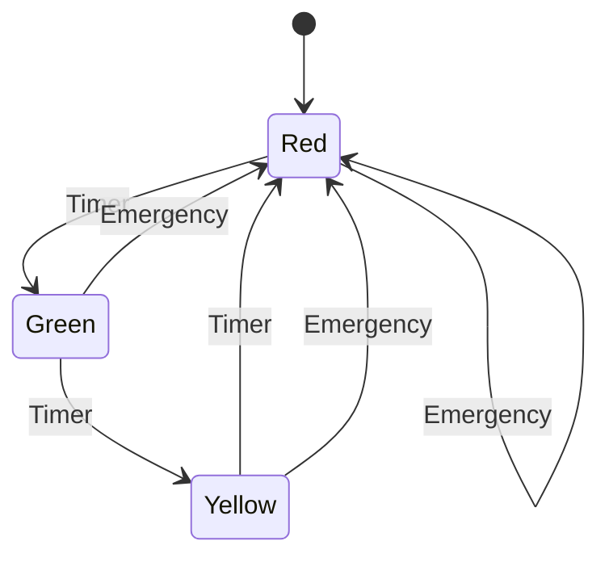
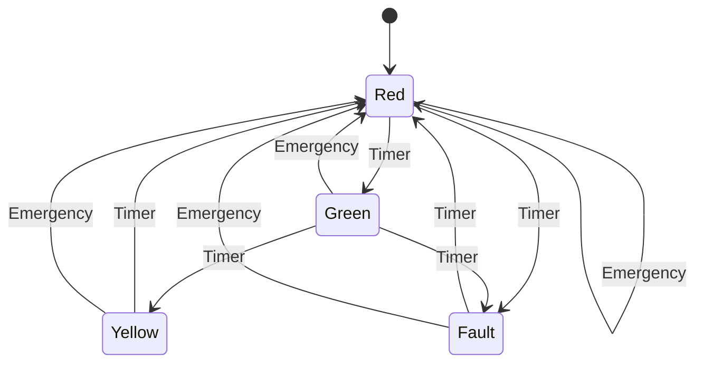

## Flavours of State Machines

Besides the mechanical state machines presented below, you should also get
acquainted with how the [State Pattern](./../../patterns/state/) can be used.


### 1. Deterministic Finite Automaton (DFA)



A DFA has one clear transition per input in each state. The traffic light
cycles normally or switches to Red for emergencies.

- States: Red, Green, Yellow
- Inputs: Timer (T), Emergency (E)
- Transitions:
  - Red + Timer → Green
  - Red + Emergency → Red (stay, already safe)
  - Green + Timer → Yellow
  - Green + Emergency → Red
  - Yellow + Timer → Red
  - Yellow + Emergency → Red
- Start State: Red
- Accept State: None (control system)

```python
class TrafficLightDFA:
    def __init__(self):
        self.state = "Red"
    
    def transition(self, input):
        if self.state == "Red":
            if input == "Timer":
                self.state = "Green"
                return "Switch to Green"
            elif input == "Emergency":
                return "Stay Red"
        elif self.state == "Green":
            if input == "Timer":
                self.state = "Yellow"
                return "Switch to Yellow"
            elif input == "Emergency":
                self.state = "Red"
                return "Emergency: Switch to Red"
        elif self.state == "Yellow":
            if input == "Timer":
                self.state = "Red"
                return "Switch to Red"
            elif input == "Emergency":
                self.state = "Red"
                return "Emergency: Switch to Red"
        return "Invalid Input"

# Usage
if __name__ == "__main__":
    light = TrafficLightDFA()
    print(light.transition("Timer"))      # Switch to Green
    print(light.transition("Emergency"))  # Emergency: Switch to Red
    print(light.transition("Timer"))      # Switch to Green
```


### 2. Non-Deterministic Finite Automaton (NFA)



An NFA allows multiple possible transitions for an input, simulating uncertainty
like a faulty timer that might skip Yellow.

- States: Red, Green, Yellow, Fault
- Inputs: Timer (T), Emergency (E)
- Transitions:
  - Red + Timer → {Green, Fault} (timer might fail)
  - Red + Emergency → Red
  - Green + Timer → {Yellow, Fault}
  - Green + Emergency → Red
  - Yellow + Timer → Red
  - Yellow + Emergency → Red
  - Fault + Timer → Red (reset)
  - Fault + Emergency → Red
- Start State: Red
- Accept State: None

```python
import random

class TrafficLightNFA:
    def __init__(self):
        self.state = "Red"
    
    def transition(self, input):
        if self.state == "Red":
            if input == "Timer":
                self.state = random.choice(["Green", "Fault"])
                return f"Switch to {self.state}"
            elif input == "Emergency":
                return "Stay Red"
        elif self.state == "Green":
            if input == "Timer":
                self.state = random.choice(["Yellow", "Fault"])
                return f"Switch to {self.state}"
            elif input == "Emergency":
                self.state = "Red"
                return "Emergency: Switch to Red"
        elif self.state == "Yellow":
            if input == "Timer":
                self.state = "Red"
                return "Switch to Red"
            elif input == "Emergency":
                self.state = "Red"
                return "Emergency: Switch to Red"
        elif self.state == "Fault":
            if input == "Timer":
                self.state = "Red"
                return "Reset to Red"
            elif input == "Emergency":
                self.state = "Red"
                return "Emergency: Switch to Red"
        return "Invalid Input"

# Usage
if __name__ == "__main__":
    light = TrafficLightNFA()
    print(light.transition("Timer"))      # Switch to Green or Fault
    print(light.transition("Timer"))      # Depends on state
    print(light.transition("Emergency"))  # Emergency: Switch to Red
```

### 3. Mealy Machine

A Mealy machine produces outputs based on the current state and input.
Outputs are instructions for drivers.

- States: Red, Green, Yellow
- Inputs: Timer (T), Emergency (E)
- Transitions and Outputs:
  - Red + Timer → Green, Output: "Go"
  - Red + Emergency → Red, Output: "Stop"
  - Green + Timer → Yellow, Output: "Prepare to Stop"
  - Green + Emergency → Red, Output: "Stop for Emergency"
  - Yellow + Timer → Red, Output: "Stop"
  - Yellow + Emergency → Red, Output: "Stop for Emergency"
- Start State: Red

```python
class TrafficLightMealy:
    def __init__(self):
        self.state = "Red"
    
    def transition(self, input):
        if self.state == "Red":
            if input == "Timer":
                self.state = "Green"
                return "Go"
            elif input == "Emergency":
                return "Stop"
        elif self.state == "Green":
            if input == "Timer":
                self.state = "Yellow"
                return "Prepare to Stop"
            elif input == "Emergency":
                self.state = "Red"
                return "Stop for Emergency"
        elif self.state == "Yellow":
            if input == "Timer":
                self.state = "Red"
                return "Stop"
            elif input == "Emergency":
                self.state = "Red"
                return "Stop for Emergency"
        return "Invalid Input"

# Usage
if __name__ == "__main__":
    light = TrafficLightMealy()
    print(light.transition("Timer"))      # Go
    print(light.transition("Timer"))      # Prepare to Stop
    print(light.transition("Emergency"))  # Stop for Emergency
```

### 4. Moore Machine

A Moore machine produces outputs based only on the current state.
Each state has a fixed output for drivers.

- States: Red, Green, Yellow
- Inputs: Timer (T), Emergency (E)
- State Outputs:
  - Red: "Stop"
  - Green: "Go"
  - Yellow: "Prepare to Stop"
- Transitions:
  - Red + Timer → Green
  - Red + Emergency → Red
  - Green + Timer → Yellow
  - Green + Emergency → Red
  - Yellow + Timer → Red
  - Yellow + Emergency → Red
- Start State: Red

```python
class TrafficLightMoore:
    def __init__(self):
        self.state = "Red"
    
    def get_output(self):
        outputs = {
            "Red": "Stop",
            "Green": "Go",
            "Yellow": "Prepare to Stop"
        }
        return outputs[self.state]
    
    def transition(self, input):
        if self.state == "Red":
            if input == "Timer":
                self.state = "Green"
            elif input == "Emergency":
                pass  # Stay Red
        elif self.state == "Green":
            if input == "Timer":
                self.state = "Yellow"
            elif input == "Emergency":
                self.state = "Red"
        elif self.state == "Yellow":
            if input == "Timer" or input == "Emergency":
                self.state = "Red"
        return self.get_output()

# Usage
if __name__ == "__main__":
    light = TrafficLightMoore()
    print(light.transition("Timer"))      # Go
    print(light.transition("Timer"))      # Prepare to Stop
    print(light.transition("Emergency"))  # Stop
```

These examples use a traffic light system to illustrate the differences
between DFA (predictable transitions), NFA (uncertain transitions),
Mealy (input-dependent outputs), and Moore (state-dependent outputs).


### 5. Pushdown Automaton (PDA)

A PDA adds a stack to the finite automaton.
This enables memory of arbitrary depth, useful when the traffic light logic depends on nested events
(e.g., a sequence of emergencies that need to be cleared in order).

The PDA tracks emergency override sequences.
An emergency can stack multiple override requests, and they are cleared in LIFO (Last-In-First-Out) order.
- States: Normal, Emergency
- Inputs: Timer (T), Emergency (E), ClearEmergency (C)
- Stack Symbols: E (emergency marker)
- Transitions:
    - Normal + Timer + ε → Normal (stack unchanged)
	- Normal + Emergency + ε → Emergency, push E
	- Emergency + Emergency + ε → Emergency, push E
	- Emergency + ClearEmergency + E → Emergency (pop E)
	- Emergency + ClearEmergency + empty stack → Normal
	- Start State: Normal
	- Stack Initially Empty

```python
class TrafficLightPDA:
    def __init__(self):
        self.state = "Normal"
        self.stack = []
    
    def transition(self, input):
        if self.state == "Normal":
            if input == "Timer":
                return "Normal cycle continues"
            elif input == "Emergency":
                self.stack.append('E')
                self.state = "Emergency"
                return "Emergency override engaged"
        elif self.state == "Emergency":
            if input == "Emergency":
                self.stack.append('E')
                return "Additional emergency stacked"
            elif input == "ClearEmergency":
                if self.stack:
                    self.stack.pop()
                    if not self.stack:
                        self.state = "Normal"
                        return "All emergencies cleared, return to normal"
                    return "One emergency cleared, remaining in override"
        return "Invalid Input"

# Usage
if __name__ == "__main__":
    light = TrafficLightPDA()
    print(light.transition("Timer"))         # Normal cycle continues
    print(light.transition("Emergency"))     # Emergency override engaged
    print(light.transition("Emergency"))     # Additional emergency stacked
    print(light.transition("ClearEmergency"))# One emergency cleared
    print(light.transition("ClearEmergency"))# All emergencies cleared
```

Key Idea: PDA can remember nested events — something DFAs cannot.


### 6. Turing Machine (TM)

A Turing machine generalises further with an infinite tape (memory)
and a read/write head that can move left and right.
It is capable of general computation, not just state-based control.

A traffic light controller that records a history of light cycles
on the tape and can rewind/replay for analysis or debugging.
- States: Red, Green, Yellow, Reviewing
- Tape Alphabet: {R, G, Y, _} (underscore is blank)
- Inputs: Timer (T), Emergency (E), Review (V), EndReview (X)
- Head Operations:
	- Write R, G, Y for each state
	- On Review (V), switch to Reviewing state and move head left
	- On EndReview (X), return to normal and move head right to resume

```python
class TrafficLightTM:
    def __init__(self):
        self.state = "Red"
        self.tape = ['R'] + ['_'] * 100  # finite tape for example
        self.head = 1  # position after initial Red
    
    def write_state(self, symbol):
        self.tape[self.head] = symbol
        self.head += 1
    
    def transition(self, input):
        if self.state in ["Red", "Green", "Yellow"]:
            if input == "Timer":
                if self.state == "Red":
                    self.state = "Green"
                    self.write_state('G')
                    return "Switch to Green"
                elif self.state == "Green":
                    self.state = "Yellow"
                    self.write_state('Y')
                    return "Switch to Yellow"
                elif self.state == "Yellow":
                    self.state = "Red"
                    self.write_state('R')
                    return "Switch to Red"
            elif input == "Emergency":
                self.state = "Red"
                self.write_state('R')
                return "Emergency: Switch to Red"
            elif input == "Review":
                self.state = "Reviewing"
                self.head -= 1
                return "Entering review mode"
        elif self.state == "Reviewing":
            if input == "EndReview":
                self.state = "Red"
                self.head = len([c for c in self.tape if c in "RGY"])
                return "Exit review mode, resume control"
            else:
                current = self.tape[self.head]
                self.head = max(0, self.head - 1)
                return f"Reviewing: {current}"
        return "Invalid Input"

# Usage
if __name__ == "__main__":
    light = TrafficLightTM()
    print(light.transition("Timer"))      # Switch to Green
    print(light.transition("Timer"))      # Switch to Yellow
    print(light.transition("Timer"))      # Switch to Red
    print(light.transition("Review"))     # Entering review mode
    print(light.transition("Timer"))      # Reviewing: Y
    print(light.transition("Timer"))      # Reviewing: G
    print(light.transition("EndReview"))  # Exit review mode
```

Key Idea: The Turing Machine has unlimited memory and control,
it can simulate logging, analysis, and arbitrary processing of traffic data.


### Summary

| Machine Type | Memory | Traffic Light Feature Example |
|--------------|--------|-------------------------------|
| DFA | None | Basic cycling |
| NFA | None (non-determinism) | Faulty timer |
| Mealy | None | Input-based driver signals |
| Moore | None | State-based driver signals |
| PDA | Stack | Remember pedestrian requests |
| TM | Infinite tape | Log and correct event history |

When to use which?
- DFA/NFA: Simple controllers, no memory.
- Mealy/Moore: Reactive systems giving outputs to users.
- PDA: Context-sensitive control (nested conditions, undo stacks).
- TM: Full programmable logic, history management, complex control.
