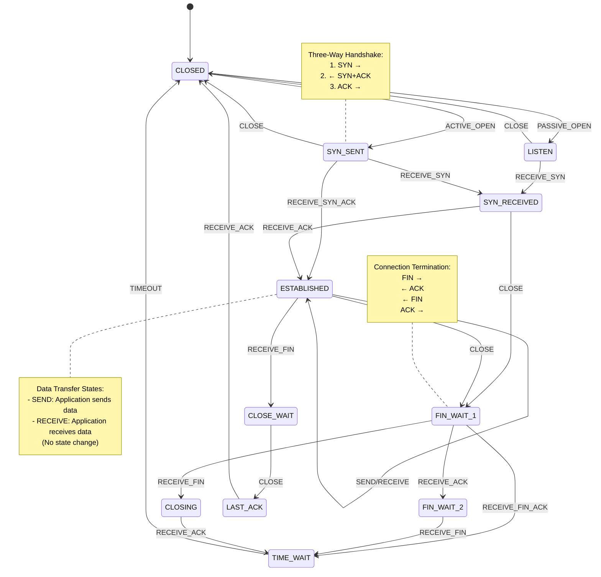

## TCP State Diagram

```mermaid
stateDiagram-v2
    [*] --> CLOSED

    CLOSED --> LISTEN: PASSIVE_OPEN
    CLOSED --> SYN_SENT: ACTIVE_OPEN

    LISTEN --> SYN_RECEIVED: RECEIVE_SYN
    LISTEN --> CLOSED: CLOSE

    SYN_SENT --> SYN_RECEIVED: RECEIVE_SYN
    SYN_SENT --> ESTABLISHED: RECEIVE_SYN_ACK
    SYN_SENT --> CLOSED: CLOSE

    SYN_RECEIVED --> ESTABLISHED: RECEIVE_ACK
    SYN_RECEIVED --> FIN_WAIT_1: CLOSE

    ESTABLISHED --> FIN_WAIT_1: CLOSE
    ESTABLISHED --> CLOSE_WAIT: RECEIVE_FIN
    ESTABLISHED --> ESTABLISHED: SEND/RECEIVE

    FIN_WAIT_1 --> FIN_WAIT_2: RECEIVE_ACK
    FIN_WAIT_1 --> CLOSING: RECEIVE_FIN
    FIN_WAIT_1 --> TIME_WAIT: RECEIVE_FIN_ACK

    FIN_WAIT_2 --> TIME_WAIT: RECEIVE_FIN

    CLOSE_WAIT --> LAST_ACK: CLOSE

    CLOSING --> TIME_WAIT: RECEIVE_ACK

    LAST_ACK --> CLOSED: RECEIVE_ACK

    TIME_WAIT --> CLOSED: TIMEOUT

    note right of ESTABLISHED
        Data Transfer States:
        - SEND: Application sends data
        - RECEIVE: Application receives data
        (No state change)
    end note

    note left of SYN_SENT
        Three-Way Handshake:
        1. SYN → 
        2. ← SYN+ACK 
        3. ACK →
    end note

    note left of FIN_WAIT_1
        Connection Termination:
        FIN → 
        ← ACK 
        ← FIN 
        ACK →
    end note
```
