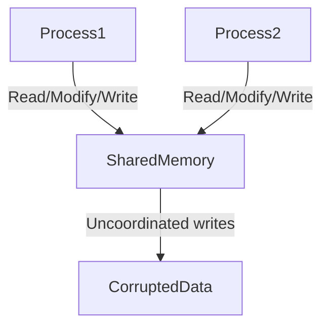
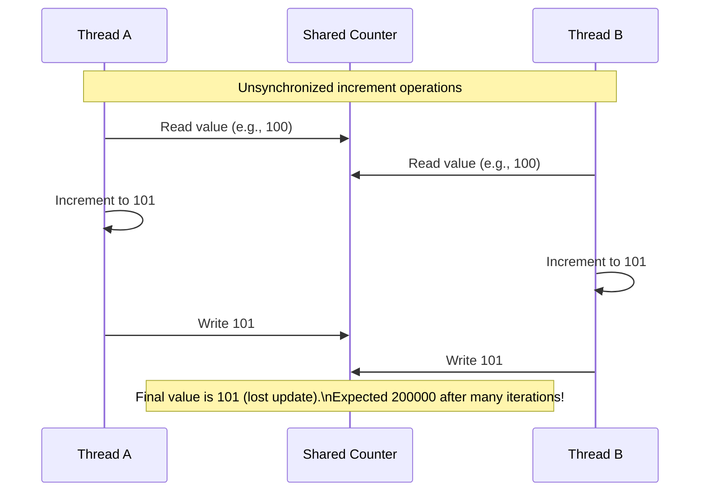
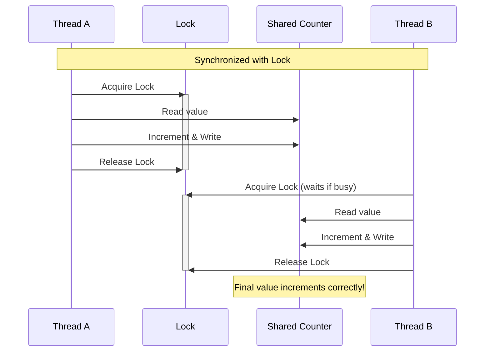

## Race Conditions

A race condition arises when multiple threads or processes access and modify a shared resource
simultaneously, leading to unpredictable results. The core issue is the non-atomic nature of
operations: even simple actions like incrementing a counter involve multiple steps (read, modify, write),
and if these steps are interrupted by another thread or process, data corruption occurs. This problem
is especially insidious in shared memory environments, where threads or processes directly manipulate
the same memory space.

To illustrate, consider a Python program using *threads* to increment a shared counter. Here, threads
share *the same memory* by default:

```python
import threading

counter = 0  # Shared variable in memory

def increment():
    global counter
    for _ in range(100000):
        temp = counter  # Read
        temp += 1       # Modify
        counter = temp  # Write

# Launch two threads
thread1 = threading.Thread(target=increment)
thread2 = threading.Thread(target=increment)
thread1.start()
thread2.start()
thread1.join()
thread2.join()

print(f"Expected 200000, got {counter}")  # Outputs less than 200000
```

When two threads read the counter simultaneously (e.g., both read `100`), they increment
their local copies to `101` and both write back `101`, losing one increment. Over thousands
of iterations, this discrepancy compounds, resulting in a final value smaller than expected.




#### Shared Memory in Processes

Now, let’s extend this to *shared memory in processes*. Unlike threads, processes have separate
memory spaces by default. To share data, we use explicit shared memory objects like `multiprocessing.Value`.
Even here, race conditions persist without synchronisation:

```python
import multiprocessing

def increment(shared_counter):
    for _ in range(100000):
        # Read-modify-write is not atomic
        shared_counter.value += 1

if __name__ == "__main__":
    shared_counter = multiprocessing.Value('i', 0)  # Shared integer
    process1 = multiprocessing.Process(target=increment, args=(shared_counter,))
    process2 = multiprocessing.Process(target=increment, args=(shared_counter,))
    process1.start()
    process2.start()
    process1.join()
    process2.join()
    print(f"Expected 200000, got {shared_counter.value}")  # Incorrect result
```

Despite using shared memory across processes, the same problem occurs: overlapping read-modify-write
operations corrupt the value. The shared memory allows processes to interact with the same data,
but without coordination, the result is still wrong.




#### Fixing the Race Condition

The solution is to enforce atomicity using synchronisation primitives. For threads, a `threading.Lock`
ensures only one thread enters the critical section at a time:

```python
def increment():
    global counter
    for _ in range(100000):
        with threading.Lock():  # Acquire lock
            counter += 1
```

For processes with shared memory, we use `multiprocessing.Lock`:

```python
def increment(shared_counter, lock):
    for _ in range(100000):
        with lock:  # Acquire process-safe lock
            shared_counter.value += 1

if __name__ == "__main__":
    shared_counter = multiprocessing.Value('i', 0)
    lock = multiprocessing.Lock()  # Process-specific lock
    process1 = multiprocessing.Process(target=increment, args=(shared_counter, lock))
    process2 = multiprocessing.Process(target=increment, args=(shared_counter, lock))
    # ... rest of code
```

In both cases, the lock acts as a gatekeeper, ensuring that only one thread or process can execute
the critical section (the increment operation) at any time. This restores the expected result of `200000`.




### Observations

Race conditions are not limited to counters or threads. They appear in file operations, database transactions,
and distributed systems--anywhere shared resources are accessed concurrently. The unpredictability stems
from the timing of operations, which is influenced by system load, scheduling, and even slight code changes
(e.g., adding a `print` statement might mask the bug). Debugging such issues is challenging because they
may not reproduce consistently.

Shared memory amplifies these risks because it allows direct interaction between concurrent entities
(threads/processes). While threads inherently share memory, processes require explicit mechanisms
(like `multiprocessing.Value`), but the core problem remains: without synchronization, concurrent modifications
corrupt data. Tools like locks, semaphores, or atomic operations (e.g., `queue.Queue` for thread-safe data exchange)
are essential to avoid these pitfalls.


