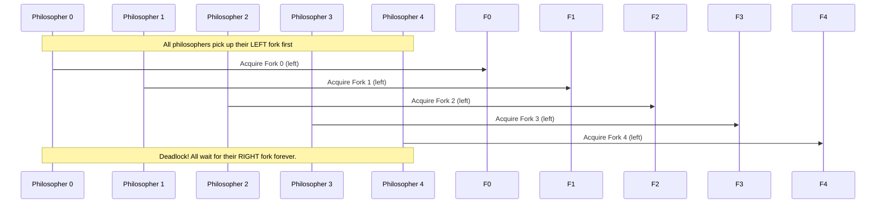

## Dining Philosophers

The Dining Philosophers problem is a classic thought experiment in computer science that illustrates
the challenges of resource allocation and synchronisation in concurrent systems. It was first introduced
by Edsger Dijkstra in 1965 as a way to explore the complexities of avoiding *deadlocks*[^dead]--a
situation where processes or threads become permanently stuck, waiting for resources that will never
become available. Later, Tony Hoare, a pioneer in formal methods for program correctness, reformulated
the problem using forks instead of Dijkstra's original "chopsticks." The problem has since become a
cornerstone example in discussions about concurrency, operating systems, and distributed computing.

[^dead]: Deadlock occurs when two or more threads are each waiting for the other to release a resource,
causing all of them to block forever. It usually involves circular waiting on locks or semaphores.
It is almost a "catch 22" of programs.

Imagine five philosophers sitting around a circular table, each with a plate of spaghetti in front of
them. Between each pair of plates is a single fork, meaning there are five forks in total. To eat, a
philosopher must pick up both the fork to their left and the fork to their right. Once they finish
eating, they put both forks back on the table, allowing their neighbours to use them. The philosophers
alternate between thinking and eating indefinitely. The challenge arises because the forks are shared
resources: if one philosopher picks up a fork, their neighbour cannot use it until it is returned.
The problem asks: *How can the philosophers coordinate their actions to avoid starvation (where a
philosopher never gets to eat) and deadlock (where all philosophers are stuck waiting for forks)?*

The most obvious issue is deadlock. Suppose all philosophers simultaneously decide to pick up their left
fork. Each philosopher now holds one fork but cannot eat, since they need their right fork--which is already
held by the philosopher to their right. No philosopher will put down their fork until they eat, and no
one can eat until they acquire a second fork. This creates a circular dependency where everyone waits
indefinitely. Even if deadlock is avoided, starvation remains a risk: one philosopher might repeatedly
miss the chance to grab forks due to timing or scheduling.

Dijkstra’s original solution proposed using semaphores--a synchronisation primitive--to manage fork access.
However, a more intuitive approach emerged later: the *resource hierarchy* solution. Here, each fork is
assigned a unique number (e.g., 0 to 4), and philosophers are required to pick up forks in ascending order.
For example, a philosopher might first pick up the lower-numbered fork to their left and then the higher-numbered
fork to their right. This breaks the symmetry that causes deadlock. If all philosophers follow this rule,
at least one philosopher will always be able to acquire both forks, ensuring progress. However, this solution
assumes a static order and does not generalise well to all scenarios.

Another common solution is to limit the number of philosophers allowed to attempt eating at the same time.
For instance, if only four philosophers are permitted to pick up forks simultaneously, at least one fork will
always remain available, preventing deadlock. This approach uses a semaphore or counter to enforce the limit.
While effective, it reduces parallelism and may not scale efficiently. A third strategy introduces an *arbitrator*,
such as a waiter or central authority, who grants permission to pick up forks. Philosophers must request both
forks from the arbitrator, who ensures that no two philosophers hold conflicting forks. This centralises
control but creates a potential bottleneck.

Modern solutions often leverage higher-level abstractions like *monitors* or *message passing* to encapsulate
fork management. For example, a monitor could enforce atomic acquisition of both forks, or philosophers could
exchange messages to negotiate access. Some approaches even randomise the wait time between fork pickup attempts
to reduce contention. However, no solution is perfect: trade-offs exist between fairness, efficiency, and
complexity. The problem also highlights the importance of avoiding circular waits (by ordering resources)
and ensuring preemption (letting processes release resources if they can’t proceed).

The Dining Philosophers problem remains relevant today, not just as an academic exercise but as a metaphor for
real-world systems. Operating systems manage processes competing for CPU time or I/O devices, databases handle
transactions requiring multiple locks, and distributed systems coordinate access to shared network resources--all
scenarios where improper synchronisation can lead to deadlock or starvation. The problem teaches us that designing
robust concurrent systems requires careful planning, whether through hierarchical resource ordering, centralised
coordination, or probabilistic methods to break symmetry. Its enduring legacy lies in its simplicity: a relatable
story that encapsulates the delicate balance between cooperation and competition in any shared-resource environment.

