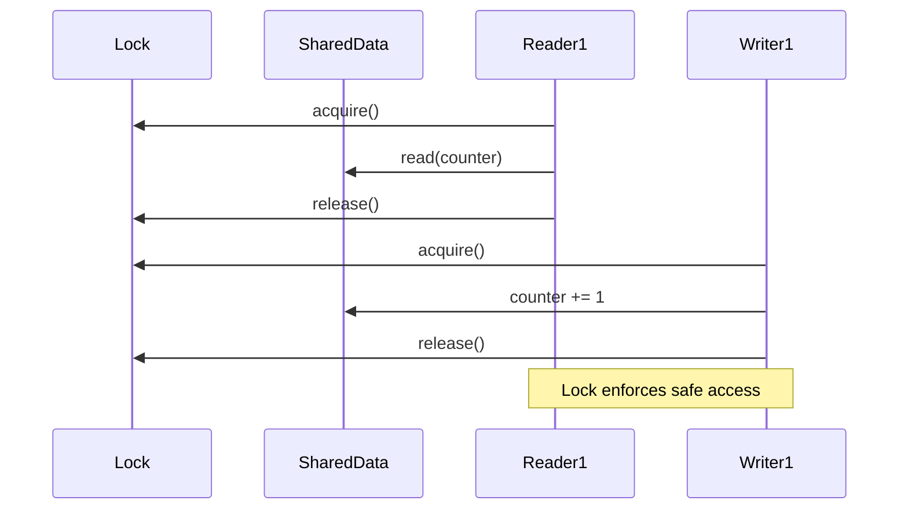

## Read/Write

In the context of concurrent programming, *reading* and *writing* represent two fundamental modes of
interaction with shared memory--observing and modifying state, respectively. A *read operation*
retrieves data from a *shared* variable or structure, reflecting the current visible state at the time
of access. A *write operation*, on the other hand, changes that state by storing new data into the shared
memory. Although these operations may seem trivial in single-threaded environments, their implications
become complex when multiple threads act simultaneously.

At an abstract level, the key challenge lies in the interleaving of operations. If two threads read and
write the same variable without coordination, the system may enter an indeterminate state where the results
differ each time the program runs. For example, two readers accessing the same value can usually proceed
without conflict, since they do not mutate state. However, if a writer updates the variable while a reader
is reading it, the reader might see a partially updated or stale value. Similarly, if two writers attempt
to update the same variable simultaneously, their operations may conflict, causing one writer's changes to
overwrite or interfere with the other's.

```python
import threading
import time
import random

# Shared data and lock
counter = 0
lock = threading.Lock()

# Reader thread function
def reader(thread_id):
    global counter
    for _ in range(5):
        with lock:  # Acquire lock to read safely
            value = counter
            print(f"Reader {thread_id} read value {value}")
        time.sleep(random.uniform(0.1, 0.3))  # Simulate processing time

# Writer thread function
def writer(thread_id):
    global counter
    for _ in range(5):
        with lock:  # Acquire lock to write safely
            counter += 1
            print(f"Writer {thread_id} wrote value {counter}")
        time.sleep(random.uniform(0.2, 0.4))  # Simulate processing time

# Launching threads
readers = [threading.Thread(target=reader, args=(i,)) for i in range(2)]
writers = [threading.Thread(target=writer, args=(i,)) for i in range(2)]

for t in readers + writers:
    t.start()
for t in readers + writers:
    t.join()

print(f"Final counter value: {counter}")
```

```mermaid
sequenceDiagram
    participant SharedData
    participant Reader1
    participant Writer1

    Reader1->>SharedData: read(counter)
    Writer1->>SharedData: counter += 1
    Reader1->>SharedData: read(counter)
    Note over Reader1,Writer1: Interleaved access → Race Condition
```



In practical systems these operations are protected using synchronisation primitives such as locks and
atomic instructions. The lock ensures mutual exclusion--only one thread at a time can enter the critical
section where shared state is accessed. In the simulation, a virtual machine (VM) handles a counter shared
between reader and writer threads. Readers acquire a lock, read the current value of the counter atomically,
and release the lock. Writers also acquire the same lock before incrementing the counter atomically and then
release the lock afterward. This disciplined structure guarantees that no two threads access the counter
in conflicting ways at the same time.



The use of atomic instructions--like ATOMIC_GET and ATOMIC_INCREMENT--further ensures that these operations
execute without interruption, even if two threads race to perform them. These atomic primitives act as
low-level guarantees provided by hardware (or simulated by the VM), allowing reads and writes to be treated
as indivisible units. Without such guarantees, subtle bugs could arise due to what's known as
[race conditions](./../race/), where the outcome of execution depends on unpredictable scheduling decisions
made by the operating system or VM scheduler.

In a broader sense, understanding reads and writes in concurrency is about understanding visibility and
ordering. A read must reflect a coherent view of memory; *a write must propagate to other threads in a
predictable way*. Mechanisms like memory barriers or fences often accompany atomic operations to enforce
this visibility. The simulation, though abstracted in a toy VM, captures this principle: threads synchronise
not just to coordinate execution, but to ensure that what they observe and modify in shared memory is
consistent, valid, and meaningful across the system.
