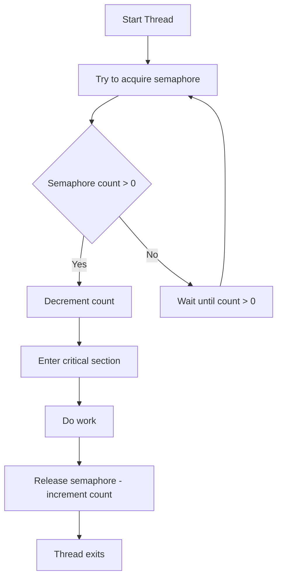

## Semaphores

A semaphore is a synchronisation primitive used to control access to a shared resource by multiple
threads in a concurrent system. Conceptually, a semaphore maintains an internal counter. Threads
perform two main operations on a semaphore:

- `acquire()` (sometimes called wait or P): Decrements the counter. If the counter is zero, the
  thread blocks until another thread releases.

- `release()` (also called signal or V): Increments the counter and potentially unblocks waiting threads.

There are two common types of semaphores:
1. *Counting Semaphore.* Allows a fixed number of threads to access a resource concurrently (e.g., a
   thread pool of size 5).
2. *Binary Semaphore (Mutex).* Can be either 0 or 1, effectively acting as a lock (mutual exclusion).

Semaphores are useful for:
- Limiting concurrent access to a finite number of resources.
- Managing producer-consumer scenarios.
- Coordinating threads in specific sequences.

Unlike locks or mutexes, semaphores do not necessarily enforce *ownership*, meaning a thread that didn’t
acquire it may still release it--this flexibility comes with both power and risk.




Simple Example in Python with threading.Semaphore

```python
import threading
import time
import random

# A shared resource: a pool with 3 available "slots"
semaphore = threading.Semaphore(3)

def worker(thread_id: int):
    print(f"Thread-{thread_id} is waiting to enter critical section.")
    with semaphore:  # Acquire semaphore
        print(f"Thread-{thread_id} has entered critical section.")
        time.sleep(random.uniform(0.5, 2.0))  # Simulate work
        print(f"Thread-{thread_id} is leaving critical section.")

threads = []
for i in range(7):
    t = threading.Thread(target=worker, args=(i,))
    threads.append(t)
    t.start()

for t in threads:
    t.join()

print("All threads completed.")
```


### Explanation

In this simulation, we create 7 threads, but the semaphore allows only 3 threads to execute in the "critical section"
at a time. This models situations like limiting the number of database connections, concurrent downloads, or slots in
a connection pool.

Python's `threading.Semaphore(value)` starts with a given value (3 in this case). Each thread calls `semaphore.acquire()`
when entering the critical section and semaphore.release() when exiting (implicitly done by with block). This ensures at
most 3 threads can work concurrently in the guarded block.


```mermaid
graph TD
    S1[Semaphore Count = 3]

    subgraph Threads
        T1[Thread 1] --> A1[acquire()]
        T2[Thread 2] --> A2[acquire()]
        T3[Thread 3] --> A3[acquire()]
        T4[Thread 4] --> A4[acquire()]
    end

    A1 --> CS1[CS: Work 1]
    A2 --> CS2[CS: Work 2]
    A3 --> CS3[CS: Work 3]
    A4 --> W4[Wait (blocked)]

    CS1 --> R1[release()]
    R1 --> A4
    A4 --> CS4[CS: Work 4]
```