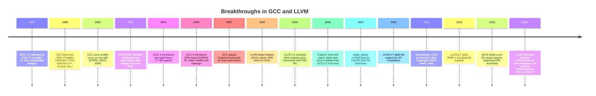

## A Modern Approach to Compilers

Examplify code evolution .. but also theory .. programming .. languages ..

This is a continuation from ch05 [classic](./../../ch05/classic/) compiler design
in a more traditional way.

This illustrates such things as design patterns, plugin architecture ..

Packrat as parser .. object orientation .. and so.





### From GCC to LLVM: The Evolution of Compiler Modularity

The late 1980s marked a turning point in compiler history. Until then, most compilers were monolithic creatures: each new language for each new machine required almost an entirely new compiler. What Richard Stallman and his collaborators achieved with the GNU Compiler Collection (GCC) was to break this rigid pattern by introducing retargetability. Twenty years later, Chris Lattner’s LLVM would take this idea even further, transforming the compiler from a mere tool into a reusable infrastructure.


#### GCC: Retargetability through Separation

When Stallman released the first version of GCC in 1987, it was called the GNU C Compiler. Its defining innovation was separating front ends from back ends. Instead of writing “a compiler for C on VAX” and another for “C on MIPS,” GCC provided:
1. Front ends: parse and analyse source code for a particular language (C, later C++, Fortran, Ada, etc.).
2. Middle end: apply machine-independent optimisations.
3. Back ends: generate code for specific target architectures (x86, ARM, MIPS, SPARC), described by machine definition files.

The central trick was to use an internal representation, first RTL (Register Transfer Language) and later GIMPLE, so that front ends and back ends could meet in the middle.

For example, compiling a trivial function in C:

```c
int add(int a, int b) {
    return a + b;
}
```

In GCC’s middle end, this might become a simplified GIMPLE form:

```gimple
# GIMPLE
add (int a, int b)
{
  int _1;
  _1 = a + b;
  return _1;
}
```

From there, the back end maps it to machine-specific assembly:
- On x86:
```asm
add:
    mov eax, edi
    add eax, esi
    ret
```
- On ARM:
```asm
add:
    add r0, r0, r1
    bx lr
```

The same high-level program, once passed through GCC’s middle end, could be retargeted to any supported architecture by providing only the back-end descriptions.

This modularity made GCC the universal toolchain of the free software world. It powered Linux distributions across architectures from Intel servers to tiny embedded controllers. Yet GCC’s design, written in C and developed incrementally over decades, became hard to extend. Its internal representations were not originally meant for external use, and experimenting with GCC internals required wading through a large, complex codebase.


#### LLVM: Infrastructure, Not Just a Compiler

Chris Lattner’s LLVM (Low Level Virtual Machine), begun in 2000 as a research project, reimagined modularity. Where GCC separated front ends and back ends, LLVM introduced an intermediate representation (LLVM IR) that was:
- Typed (with explicit integer, floating, and pointer types),
- In SSA form (Static Single Assignment, making optimisation cleaner),
- Stable and documented (meant to be read, written, and stored).

Unlike GCC’s internal GIMPLE/RTL, LLVM IR was first-class: you could write it to disk, inspect it, reload it, and even hand-edit it.

The same C function from above, compiled with Clang (LLVM’s C front end), becomes:

```llvm
; LLVM IR
define i32 @add(i32 %a, i32 %b) {
entry:
  %sum = add i32 %a, %b
  ret i32 %sum
}
```

This intermediate code is machine-independent, yet precise enough to lower efficiently to many targets. The LLVM toolchain allows you to transform and optimise this IR using the opt command, and finally emit native code with llc.

For example:

```
clang -S -emit-llvm add.c -o add.ll
opt -O2 add.ll -o add_opt.ll
llc add_opt.ll -o add.s
```

The design philosophy is clear: LLVM is not just a compiler, but a framework. Languages as diverse as Swift, Rust, Julia, and Haskell all use LLVM as their back end. Hardware vendors (e.g., Apple for ARM64, NVIDIA for GPUs, WebAssembly groups) also adopt it to avoid reinventing optimisation and codegen pipelines.


#### GCC vs LLVM: Philosophical Differences

- GCC pioneered separation. Its retargetable structure made it possible to support many languages and architectures in one collection. But GCC’s IRs were internal tools, not external artefacts.
- LLVM made IR central. LLVM IR is human-readable, language-agnostic, and usable across compile-time and runtime. It is the “lingua franca” of modern compiler design.
- GCC is a compiler collection. Each language plugs into a shared, but historically monolithic, middle/back end.
- LLVM is compiler infrastructure. It provides libraries, APIs, and tools that let anyone build a compiler, JIT engine, or analysis tool.


Broader Impact

- GCC’s modularity enabled UNIX and Linux portability in the 1990s. Without it, Linux would not have spread across dozens of architectures so quickly.
- LLVM’s infrastructure enabled new languages and tooling in the 2000s and 2010s. Without it, languages like Rust, Swift, and Julia might never have gained high-performance back ends so quickly.

The transition from GCC to LLVM marks a shift from thinking of compilers as monolithic programs to viewing them as reusable ecosystems. GCC showed the power of modularity; LLVM demonstrated the power of infrastructure built around a universal IR.

