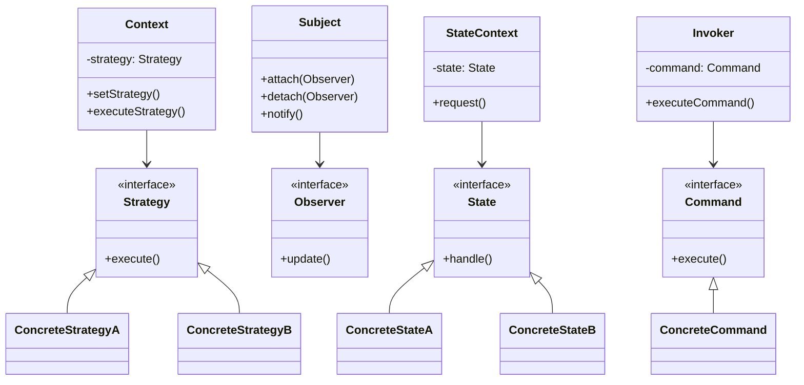
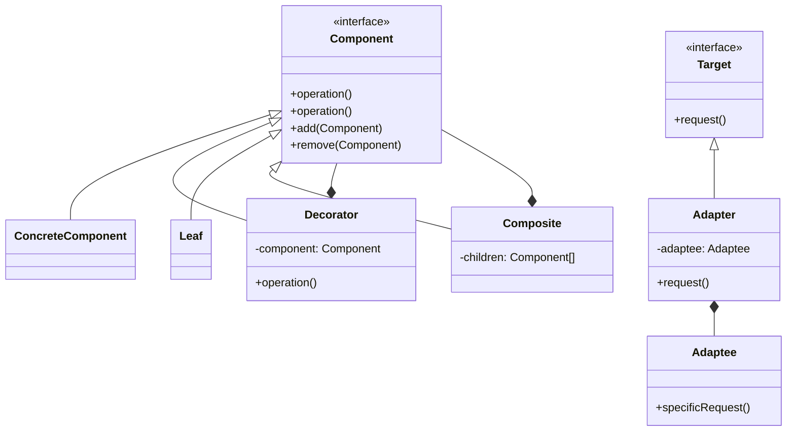
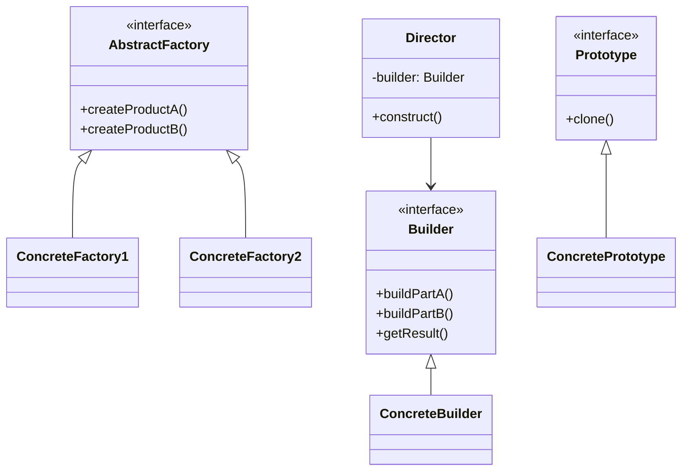
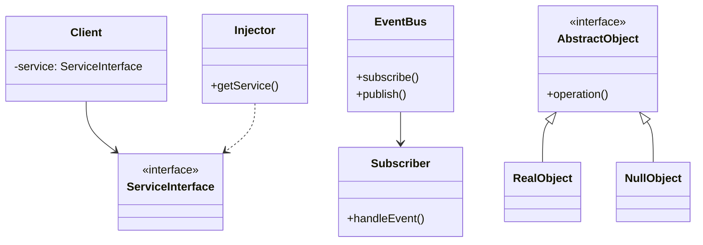
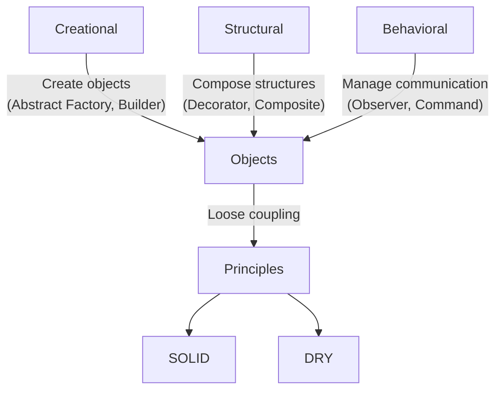

Gang-of-Four patterns .. + 3 others

| Pattern | Category | Purpose | Example Use Case | Source |
|----|----|----|----|----|
| [Strategy](./strategy/) | Behavioural | Encapsulate interchangeable algorithms or behaviours | Sorting algorithms, payment methods | GoF |
| [Command](./command/) | Behavioural | Encapsulate a request as an object | Undo/Redo, action queues, macro recording | GoF |
| Observer           | Behavioural      | Notify dependent objects of state changes                        | GUIs, event systems, data binding                | GoF            |
| [State](./state/) | Behavioural | Change object behaviour based on internal state | Game AI, UI modes | GoF |
| Decorator          | Structural      | Add behaviour to objects dynamically                              | I/O streams, middleware pipelines                | GoF            |
| Adapter            | Structural      | Convert one interface to another                                 | Legacy code integration, wrapper libraries       | GoF            |
| [Facade](./facade/) | Structural | Provide a unified interface to a set of interfaces in a subsystem | Simplifying complex libraries, subsystems, APIs | GoF |
| [Composite](./composite/) | Structural | Treat objects and groups uniformly | Scene graphs, file system trees | GoF |
| [Factory Method](./factory/) | Creational | Define interface for creating objects, let subclass decide | Plugin creation, document editors | GoF |
| [Abstract Factory](./factory/05/) | Creational | Create families of related objects without specifying classes | GUI themes, cross-platform toolkits | GoF |
| [Singleton](./singleton/)[^single] | Creational | Ensure a class has only one instance | Config manager, global registries | GoF (controversial) |
| [Builder](./builder/) | Creational | Separate construction of a complex object from its representation | Object configurators, UI builders | GoF |
| Prototype          | Creational      | Clone existing objects instead of creating new ones              | Object pools, data templates                     | GoF            |
| Mediator           | Behavioural      | Centralise complex communication between objects                 | Chat servers, air traffic control systems        | GoF            |
| [Visitor](./visitor/) | Behavioural | Separate an algorithm from the objects it operates on | Compilers, AST traversal, document processing | GoF |
| [Dependency Injection](./combined/os/DEPENDENCY.md) | Structural | Provide dependencies from the outside | Testable systems, service wiring | Post-GoF |
| [Null Object](./null/) | Behavioural | Use an object with default behaviour instead of `null` | Safe iteration, fault-tolerant systems | Post-GoF |
| [Event Bus](./event/) | Behavioural | Decouple senders from receivers using a publish/subscribe model | UI events, logging systems | Post-GoF |

Maybe:
| Pattern | Category | Purpose | Example Use Case | Source |
|----|----|----|----|----|
| Bridge | Structural | Decouple abstraction from implementation so they can vary independently | GUI toolkits, device drivers | GoF |
| Template Method | Behavioural | Define the skeleton of an algorithm, let subclasses redefine steps | Frameworks, code generators | GoF |
| Proxy | Structural | Provide a placeholder or surrogate for another object | Remote proxies, lazy loading, access control | GoF |

[^single]: Singleton is often discouraged in modern design due to global state issues; use with care: https://en.wikipedia.org/wiki/Singleton_pattern.

### 1. Behavioural Patterns

### 2. Structural Patterns

### 3. Creational Patterns

### 4. Post-GoF Patterns

### 5. Pattern Relationships (Meta-Diagram)

Abstractions shown:

1. *Interfaces* (<<interface>>) as pattern contracts

2. *Arrow types*:
   - `-->` for dependency
   - `<|--` for inheritance
   - `*--` for composition

3. *Pattern-specific relationships*:
   - Observer's subject-observer binding
   - Decorator's recursive wrapping
   - Composite's tree structure

4. *Post-GoF patterns* with modern tooling (DI containers, event systems)

Each diagram isolates the pattern's essence while maintaining consistent notation.
The meta-diagram shows how categories relate to design principles.

