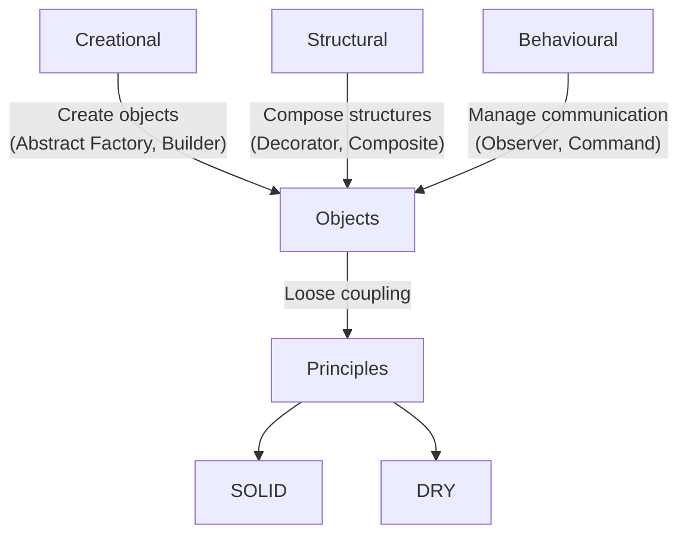

## Design Patterns

In 1994, Erich Gamma, Richard Helm, Ralph Johnson, and John Vlissides published
*Design Patterns: Elements of Reusable Object-Oriented Software*.
These four authors are collectively known as the Gang of Four (GoF).

Their book cataloged 23 classic software design patterns--recurring solutions to
common problems in object-oriented software development. The patterns are divided
into three main categories:

|Category	|Description	|Examples|
|--|--|--|
|Creational	|Object creation mechanisms	|Factory Method, Singleton, Builder|
|Structural	|Composing classes and objects into larger structures	|Adapter, Composite, Facade|
|Behavioural	|Managing algorithms, responsibilities, communication	|Strategy, Observer, Command|

The GoF patterns are not code libraries--they are general reusable solutions that
can be adapted to various programming languages and contexts. They aim to make designs
more flexible, reusable, and maintainable, by anticipating future changes and encouraging
good separation of concerns.

The GoF book emphasises object-oriented principles like encapsulation, composition over
inheritance, and delegation--themes still relevant today, even beyond OOP-heavy languages.

### DRY Principle (Don’t Repeat Yourself)

Definition:
> Every piece of knowledge must have a single, unambiguous, authoritative representation within a system.

Introduced in the book *The Pragmatic Programmer* (1999) by Andrew Hunt and David Thomas,
DRY is a principle of software development aimed at reducing repetition of code or logic.

Why it matters:
- Repetition increases the risk of inconsistency and bugs (when one copy changes but others don’t).
- Changes become harder to maintain when logic is duplicated.
- Code becomes harder to understand when behaviour is scattered in multiple places.

Typical applications:
- Extracting shared code into functions or methods.
- Using data normalisation in databases.
- Applying inheritance or composition to reuse logic.

A DRY codebase is easier to maintain, less error-prone, and clearer to read.

### SOLID Principles

The SOLID acronym represents five fundamental design principles for object-oriented programming,
popularised by Robert C. Martin ("Uncle Bob") in the early 2000s. They guide developers to build
systems that are modular, extensible, and maintainable.

|Principle	|Name	|Summary|
|--|--|--|
|S	|Single Responsibility Principle (SRP)	|A class should have one and only one reason to change.|
|O	|Open/Closed Principle (OCP)	|Software entities should be open for extension, but closed for modification.|
|L	|Liskov Substitution Principle (LSP)	|Subtypes should be substitutable for their base types.|
|I	|Interface Segregation Principle (ISP)	|No client should be forced to depend on methods it does not use.|
|D	|Dependency Inversion Principle (DIP)	|High-level modules should not depend on low-level modules; both should depend on abstractions.|

Quick breakdown:
- SRP: Keep responsibilities focused; split large classes with multiple roles.
- OCP: Favour extending behaviour with new code rather than modifying existing code.
- LSP: Ensure derived classes can fully replace their parents without breaking functionality.
- ISP: Design small, focused interfaces, not large "fat" ones.
- DIP: Depend on interfaces or abstractions, not concrete implementations.

These principles complement the use of design patterns. 
Patterns provide reusable solutions--DRY and SOLID help you structure and integrate those solutions cleanly.

### Selection of Patterns

| Pattern | Category | Purpose | Example Use Case | Source |
|----|----|----|----|----|
| [Strategy](./strategy/) | Behavioural | Encapsulate interchangeable algorithms or behaviours | Sorting algorithms, payment methods | GoF |
| [Command](./command/) | Behavioural | Encapsulate a request as an object | Undo/Redo, action queues, macro recording | GoF |
| Observer           | Behavioural      | Notify dependent objects of state changes                        | GUIs, event systems, data binding                | GoF            |
| [State](./state/) | Behavioural | Change object behaviour based on internal state | Game AI, UI modes | GoF |
| [Decorator](./decorator/) | Structural | Add behaviour to objects dynamically | I/O streams, middleware pipelines | GoF |
| [Adapter](./adapter/) | Structural | Convert one interface to another | Legacy code integration, wrapper libraries | GoF |
| [Facade](./facade/) | Structural | Provide a unified interface to a set of interfaces in a subsystem | Simplifying complex libraries, subsystems, APIs | GoF |
| [Composite](./composite/) | Structural | Treat objects and groups uniformly | Scene graphs, file system trees | GoF |
| [Factory Method](./factory/) | Creational | Define interface for creating objects, let subclass decide | Plugin creation, document editors | GoF |
| [Abstract Factory](./factory/05/) | Creational | Create families of related objects without specifying classes | GUI themes, cross-platform toolkits | GoF |
| [Singleton](./singleton/)[^single] | Creational | Ensure a class has only one instance | Config manager, global registries | GoF (controversial) |
| [Builder](./builder/) | Creational | Separate construction of a complex object from its representation | Object configurators, UI builders | GoF |
| [Prototype](./prototype/) | Creational | Clone existing objects instead of creating new ones | Object pools, data templates | GoF |
| Mediator           | Behavioural      | Centralise complex communication between objects                 | Chat servers, air traffic control systems        | GoF            |
| [Visitor](./visitor/) | Behavioural | Separate an algorithm from the objects it operates on | Compilers, AST traversal, document processing | GoF |
| [Dependency Injection](./combined/os/DEPENDENCY.md) | Structural | Provide dependencies from the outside | Testable systems, service wiring | Post-GoF |
| [Null Object](./null/) | Behavioural | Use an object with default behaviour instead of `null` | Safe iteration, fault-tolerant systems | Post-GoF |
| [Event Bus](./event/) | Behavioural | Decouple senders from receivers using a publish/subscribe model | UI events, logging systems | Post-GoF |

[^single]: Singleton is often discouraged in modern design due to global state issues; use with care: https://en.wikipedia.org/wiki/Singleton_pattern.

