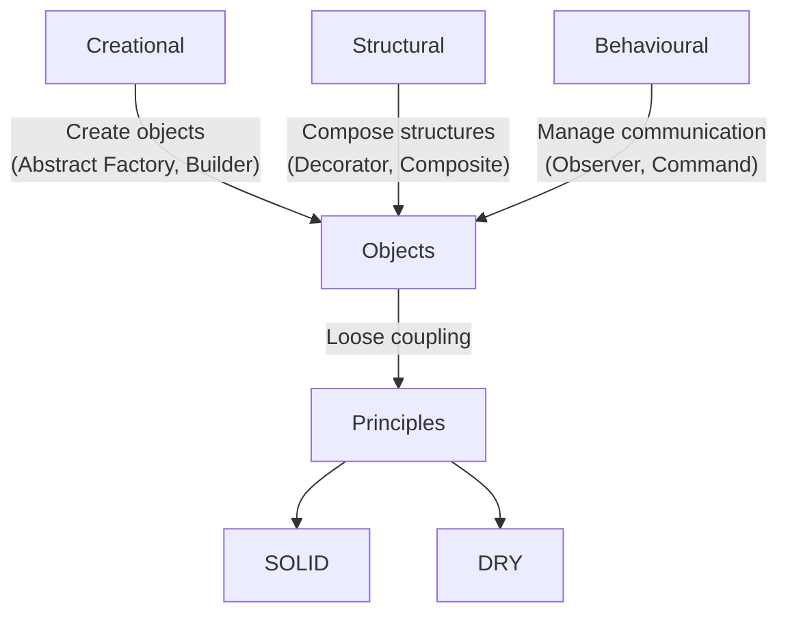

## Design Patterns

In 1994, Erich Gamma, Richard Helm, Ralph Johnson, and John Vlissides published
*Design Patterns: Elements of Reusable Object-Oriented Software*.
These four authors are collectively known as the Gang of Four (GoF).

Their book cataloged 23 classic software design patterns--recurring solutions to
common problems in object-oriented software development. The patterns are divided
into three main categories:

|Category	|Description	|Examples|
|--|--|--|
|Creational	|Object creation mechanisms	|Factory Method, Singleton, Builder|
|Structural	|Composing classes and objects into larger structures	|Adapter, Composite, Facade|
|Behavioural	|Managing algorithms, responsibilities, communication	|Strategy, Observer, Command|

The GoF patterns are not code libraries--they are general reusable solutions that
can be adapted to various programming languages and contexts. They aim to make designs
more flexible, reusable, and maintainable, by anticipating future changes and encouraging
good separation of concerns.

### Lessons from history

By the mid-1990s, when Design Patterns emerged, object-oriented programming had firmly
established itself as the dominant paradigm in mainstream software engineering. The patterns
catalogue captured not only a collection of reusable solutions but also a particular mindset
about how software ought to be structured: through collaborating objects with clear
responsibilities and stable interfaces. The book resonated with a generation of developers
working primarily in C++ and, soon after, Java, who were seeking systematic ways to design
flexible, maintainable systems in these relatively new, complex languages.

For a time, design thinking in software became synonymous with applying patterns. Architectural
discussions, code reviews, and refactorings frequently revolved around identifying which pattern
best fit a given scenario. This pattern-oriented worldview influenced not only codebases but also
education and professional discourse. To design well, in the prevailing view, was to demonstrate
mastery of patterns, and to arrange systems as compositions of collaborating classes mapped
explicitly to canonical solutions from the catalogue.

Yet as software development matured and diversified, the limitations of this approach began to
surface. The strong emphasis on object-oriented structure sometimes led to overengineered solutions,
where simple problems were framed in ways that justified the application of heavyweight abstractions.
Moreover, the rise of alternative paradigms--notably functional programming, dynamic scripting
languages, and later distributed architectures--exposed contexts where the classical patterns
either felt cumbersome or were simply mismatched to the problem domain. Some patterns, such as
Singleton and Abstract Factory, came under scrutiny for encouraging rigid and inflexible designs,
or for masking poor architectural decisions under a veneer of pattern compliance.

Despite this, the underlying principles that animated the patterns--modularity, separation of
concerns, decoupling, and composability — retained their relevance. Even as explicit pattern
nomenclature faded from everyday vocabulary, its intellectual legacy persisted. Modern practices
like dependency injection, event-driven architectures, middleware pipelines, and component-based
systems can often be traced back, conceptually, to these earlier ideas, though reframed in
different paradigms and languages.

Thus, while today’s developers may rarely invoke the full catalogue explicitly, the sensibilities
promoted by the GoF patterns continue to inform how we think about constructing systems. The
patterns endure less as rigid templates to apply verbatim, and more as exemplars of a broader
architectural instinct--an awareness of how to balance flexibility and structure in systems that
must evolve over time.

### DRY Principle (Don’t Repeat Yourself)

Definition:
> Every piece of knowledge must have a single, unambiguous, authoritative representation within a system.

Introduced in the book *The Pragmatic Programmer* (1999) by Andrew Hunt and David Thomas,
DRY is a principle of software development aimed at reducing repetition of code or logic.

Why it matters:
- Repetition increases the risk of inconsistency and bugs (when one copy changes but others don’t).
- Changes become harder to maintain when logic is duplicated.
- Code becomes harder to understand when behaviour is scattered in multiple places.

Typical applications:
- Extracting shared code into functions or methods.
- Using data normalisation in databases.
- Applying inheritance or composition to reuse logic.

A DRY codebase is easier to maintain, less error-prone, and clearer to read.

### SOLID Principles

The SOLID acronym represents five fundamental design principles for object-oriented programming,
popularised by Robert C. Martin ("Uncle Bob") in the early 2000s. They guide developers to build
systems that are modular, extensible, and maintainable.

|Principle	|Name	|Summary|
|--|--|--|
|S	|Single Responsibility Principle (SRP)	|A class should have one and only one reason to change.|
|O	|Open/Closed Principle (OCP)	|Software entities should be open for extension, but closed for modification.|
|L	|Liskov Substitution Principle (LSP)	|Subtypes should be substitutable for their base types.|
|I	|Interface Segregation Principle (ISP)	|No client should be forced to depend on methods it does not use.|
|D	|Dependency Inversion Principle (DIP)	|High-level modules should not depend on low-level modules; both should depend on abstractions.|

Quick breakdown:
- SRP: Keep responsibilities focused; split large classes with multiple roles.
- OCP: Favour extending behaviour with new code rather than modifying existing code.
- LSP: Ensure derived classes can fully replace their parents without breaking functionality.
- ISP: Design small, focused interfaces, not large "fat" ones.
- DIP: Depend on interfaces or abstractions, not concrete implementations.

These principles complement the use of design patterns. 
Patterns provide reusable solutions--DRY and SOLID help you structure and integrate those solutions cleanly.

### Selection of Patterns

| Pattern | Category | Purpose | Example Use Case | Source |
|----|----|----|----|----|
| [Strategy](./strategy/) | Behavioural | Encapsulate interchangeable algorithms or behaviours | Sorting algorithms, payment methods | GoF |
| [Command](./command/) | Behavioural | Encapsulate a request as an object | Undo/Redo, action queues, macro recording | GoF |
| Observer           | Behavioural      | Notify dependent objects of state changes                        | GUIs, event systems, data binding                | GoF            |
| [State](./state/) | Behavioural | Change object behaviour based on internal state | Game AI, UI modes | GoF |
| [Decorator](./decorator/) | Structural | Add behaviour to objects dynamically | I/O streams, middleware pipelines | GoF |
| [Adapter](./adapter/) | Structural | Convert one interface to another | Legacy code integration, wrapper libraries | GoF |
| [Facade](./facade/) | Structural | Provide a unified interface to a set of interfaces in a subsystem | Simplifying complex libraries, subsystems, APIs | GoF |
| [Composite](./composite/) | Structural | Treat objects and groups uniformly | Scene graphs, file system trees | GoF |
| [Factory Method](./factory/) | Creational | Define interface for creating objects, let subclass decide | Plugin creation, document editors | GoF |
| [Abstract Factory](./factory/05/) | Creational | Create families of related objects without specifying classes | GUI themes, cross-platform toolkits | GoF |
| [Singleton](./singleton/)[^single] | Creational | Ensure a class has only one instance | Config manager, global registries | GoF (controversial) |
| [Builder](./builder/) | Creational | Separate construction of a complex object from its representation | Object configurators, UI builders | GoF |
| [Prototype](./prototype/) | Creational | Clone existing objects instead of creating new ones | Object pools, data templates | GoF |
| Mediator           | Behavioural      | Centralise complex communication between objects                 | Chat servers, air traffic control systems        | GoF            |
| [Visitor](./visitor/) | Behavioural | Separate an algorithm from the objects it operates on | Compilers, AST traversal, document processing | GoF |
| [Dependency Injection](./combined/os/DEPENDENCY.md) | Structural | Provide dependencies from the outside | Testable systems, service wiring | Post-GoF |
| [Null Object](./null/) | Behavioural | Use an object with default behaviour instead of `null` | Safe iteration, fault-tolerant systems | Post-GoF |
| [Event Bus](./event/) | Behavioural | Decouple senders from receivers using a publish/subscribe model | UI events, logging systems | Post-GoF |

[^single]: Singleton is often discouraged in modern design due to global state issues; use with care: https://en.wikipedia.org/wiki/Singleton_pattern.

### Lessons for the Future?

If we accept that one plausible future of programming lies not in replacing the programmer
(one possible outcome with LLMs and AI) but in strengthening and amplifying the human role,
then design patterns--and similar intellectual tools--have an important and renewed relevance.
As long as we stay in the context of "programming lanuages".

At their core, design patterns are communication devices. They capture common structures of
reasoning about software--recurring solutions to recurring problems--and give them shared names
and conceptual clarity. This dual role, both cognitive aid and shared vocabulary, is key in
complex software engineering, where no individual can hold every detail in their head at once.
Patterns scaffold understanding across teams and over time.

In an AI-assisted future where programmers interact with ever-more powerful tools, the need
for conceptual clarity does not diminish--it intensifies. As systems grow more abstract and as
layers of automation intervene between human intent and machine execution, having stable
architectural idioms (like Observer, Strategy, or Command) gives the human programmer anchoring
points. Patterns act as mental models, allowing programmers to:
- predict behavior,
- reason about interactions,
- communicate ideas to other humans (and perhaps to AI assistants as well),
- and verify correctness in evolving systems.

Moreover, patterns are agnostic to technology shifts. Whether we code in Java, Rust, or prompt
an LLM, the underlying structural ideas of patterns can guide how we organize logic, data, and
behavior. Even in paradigms that look less explicitly OO--like functional or reactive systems--analogous
patterns (compositional, higher-order abstractions) surface and play similar roles.

Seen in this light, design patterns are part of a larger class of "conceptual instruments" that
empower programmers:
- Type systems clarify constraints and data structure relationships.
- Architecture diagrams map system components and flows.
- Code smells and refactoring catalogs guide iterative improvement.
- Formal specifications (even lightweight ones like contracts or tests) make intent explicit.

If future programming environments blend natural language, AI assistance, and evolving abstractions,
these instruments become interface layers between human cognition and machine execution. Rather than
discarding them, we should expect a recontextualization: patterns not as rigid templates to copy,
but as conceptual checklists, conversational scaffolds, and explanation aids--tools that help both
humans and AI systems maintain alignment around intent and design quality.

The historical pattern (pun intended) is clear: tools that survive are those that enhance both
expression and understanding. Design patterns have persisted because they make complex designs
comprehensible, discussable, and adaptable--qualities that will remain essential as systems and
toolchains evolve.

In short: if the future of programming strengthens the programmer rather than marginalises them,
then patterns (and their intellectual kin) become not obsolete relics but amplifiers of human
design capacity--the grammar and rhetoric of computational thought, even as the languages and
platforms change beneath us.

