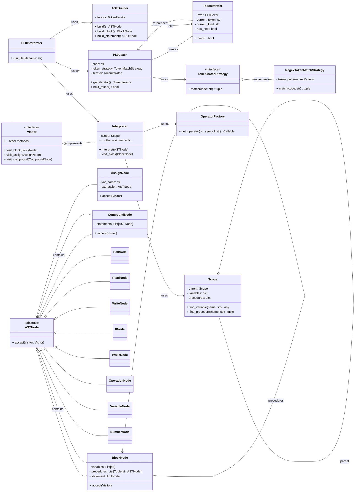

## Builder Pattern

### What is the Builder Pattern?

The *Builder Pattern* is a *creational design pattern* that:
- Separates the construction of a complex object from its representation.
- Allows step-by-step construction using a fluent interface.
- Enables the creation of different object configurations with the same construction process.


### How It Works

| Component         | Description                                                           |
|-------------------|-----------------------------------------------------------------------|
| *Director*        | Orchestrates the construction process using the builder's interface.  |
| *Builder*         | Abstract interface defining steps to build parts of the product.      |
| *Concrete Builder* | Implements the builder's steps to create a specific product variant. |
| *Product*         | The complex object being constructed.                                 |

Flow:
1. The *Director* calls methods on the *Builder* to construct the product.
2. The *Concrete Builder* implements these steps to assemble the product.
3. The final *Product* is retrieved from the builder.


### Use Cases

- When an object requires *many optional parameters* (avoiding telescoping constructors).
- When constructing *complex objects with multiple parts* (e.g. ASTs, UI elements, reports).
- When different **representations* of an object are needed (e.g. HTML vs. PDF reports).


### Relation to Other Patterns

| Pattern            | Relationship                                                                 |
|--------------------|-----------------------------------------------------------------------------|
| *Abstract Factory* | Focuses on creating families of related objects, while Builder constructs a single complex object. |
| *Factory Method*   | Deals with object creation via inheritance, while Builder uses composition. |
| *Prototype*        | Clones existing objects, while Builder constructs new ones step by step.   |


#### Simple Example

Pizza Builder:
```python
class Pizza:
    def __init__(self):
        self.crust = None
        self.toppings = []
        self.size = None

class PizzaBuilder:
    def __init__(self):
        self.pizza = Pizza()
    
    def set_crust(self, crust: str):
        self.pizza.crust = crust
        return self
    
    def add_topping(self, topping: str):
        self.pizza.toppings.append(topping)
        return self
    
    def set_size(self, size: str):
        self.pizza.size = size
        return self
    
    def build(self):
        return self.pizza

# usage
margherita = PizzaBuilder() \
    .set_crust("thin") \
    .add_topping("cheese") \
    .add_topping("basil") \
    .set_size("large") \
    .build()
```


### Builder Pattern in the PL/0 Interpreter

Role:
- The `ASTBuilder` class acts as the *Concrete Builder*.
- Constructs the *Abstract Syntax Tree (AST)* by parsing tokens from the lexer.

Features:
1. *Step-by-Step Construction*:
   - Methods like `build_block()`, `build_statement()`, and `build_expression()`
     incrementally parse tokens and create nodes (e.g., `BlockNode`, `AssignNode`).
   ```python
   def build_block(self) -> BlockNode:
       variables = self.parse_variables()
       procedures = self.parse_procedures()
       statement = self.build_statement()
       return BlockNode(variables, procedures, statement)
   ```
2. *Isolation of Parsing Logic*:
   - The lexer (`PL0Lexer`) handles tokenization, while the builder focuses on AST
     construction.
3. *Flexibility*:
   - Adding new node types (e.g., `ForNode`) requires changes only to the builder.

Benefits:
- *Maintainability*: Changes to the AST structure don’t affect the lexer or interpreter.
- *Readability*: Each method corresponds to a grammar rule (e.g., `build_while_loop()`).





### Summary

The Builder Pattern decouples complex object construction from its representation. In
the PL/0 interpreter, the `ASTBuilder` encapsulates the parsing logic to create an AST,
enabling clean separation between tokenization, syntax tree construction, and program
execution. This pattern is ideal for scenarios requiring step-by-step assembly of objects
with many components.
